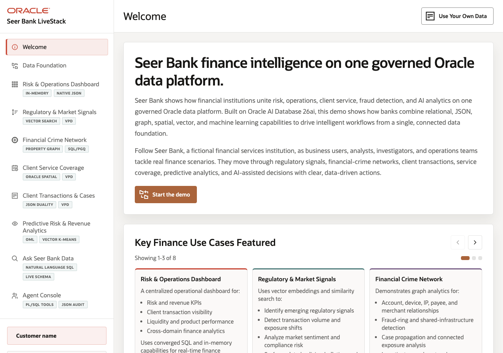

# Seer Bank Finance LiveStack Guide

## Introduction

Financial institutions are under pressure to make faster, better-governed decisions while their data is spread across core banking systems, transaction platforms, client service tools, compliance queues, fraud investigation systems, analytics environments, and AI experiments. Risk leaders need to understand emerging exposure before it becomes a loss event. Operations teams need service coverage and case visibility across regions. Application teams need transaction records that work for both relational systems and API-driven experiences. Business users want answers without waiting for custom reports, and executives want AI recommendations that remain grounded in governed enterprise data.

This runbook supports the Seer Bank Finance LiveStack Demo. The demo shows how Oracle AI Database 26ai can help financial-services teams bring those workloads together on one connected data foundation. Instead of splitting relational transactions, JSON documents, graph relationships, spatial analysis, vector search, machine learning, natural-language SQL, and AI agent workflows across separate systems, the LiveStack shows how those capabilities can work against the same governed Oracle data model.

In the demo, Seer Bank uses Oracle AI Database to connect financial products, client transactions, regulatory and market signals, fraud networks, service coverage, predictive analytics, conversational data access, and agent-assisted operations. Each scene is designed to help you explain a practical finance challenge and then show how a converged Oracle database capability supports a clearer decision path.

Estimated Demo Time: 95 minutes

Each scene is designed to take between 5 and 10 minutes.

### Objectives

In this LiveStack Demo, you will:
- Explore the key finance use cases featured in the Seer Bank demo, from data foundation and risk dashboard visibility to regulatory signals, fraud investigation, client service coverage, transaction intelligence, analytics, conversational data access, and AI agent workflows.
- Understand how common financial-services challenges such as fragmented data, fast-changing risk signals, fraud complexity, service coverage pressure, limited self-service analytics, and governed AI adoption are addressed in the demo flow.
- See how Oracle AI Database 26ai supports each use case with converged capabilities including relational data, JSON, graph, spatial, vector search, machine learning, natural-language SQL, and AI-assisted operations.
- Connect each scene to a practical business outcome, so the demo shows not only what the application does, but why the Oracle data platform matters for modern finance.

### Prerequisites

This LiveStack Demo assumes you have:
- Access to the running Seer Bank Finance LiveStack.
- A modern browser open to the application URL.

## Demo Flow

- Scene 1: Welcome and Demo Orientation.
- Scene 2: Data Foundation.
- Scene 3: Risk & Operations Dashboard.
- Scene 4: Regulatory & Market Signals.
- Scene 5: Financial Crime Network.
- Scene 6: Client Service Coverage.
- Scene 7: Client Transactions & Cases.
- Scene 8: Predictive Risk & Revenue Analytics.
- Scene 9: Ask Seer Bank Data.
- Scene 10: Agent Console.
- Scene 11: Use Your Own Data.

## Learn More

- [Oracle AI Database 26ai documentation](https://docs.oracle.com/en/database/oracle/oracle-database/26/index.html)
- [Oracle AI Agent Memory](https://www.oracle.com/database/ai-agent-memory/)
- [Oracle AI Vector Search](https://www.oracle.com/database/ai-vector-search/)
- Oracle Spatial and Graph documentation: [Oracle Spatial](https://docs.oracle.com/en/database/oracle/oracle-database/26/spatl/toc.htm) and [Oracle Property Graph](https://docs.oracle.com/en/database/oracle/property-graph/26.2/index.html)
- [Oracle Machine Learning for SQL documentation](https://docs.oracle.com/en/database/oracle/machine-learning/oml4sql/tasks.html)
- [Oracle REST Data Services documentation](https://docs.oracle.com/en/database/oracle/oracle-rest-data-services/25.4/orddg/index.html)
- [Oracle LiveLabs catalog](https://livelabs.oracle.com/)

## Credits & Build Notes
- **Author** - Oracle LiveLabs Team
- **Last Updated By/Date** - Oracle LiveLabs Team, 2026-05-21
