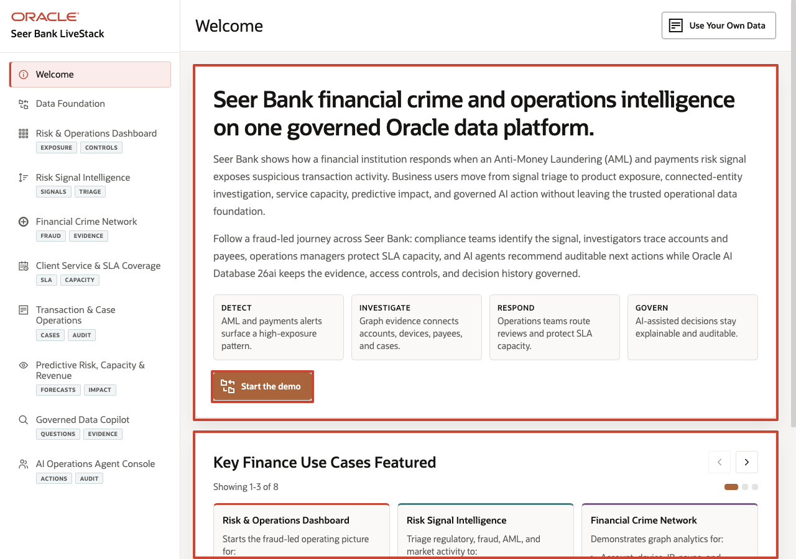

# Scene 1 Welcome and Demo Orientation

## Introduction

This opening scene orients users to the Seer Bank Finance LiveStack Demo. The welcome page summarizes the eight active use cases and connects them to one financial-intelligence journey: monitor risk, investigate exposure, route work, analyze capacity, ask governed questions, and coordinate AI-assisted action.

Estimated Time: 5 minutes

### Objectives

In this scene, you will learn what financial-services decision journey the demo supports, how the pages connect, and where the presenter should start the seller story.

## Task 1: Review the finance story and use case carousel

1. Review the top panel on the **Welcome** page. It frames the demo around financial operations, compliance risk, customer exposure, and AI-assisted decision intelligence.
2. Read the numbered use case summaries. The point is to make the demo easy to tell as one connected Seer Bank story rather than a set of disconnected feature pages.
3. Read the visible use case tiles in the carousel.
4. Click the right carousel arrow to move forward.
5. Continue until you have reviewed the use cases for risk operations, signal intelligence, financial crime, service coverage, transactions, predictive analytics, governed data access, and agent operations.
6. Use the left carousel arrow if you want to return to earlier tiles.

## Task 2: Continue the demo

1. Click **Start the demo**.
2. Confirm the demo moves to the next page.

## Credits & Build Notes
- **Author** - Oracle LiveLabs Team
- **Last Updated By/Date** - Oracle LiveLabs Team, 2026-05-28
