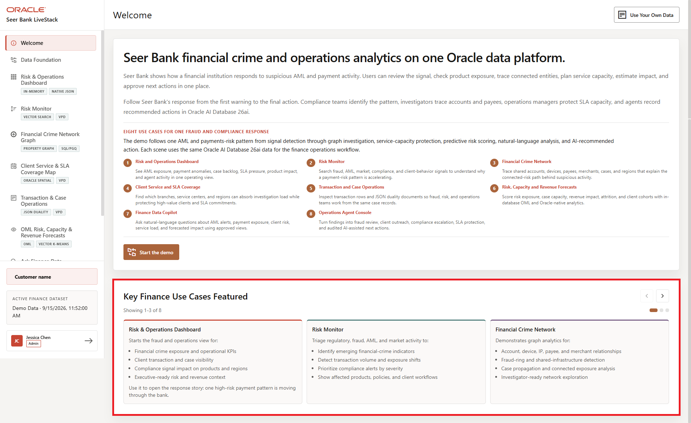

# Scene 1 Welcome and Demo Orientation

## Introduction

This opening scene gives users a quick business roadmap for the demo. The carousel previews the finance use cases covered in the LiveStack, so the audience can see how the walkthrough moves from data foundation to risk insight, service coverage, transactions, analytics, and AI-assisted operations.

Estimated Time: **5 minutes**

<video controls width="100%">
  <source src="https://c4u04.objectstorage.us-ashburn-1.oci.customer-oci.com/p/EcTjWk2IuZPZeNnD_fYMcgUhdNDIDA6rt9gaFj_WZMiL7VvxPBNMY60837hu5hga/n/c4u04/b/livelabsfiles/o/livestack/Videos/SeerBank_Intro_with-CC.mp4" type="video/mp4">
  Your browser does not support the video tag.
</video>

### Objectives

In this scene, you will learn what finance decision the page supports, what evidence the user should inspect, and what action the business may take next.

## Task 1: Review the finance story and use case carousel

Perform the following set of steps so the audience understands the full finance journey. Each card previews a business problem the demo will address, such as risk monitoring, service coverage, financial crime analysis, transaction visibility, analytics, or AI-assisted action.

1. Review the top panel on the **Welcome** page. It frames the demo around financial operations, compliance risk, customer exposure, and AI-assisted decision intelligence.
2. Read the numbered use case summaries. The point is to make the demo easy to tell as one connected Seer Bank story rather than a set of disconnected feature pages.
3. Read the visible use case tiles in the carousel.
4. Click the right carousel arrow to move forward.
5. Continue until you have reviewed the use cases for risk operations, signal intelligence, financial crime, service coverage, transactions, predictive analytics, governed data access, and agent operations.
6. Use the left carousel arrow if you want to return to earlier tiles.

## Task 2: Continue the demo

1. Click **Start the demo**.
2. Confirm the demo moves to the next page.

## Credits & Build Notes
- **Author** - Oracle LiveLabs Team
- **Last Updated By/Date** - Oracle LiveLabs Team, 2026-06-29
