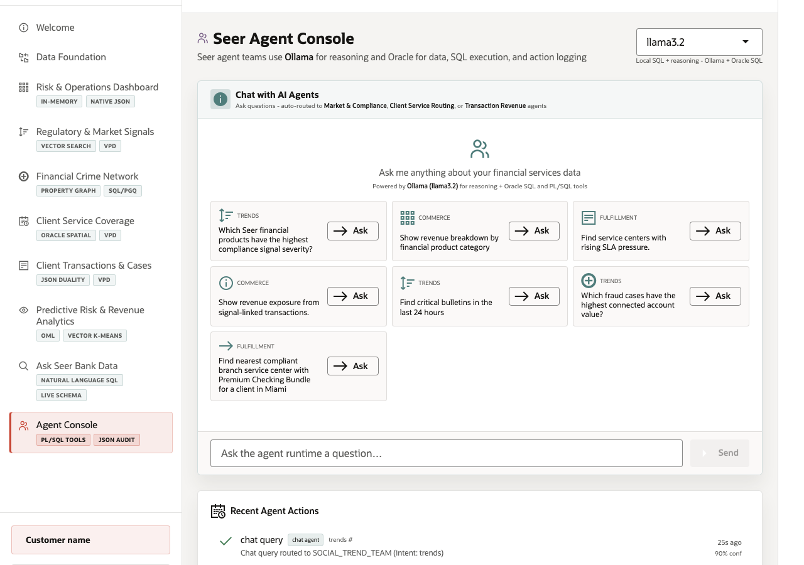

# Scene 10: Agent Console

## Introduction

A Seer Bank operations lead wants agent-assisted answers that are routed to the right specialist workflow and recorded for audit. A chat box alone is not enough for finance. The agent must use governed data, call approved tools, and leave a durable action trail. This scene shows application orchestration with Ollama reasoning, Oracle SQL and PL/SQL tools, and `agent_actions` audit logging.

Estimated Time: 10 minutes

### Objectives

In this scene, you will:
- Open **Agent Console**.
- Ask or select an agent question.
- Review specialist routing, tool use, and recent actions.
- Explain why Oracle stays in the loop for data, execution, and auditability.

## Task 1: Ask a compliance severity question

1. Click **Agent Console**.
2. Use the active runtime profile, or keep the default `llama3.2` profile.
3. Ask or click **Which Seer financial products have the highest compliance signal severity?**
4. Review the routed team and result.

The verified stack routed the question to `SOCIAL_TREND_TEAM` with intent `trends`. The response found critical financial products, including **Fraud Monitoring Add-On** from Clearwater Credit Union with risk severity 78.6 and exposure 16,209,162.

## Task 2: Review tool use and fallback behavior

1. Review the response metadata and recent actions.
2. In the verified run, Ollama timed out and the app recorded that fallback, while the approved `risk_signal_detector` tool succeeded.
3. Use this as an important finance point: the agent workflow can still return governed Oracle-backed evidence and log what happened when an LLM call is unavailable.

## Task 3: Inspect the audit trail

1. Review **Recent Agent Actions**.
2. Point to action `101` if it is visible: a completed `chat_agent` action with confidence 0.9 for the compliance severity question.
3. Open **Oracle Internals** and show the badges for Ollama runtime, Oracle SQL and PL/SQL tools, application orchestration, `agent_actions`, `event_stream`, vector retrieval, and in-database ML scoring.

The demo action proves that finance AI workflows need durable tool execution records, not only generated prose.

## Credits & Build Notes
- **Author** - Oracle LiveLabs Team
- **Last Updated By/Date** - Oracle LiveLabs Team, 2026-05-20
- **Build Notes** - Agent evidence was verified with `/api/agents/chat`, `/api/agents/actions`, and `/api/dashboard/summary`.
