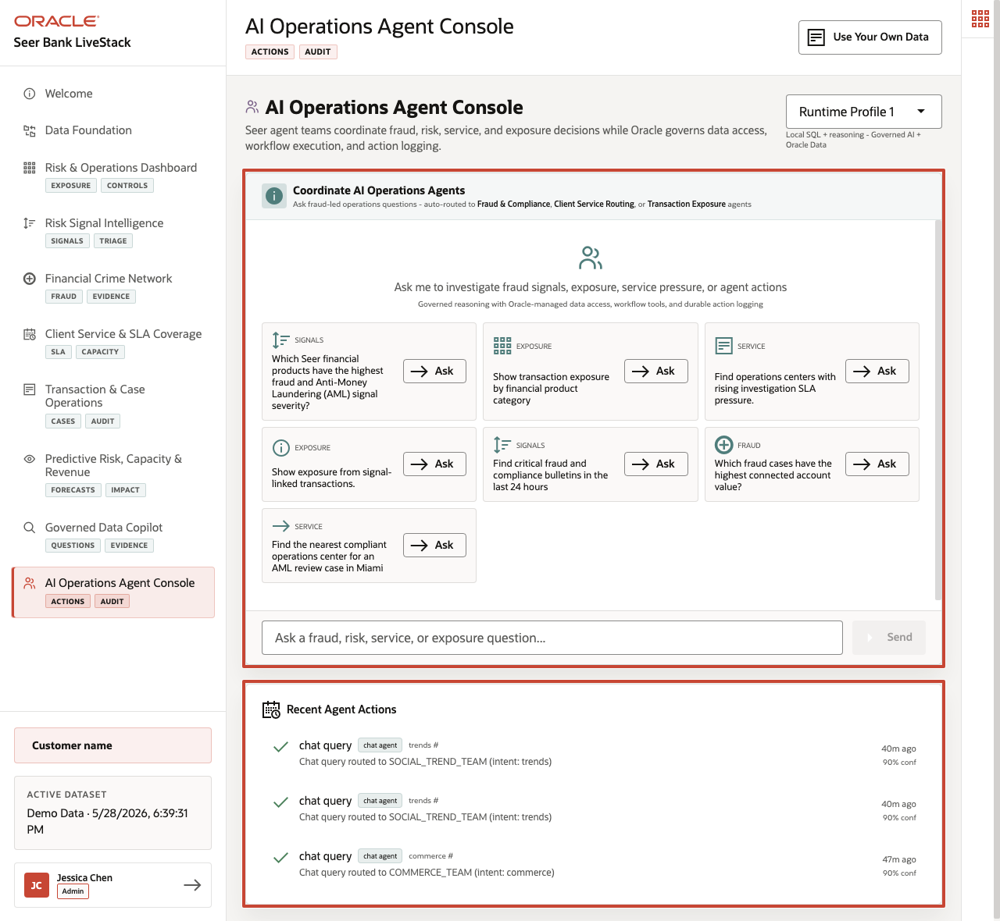
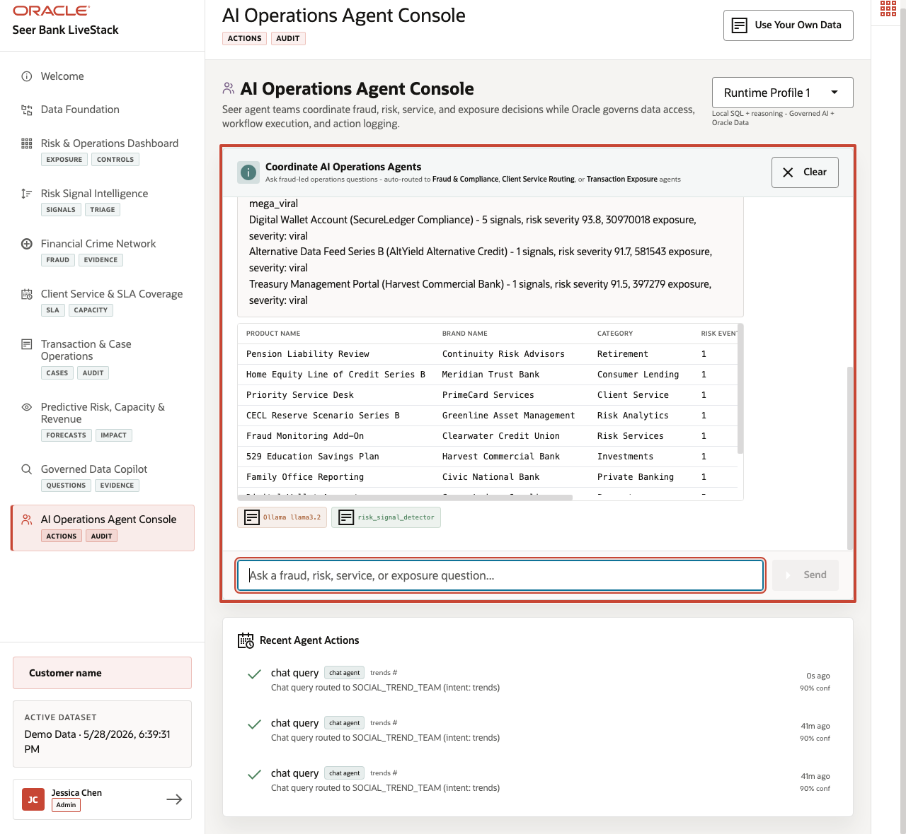
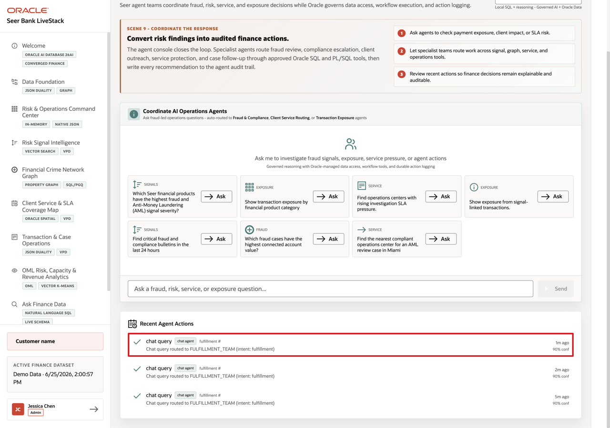

# Scene 10 AI Operations Agent Console

## Introduction

**AI Operations Agent Console** shows how AI assistance can support finance operations without becoming a black box. When an agent supports compliance, service, transaction, revenue, or risk workflows, users need to see the routing decision, tools used, data returned, confidence, and audit record.

Finance teams struggle when the information needed for one decision lives in separate tools. That separation slows action, increases reconciliation work, and makes it harder to trust the result.

Oracle AI Database helps address these challenges by keeping the source data, SQL execution, PL/SQL tools, and durable action logging in the database. In this LiveStack Demo, the app orchestrates the agent workflow, Ollama provides reasoning, and Oracle AI Database 26ai executes the governed data operations. Agent actions are written back to `agent_actions`, while the UI shows the response, tool badges, and recent audit trail.

Estimated Time: **10 minutes**

### Objectives

In this scene, you will learn what finance decision the page supports, what evidence the user should inspect, and what action the business may take next.

## Task 1: Review the agent console workspace

Review the agent console as an operational workspace. The user should notice the runtime profile, example questions, routing behavior, recent actions, and confidence information before running an agent task.

1. Click **AI Operations Agent Console** in the sidebar.
2. Review the runtime profile selector in the top right. The current demo uses **llama3.2** through an Ollama-backed runtime profile.
3. Review the example questions in the chat panel.
4. Review **Recent Agent Actions** below the chat panel.
5. Focus on the fraud and AML example: **Which Seer financial products have the highest fraud and Anti-Money Laundering (AML) signal severity?**

Use this opening view to explain that the page is an operational agent console. The user can see routing, tools, results, confidence, and action history, not just a chat response.

## Task 2: Run the fraud and AML signal-severity agent question

Perform the following set of steps to show how the agent identifies critical products and supporting risk evidence that may require compliance review, operational follow-up, or product-risk escalation.

1. Click **Ask** on **Which Seer financial products have the highest fraud and Anti-Money Laundering (AML) signal severity?**
2. Review the agent response at the top of the chat output.
3. Review the returned product table.
4. Review the tool badges below the result.

In the current demo dataset, the agent routes the request to the **SOCIAL_TREND_TEAM** with intent **trends** and returns **10** critical financial products from the last 48 hours. The top results include **Pension Liability Review** from **Continuity Risk Advisors**, **Home Equity Line of Credit Series B** from **Meridian Trust Bank**, **Priority Service Desk** from **PrimeCard Services**, and **Fraud Monitoring Add-On** from **Clearwater Credit Union**. These rows show critical risk severity, exposure, and severity-band context.

**Note:** Sample values may change after data refreshes or rebuilds. Verify live output before presenting, then explain the business takeaway.

After showing the critical products, explain what the business can decide: review exposure, route the item to compliance, prepare service capacity, or investigate the underlying risk signals.

## Task 3: Interpret the operational story

Interpret the response as an observable AI workflow. The user can see which route handled the request, which tool succeeded, what evidence was returned, and how the result should guide the next operational decision.

1. The question creates a fraud, AML, compliance, and product-risk intent.
2. The app routes the request to the market and compliance agent path.
3. Oracle-backed tools identify financial products with severe risk signals.
4. The response returns product, institution, category, risk event, severity, exposure, and severity-band context.
5. The tool badges show whether the reasoning runtime or database-backed tool path completed the work.

The important story is observability: the user can see which route handled the request, which tool succeeded, and what Oracle-backed evidence supports the result.

## Task 4: Review the agent action audit trail

Perform the following set of steps to show that AI actions do not disappear after the chat. Finance leaders, operators, architects, and auditors can review what the agent did, which path it used, and how confident the system was.

1. Scroll to **Recent Agent Actions**.
2. Review the top action row.
3. Confirm that the row shows a completed **chat query** routed to a specialist finance agent team, such as **SOCIAL_TREND_TEAM** for risk signals or **FULFILLMENT_TEAM** for client service routing.
4. Review the confidence value.

In the current demo dataset, the completed chat action is logged with **90%** confidence. This is the governance point of the scene: agent decisions should be observable after the conversation. The page shows that agent interactions are not just transient chat messages. They are written into the action history so an operator, architect, or auditor can understand what happened.

**Note:** Sample values may change after data refreshes or rebuilds. Verify live output before presenting, then explain the business takeaway.

The business value is that teams can make the decision from connected, governed data. Oracle AI Database provides the shared foundation that keeps the data, analytics, and AI workflow aligned.

*You can move to the next scene.*

## Credits & Build Notes
- **Author** - Oracle LiveLabs Team
- **Last Updated By/Date** - Oracle LiveLabs Team, 2026-05-28
