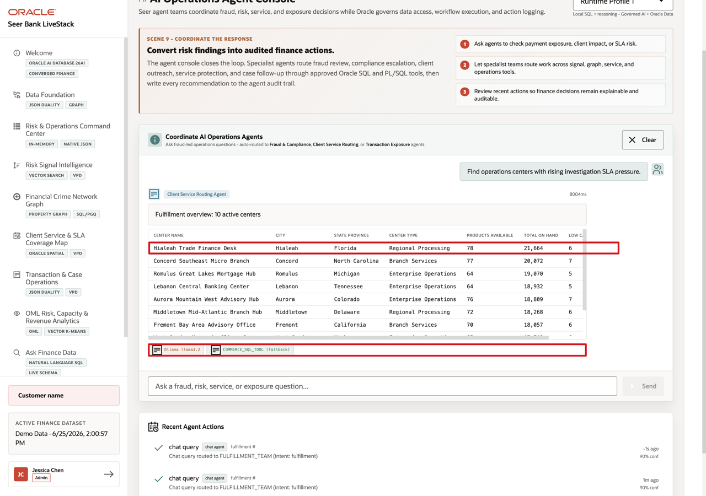

# Scene 10 AI Operations Agent Console

## Introduction

**AI Operations Agent Console** shows how AI assistance can support finance operations without becoming a black box. When an agent supports compliance, service, transaction, revenue, or risk workflows, users need to see the routing decision, tools used, data returned, confidence, and audit record.

Finance teams struggle when the information needed for one decision lives in separate tools. That separation slows action, increases reconciliation work, and makes it harder to trust the result.

Oracle AI Database helps address these challenges by keeping the source data, SQL execution, PL/SQL tools, and durable action logging in the database. In this LiveStack Demo, the app orchestrates the agent workflow, Ollama provides reasoning, and Oracle AI Database 26ai executes the governed data operations. Agent actions are written back to `agent_actions`, while the UI shows the response, tool badges, and recent audit trail.

Estimated Time: **10 minutes**

### Objectives

In this scene, you will learn what finance decision the page supports, what evidence the user should inspect, and what action the business may take next.

## Task 1: Review the agent console workspace

Review the agent console as an operational workspace. The user should notice the runtime profile, example questions, routing behavior, recent actions, and confidence information before running an agent task.

1. Click **Finance Agent Console** in the sidebar.
2. Review the runtime profile selector in the top right. The current demo displays **Runtime Profile 1**, which combines local reasoning with governed Oracle data access.
3. Review the example questions in the chat panel.
4. Review **Recent Agent Actions** below the chat panel.
5. Focus on the service example: **Find operations centers with rising investigation SLA pressure.**

Use this opening view to explain that the page is an operational agent console. The user can see routing, tools, results, confidence, and action history, not just a chat response.

## Task 2: Run the investigation SLA pressure question

Perform the following set of steps to show how the console routes a service-pressure question, returns governed operations-center data, and exposes the tools used to complete the request.

1. Click **Ask** on **Find operations centers with rising investigation SLA pressure.**
2. Confirm that the request is routed to the **Client Service Routing Agent**.
3. Review the response and the returned operations-center table.
4. Review the tool badges below the result.

In the current demo dataset, the console routes the request to **FULFILLMENT_TEAM** with intent **fulfillment** and returns **10** active operations centers. Focus on **Hialeah Trade Finance Desk** in **Hialeah, Florida**. It is a **Regional Processing** center with capacity records for **78** financial products, **21,664** aggregate case-processing capacity units, and **6** products below their capacity threshold.

**Note:** Sample values may change after data refreshes or rebuilds. Verify live output before presenting, then explain the business takeaway.

After showing the center row, explain what the business can decide: compare capacity across centers, identify products already below threshold, and route investigation work before SLA pressure affects clients.

## Task 3: Interpret the operational story

Interpret the response as an observable AI workflow. The user can see which route handled the request, which tool succeeded, what evidence was returned, and how the result should guide the next operational decision.

1. The question creates a service-capacity and operations-center intent.
2. The app routes the request to the client-service agent path.
3. The local reasoning runtime is attempted first.
4. If that runtime does not complete in time, the governed SQL fallback still returns the operations-center rows.
5. The tool badges show **Ollama llama3.2** as the attempted reasoning path and **COMMERCE_SQL_TOOL (fallback)** as the successful data path in this run.

The important story is observability and resilience: the user can see which route handled the request, which tool completed the work, and what Oracle-backed evidence supports the result. A model timeout does not need to hide the data path or erase the audit trail.

## Task 4: Review the agent action audit trail

Perform the following set of steps to show that AI actions do not disappear after the chat. Finance leaders, operators, architects, and auditors can review what the agent did, which path it used, and how confident the system was.

1. Scroll to **Recent Agent Actions**.
2. Review the top action row.
3. Confirm that the row shows a completed **chat query** routed to **FULFILLMENT_TEAM** with intent **fulfillment**.
4. Review the confidence value.

In the current demo dataset, the completed chat action is logged with **90%** confidence. This is the governance point of the scene: agent decisions should be observable after the conversation. The page shows that agent interactions are not just transient chat messages. They are written into the action history so an operator, architect, or auditor can understand what happened.

**Note:** Sample values may change after data refreshes or rebuilds. Verify live output before presenting, then explain the business takeaway.

The business value is that teams can make the decision from connected, governed data. Oracle AI Database provides the shared foundation that keeps the data, analytics, and AI workflow aligned.

*You can move to the next scene.*

## Credits & Build Notes
- **Author** - Oracle LiveLabs Team
- **Last Updated By/Date** - Oracle LiveLabs Team, 2026-06-29
