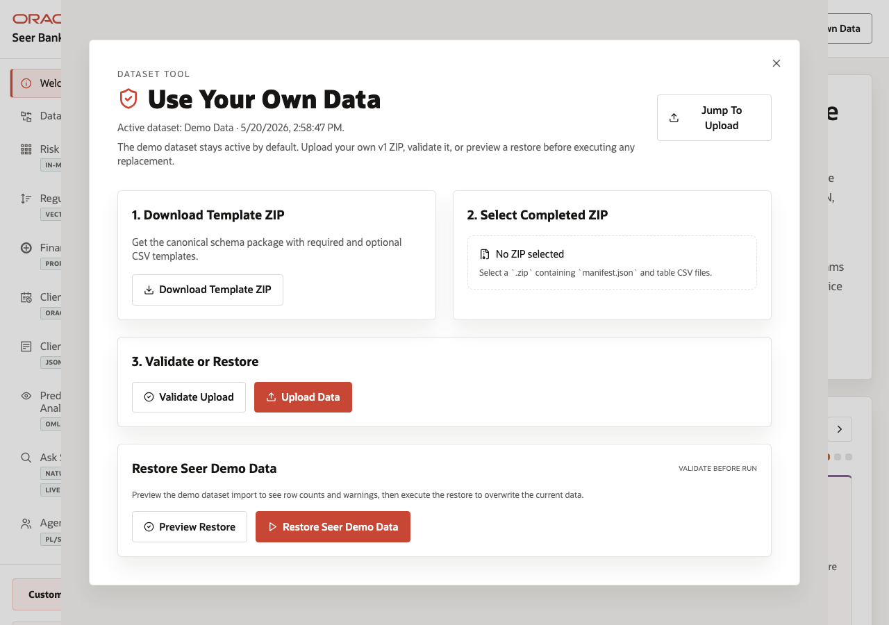

# Scene 11: Use Your Own Data

## Introduction

A field engineer or data steward needs to shift from the packaged Seer Bank story to a customer's own finance language without breaking the schema contract. Replacing demo data is risky if the archive is malformed or if derived artifacts are not rebuilt. This scene shows the guided dataset manager for template download, validation, upload, and demo restore.

Estimated Time: 10 minutes

### Objectives

In this scene, you will:
- Open **Use Your Own Data** from the top action bar.
- Review the active dataset state.
- Download the required template ZIP.
- Validate customer data before upload or restore demo data safely.

## Task 1: Open the dataset manager

1. From any page, click **Use Your Own Data** in the top action bar.
2. Review the overlay sections: **Download Template ZIP**, **Select Completed ZIP**, **Validate or Restore**, and **Restore Seer Demo Data**.
3. Point out the live active dataset. The verified stack reported source `demo`, label **Demo Data**, version `v1`, updated at `2026-05-20T12:58:47.273Z`, and no active operation.

This tells the presenter and customer which dataset is currently powering the app.

## Task 2: Download and validate a replacement archive

1. Click **Download Template ZIP** to get the expected CSV layout.
2. The verified endpoint returned `financial-services-import-template-v1.zip`.
3. Select a completed customer ZIP only when one is ready.
4. Click **Validate** before upload. Use validation results to discuss missing files, header mismatches, foreign-key issues, warnings, or a clean dry run.

The important behavior is validate first, replace second.

## Task 3: Restore the Seer demo data

1. Use **Preview Restore** when you want to see what demo restore will affect.
2. Click **Restore Seer Demo Data** only when you want to return to the seeded story.
3. Explain that restore rebuilds dependent artifacts such as vectors, semantic matches, spatial zones, forecasts, and other derived demo data.

## Credits & Build Notes
- **Author** - Oracle LiveLabs Team
- **Last Updated By/Date** - Oracle LiveLabs Team, 2026-05-20
- **Build Notes** - Dataset manager evidence was verified with `/api/import/dataset` and `/api/import/template`.
