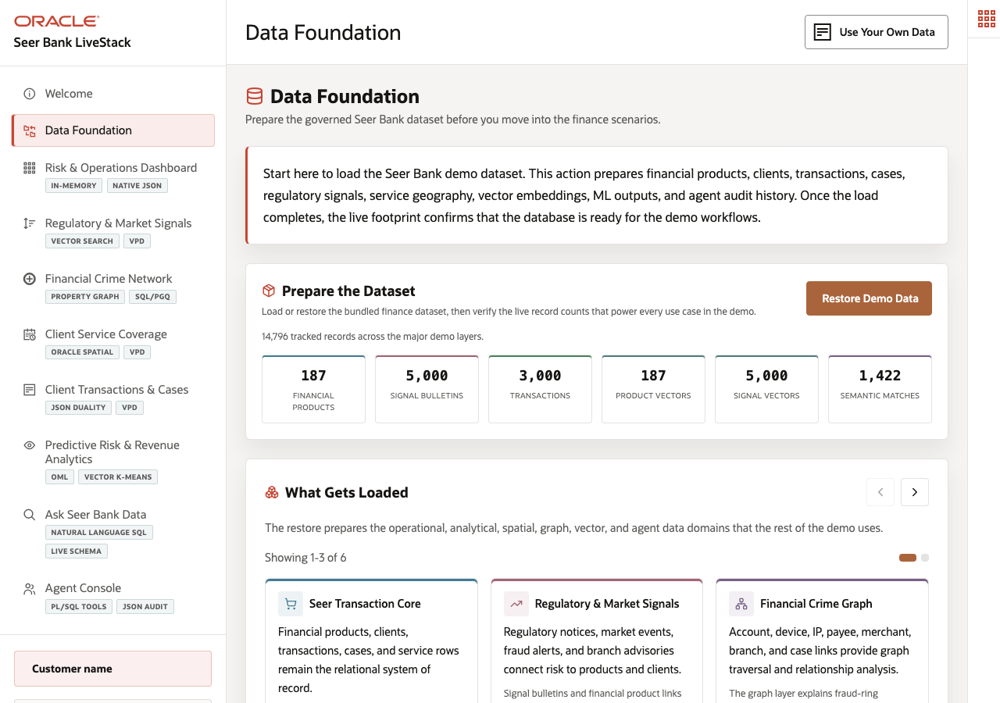

# Scene 2: Data Foundation

## Introduction

A Seer Bank data platform lead needs to prove that the demo is operating from one trusted finance foundation before executives, analysts, investigators, and AI agents start using it. In many banks, those teams work from reconciled extracts or separate search, graph, and ML stores. This scene starts with the governed Oracle AI Database 26ai footprint that supports the rest of the demo.

Estimated Time: 5 minutes

### Objectives

In this scene, you will:
- Open the **Data Foundation** page.
- Confirm the live demo counts and restore readiness.
- Connect each data domain to the downstream finance scenes.
- Explain why converged data matters before any AI workflow runs.

## Task 1: Confirm the live finance data footprint

1. Click **Data Foundation** in the left navigation.
2. Review **Prepare the Dataset** and confirm that the status cards show data loaded.
3. Use the live counts as your first evidence point: the verified deployment contained 187 financial products, 5,000 signal bulletins, 3,000 transactions, 187 product vectors, 5,000 signal vectors, and 1,422 semantic matches.
4. Mention the deeper graph and spatial footprint from the same stack: 4,804 graph nodes, 3,008 graph edges, 30 service centers, 120 fulfillment zones, 20 demand regions, and 360 demand forecasts.

This is the baseline for the demo. Every later screen reads from the same Oracle-backed application schema instead of switching to a different data copy.

## Task 2: Connect the foundation to the finance story

1. Review the cards for **Seer Transaction Core**, **Regulatory & Market Signals**, **Financial Crime Graph**, **Client Service Coverage**, **Transaction Documents**, and **Predictive AI & Decisioning**.
2. For each card, tell the audience which later scene uses that data. For example, regulatory signals drive Scene 4, fraud graph entities drive Scene 5, and transaction documents drive Scene 7.
3. Open **Oracle Internals** if you want to show the capability map: relational core, JSON duality views, property graph, Oracle Spatial, vector search, in-database ML, and agent audit trail.

The presenter takeaway is that Seer Bank is not demoing isolated AI widgets. It is showing finance workflows on one governed data product.

## Task 3: Explain the restore workflow

1. Point to the restore control in **Prepare the Dataset**.
2. Explain that restore is the safe reset path for field demos. It reloads the seeded finance data and rebuilds derived artifacts such as vector embeddings and semantic matches.
3. Do not run restore during a live presentation unless you intentionally want to reset the stack. It changes the active dataset and can take time to rebuild vector artifacts.

## Credits & Build Notes
- **Author** - Oracle LiveLabs Team
- **Last Updated By/Date** - Oracle LiveLabs Team, 2026-05-20
- **Build Notes** - Scene updated from `/api/demo/status` on the running finance stack.
