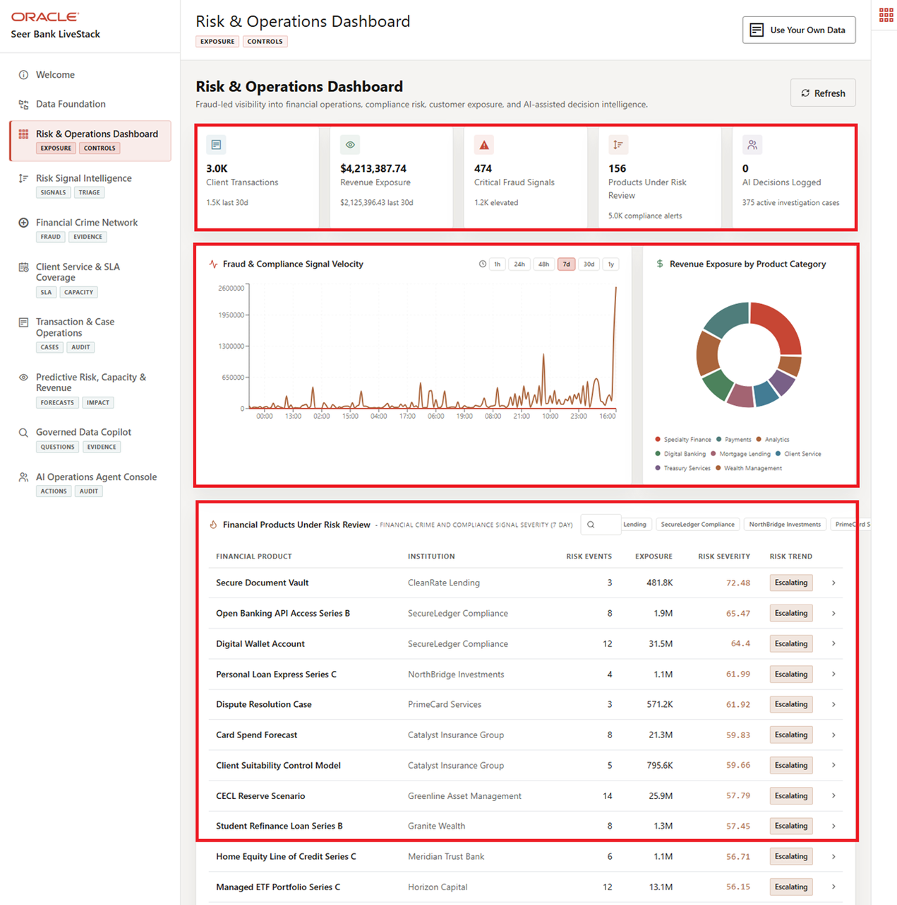
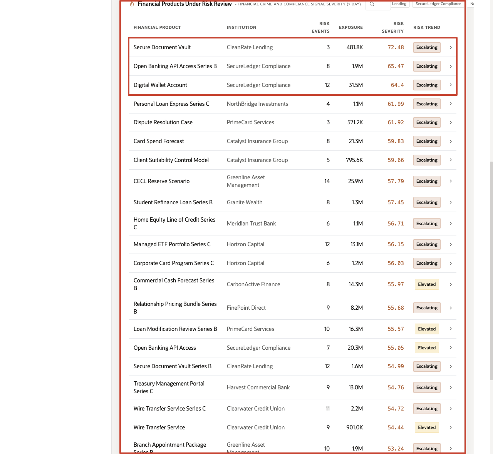
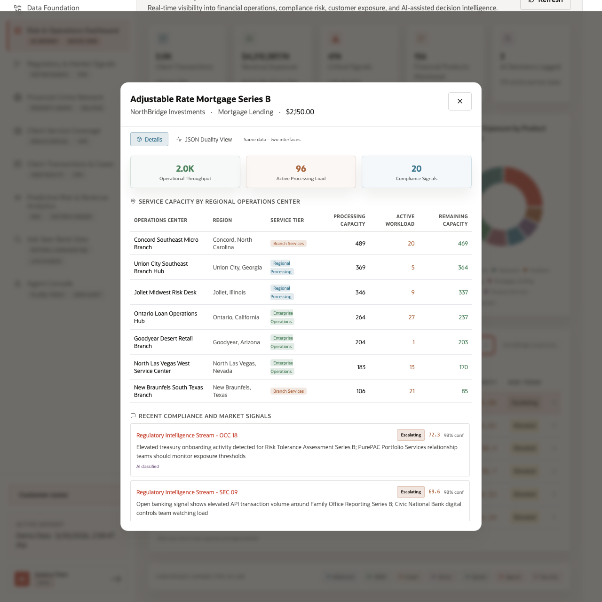
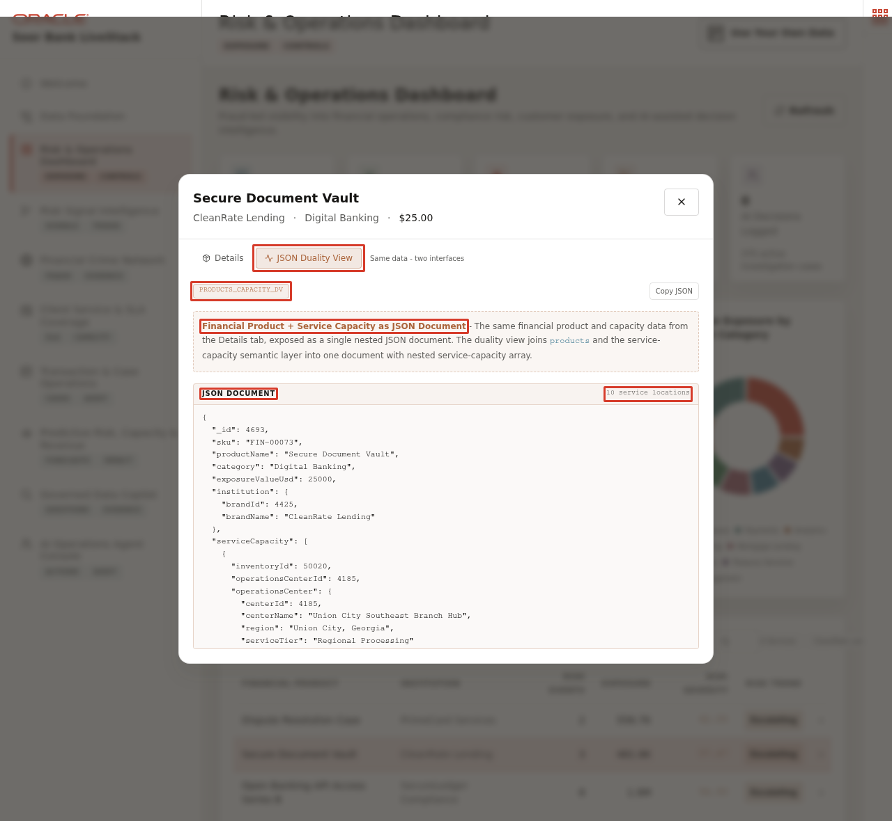

# Scene 3 Risk & Operations Dashboard

## Introduction

The **Risk & Operations Dashboard** helps finance leaders answer a daily question: what needs attention right now? The page brings together transaction activity, revenue exposure, risk signal velocity, monitored products, service pressure, and AI-assisted actions so teams can quickly decide where to investigate first.

Dashboards like this are difficult to implement when finance data is split across core banking systems, compliance platforms, fraud tools, client service applications, and analytics pipelines. Teams often need copied data, ETL jobs, separate search indexes, and reconciliation logic before a dashboard can show a trustworthy view.

Oracle AI Database helps address that challenge by keeping operational, analytical, JSON, in-memory, and AI-ready data close to the same governed data foundation. In this scene, the dashboard brings together live finance KPIs, risk signal velocity, revenue exposure by product category, and product-level detail without sending the user to a different application.

Estimated Time: **10 minutes**

### Objectives

In this scene, you will learn what finance decision the page supports, what evidence the user should inspect, and what action the business may take next.

## Task 1: Review the risk and operations dashboard

Use the dashboard as a daily triage view. The goal is to see which part of the business needs attention first, such as elevated risk signals, revenue exposure, service pressure, or AI-assisted actions.

1. Click **Risk & Operations Dashboard** in the sidebar.
2. Review the KPI cards across the top of the page. These summarize the current operating picture: client transactions, revenue exposure, critical fraud signals, products under risk review, and AI decisions logged.
3. Review **Risk Signal Velocity**. This chart measures the rate and intensity of regulatory, market, and operational risk activity.
4. Review **Revenue Exposure by Product Category** to see which finance categories are contributing most to exposure.
5. Review the **Oracle Internals** sidebar after the business flow is clear. Use it to connect the visible finance outcome to the database capabilities behind the page.

## Task 2: Review financial products under risk review

Perform the following set of steps to identify where product exposure, risk severity, processing load, or service pressure may require follow-up.

1. Scroll to **Financial Products Under Risk Review**.
2. Review the product rows. The table ranks monitored financial products by recent regulatory and market signal severity and shows product name, institution, risk events, exposure, risk severity, and risk trend.
3. Review the highest-risk rows, such as **Secure Document Vault**, **Open Banking API Access Series B**, and **Digital Wallet Account**.
4. Click **Secure Document Vault**.

In the current live stack, the table surfaces products such as **Secure Document Vault**, **Open Banking API Access Series B**, and **Digital Wallet Account** with elevated risk severity. The table helps the user move from broad dashboard signals to product-level evidence. A high-ranking product may call for exposure review, compliance follow-up, capacity planning, or client-service action.

**Note:** Sample values may change after data refreshes or rebuilds. Verify live output before presenting, then explain the business takeaway.

## Task 3: Inspect the financial product detail modal

Open the product detail modal to connect portfolio-level signals with operational readiness. The user can see whether the product has service capacity, active workload, and recent compliance or market signals that may require action.

Review the case-processing table to see where the product is supported, which regional operations centers are involved, how much **Case-Processing Capacity** is available, and how much active workload is already reserved. **Case-Processing Capacity** represents the number of product-related review or service cases an operations center can currently handle. **Active Workload** shows how many of those slots are already committed, and **Remaining Capacity** shows how many additional cases the center can still absorb.

For example, if **Secure Document Vault** shows **Lebanon Central Banking Center** with **455** case-processing capacity and **0** active workload, that center has **455** available case-processing slots for Secure Document Vault-related review or service work. Compare that row with lower-capacity centers to explain where work can be routed when risk, compliance, or client-service pressure increases.

The **Details** tab is the operational view of the same governed data. It presents relational product, case-processing, and signal records as a business interface for risk and operations users.

## Task 4: Review the JSON Duality View

Perform the following set of steps to show that the same trusted product data can support different users. Business teams see an operational product view, while applications and APIs can use the same information as a structured document.

1. In the product modal, click **JSON Duality View**.
2. Review the JSON document generated for the same financial product and case-processing data.

The point of this view is to show that the same data can support different application needs. The **Details** tab presents the data as an operational interface for business users. The **JSON Duality View** presents the same product and case-processing information as a nested JSON document that is useful for APIs and application developers. Oracle JSON Relational Duality lets the application expose document-style access without copying the data into a separate document store.

*You can move to the next scene.*

## Credits & Build Notes
- **Author** - Oracle LiveLabs Team
- **Last Updated By/Date** - Oracle LiveLabs Team, 2026-05-28
