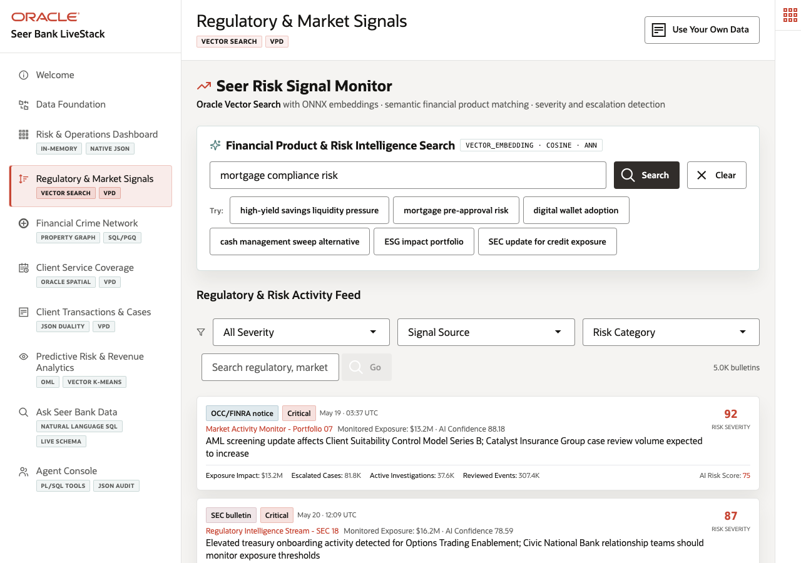

# Scene 4: Regulatory & Market Signals

## Introduction

A compliance analyst at Seer Bank needs to understand which products and institutions are affected by regulatory, market, branch, and fraud signals. Keyword search is not enough because signals arrive in varied language. This scene shows Oracle Vector Search using in-database embeddings to match meaning across finance products and bulletins.

Estimated Time: 10 minutes

### Objectives

In this scene, you will:
- Run a semantic search over financial products and risk signals.
- Filter the signal feed by severity, source, and text.
- Review a specific signal and product match.
- Explain how Oracle vector search keeps semantic retrieval close to governed finance data.

## Task 1: Run a product and risk signal search

1. Click **Regulatory & Market Signals**.
2. In **Financial Product & Risk Intelligence Search**, enter `mortgage compliance risk`.
3. Click **Search**.
4. Point to the returned product matches. The verified stack returned **Mortgage Pre-Approval Series C** from NorthBridge Investments with a similarity score near 0.4656 and $995,000 exposure value, followed by related mortgage and loan portfolio review products.

The data point proves that the app can connect a plain-language compliance phrase to products, institutions, and exposure without exact keyword matching.

## Task 2: Inspect a matching signal bulletin

1. Use the feed search field or the result list to review signals related to the same phrase.
2. Point out the live bulletin **Credit risk signal detected for Mortgage Pre-Approval; NorthBridge Investments exposure limits need review**.
3. Use the similarity score near 0.6272 and the source **Client Exposure Engine - Branch 13** as your evidence point.
4. Explain that the page reports the active embedding model as `ALL_MINILM_L12_V2` with 384-dimensional vectors.

This is a compliance workflow: the analyst can start with business language and land on a specific product, institution, signal, and exposure.

## Task 3: Tell the Oracle value story

1. Open **Oracle Internals**.
2. Point to `VECTOR_EMBEDDING`, `VECTOR_DISTANCE(COSINE)`, approximate search, and the product and signal embedding tables.
3. Explain that Oracle AI Database keeps the sensitive finance data, embeddings, and search results inside the governed data layer.

## Credits & Build Notes
- **Author** - Oracle LiveLabs Team
- **Last Updated By/Date** - Oracle LiveLabs Team, 2026-05-20
- **Build Notes** - Search evidence was verified with `/api/social/semantic-search` and `/api/social/post-search` on the running stack.
