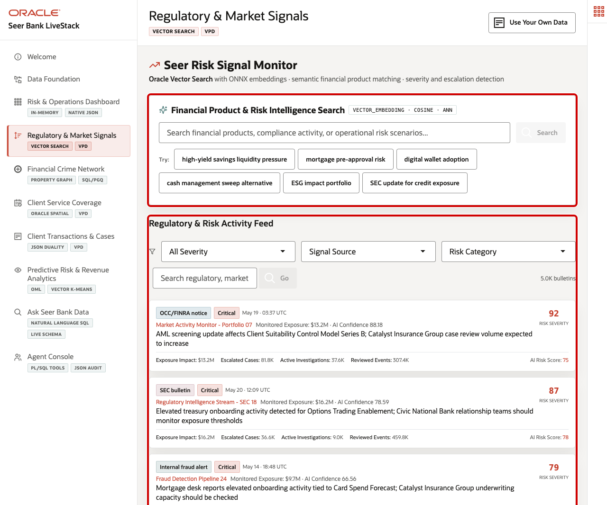
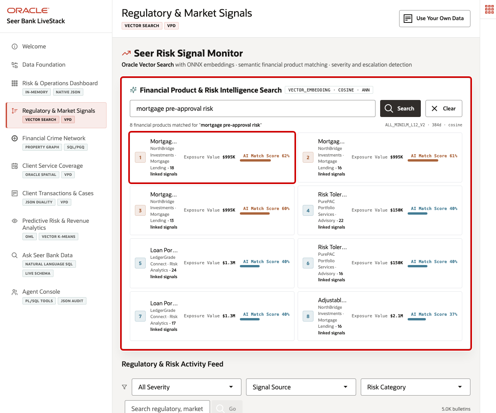
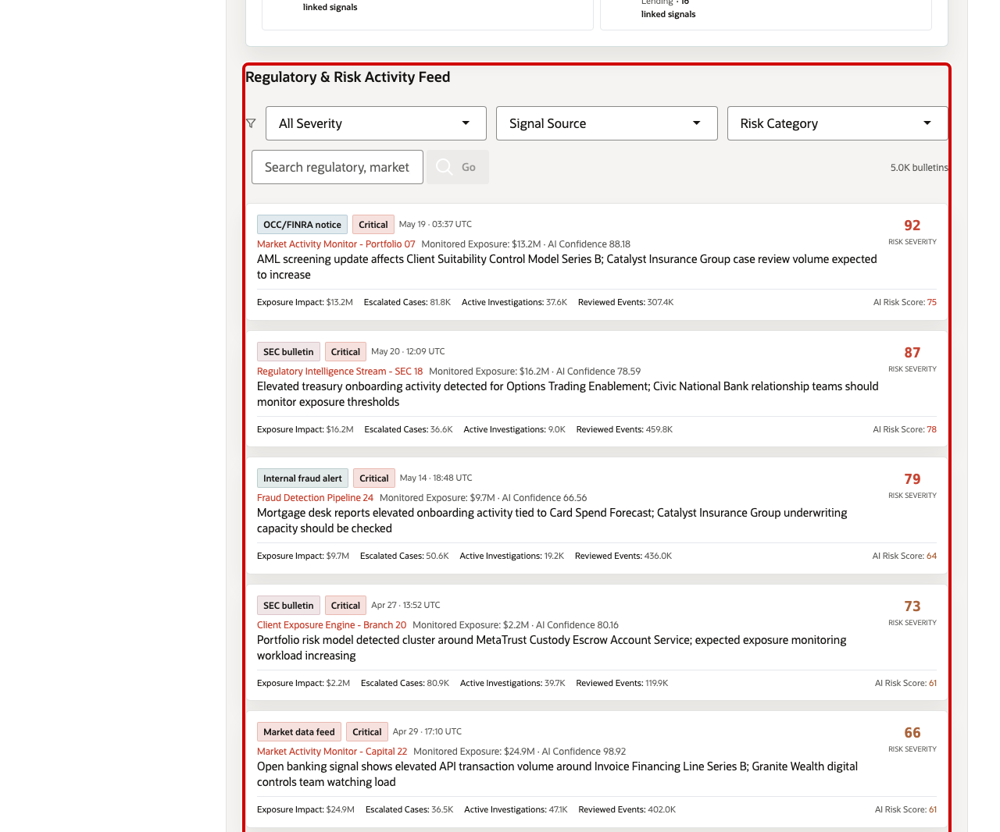
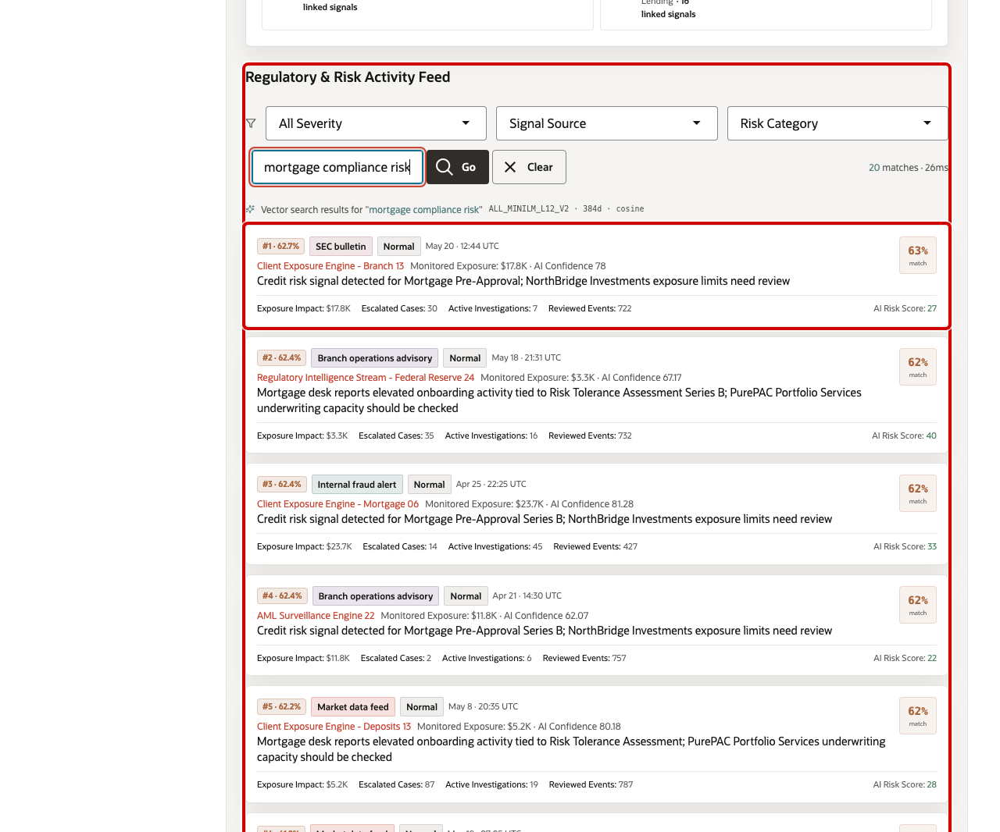

# Scene 4 Regulatory & Market Signals

## Introduction

A compliance analyst, risk intelligence analyst, or financial product risk manager uses this page to understand which products and institutions are affected by regulatory, market, branch, and fraud signals before those signals become separate escalations. This persona is looking for patterns in regulatory notices, credit-risk bulletins, internal fraud alerts, branch advisories, product exposure, institution names, and signal severity. The goal is to connect plain-language risk activity to specific financial products quickly enough to act.

Secure semantic search is difficult to implement when financial product data, compliance bulletins, embeddings, search indexes, and security policies live in separate systems. Finance teams often have to move sensitive signal text into external AI services, synchronize vector indexes, duplicate product catalogs, and then rebuild access control outside the database.

Oracle AI Database helps address these challenges by keeping vector search, SQL, row-level security, and operational finance data together. In this scene, Oracle AI Database can create embeddings inside the database, so sensitive product and regulatory signal data does not need to be sent to external AI services or exposed through another processing layer. Oracle Vector Search can embed a business query, compare it against financial product or signal embeddings, and return ranked matches while Oracle security policies continue to govern which data the user can see.

Estimated Time: 10 minutes

### Objectives

In this scene, you will:
- Review the two main areas of **Regulatory & Market Signals**: **Financial Product & Risk Intelligence Search** and **Regulatory & Risk Activity Feed**.
- Use a demo query in **Financial Product & Risk Intelligence Search** to see how risk language returns similar financial products.
- Use a demo query in **Regulatory & Risk Activity Feed** to see how regulatory and market bulletins are ranked by semantic similarity.
- Review how the page connects to Oracle Vector Search, embeddings, cosine distance, approximate nearest-neighbor search, and VPD-based security.

## Task 1: Review the Regulatory & Market Signals page

1. Click **Regulatory & Market Signals**.
2. Review **Financial Product & Risk Intelligence Search** at the top of the page. This section searches the financial product catalog by meaning, not only by exact keywords.
3. Review **Regulatory & Risk Activity Feed** below it. This section searches regulatory notices, market activity, internal fraud alerts, branch advisories, and credit-risk bulletins.
4. Keep the **Oracle Internals** sidebar collapsed while following the screenshots. If you expand it, it shows that the page uses `VECTOR_EMBEDDING`, `VECTOR_DISTANCE(COSINE)`, approximate nearest-neighbor search, product embeddings, signal embeddings, semantic matches, and VPD-based row-level security.

Pay attention to the data points behind the page: the demo has pre-embedded financial product vectors, signal bulletin vectors, and semantic matches. This is the foundation that lets a finance user search by risk intent instead of relying only on product names, exact regulatory terms, or manually curated tags.

## Task 2: Run Financial Product & Risk Intelligence Search

1. In **Financial Product & Risk Intelligence Search**, click the demo query **mortgage pre-approval risk**.
2. Review the returned product matches.

The demo query is embedded at runtime and compared against financial product embeddings stored in Oracle AI Database. The results show ranked products, institution, category, exposure value, linked signal count, and AI match score. For example, the live stack returns **Mortgage Pre-Approval** from **NorthBridge Investments** with **$995K** exposure value, **18** linked signals, and an AI match score around **62%**.

This helps a compliance or product-risk user translate vague business language into concrete products that may need exposure review, underwriting-capacity checks, or deeper signal analysis.

## Task 3: Review Regulatory & Risk Activity Feed

1. Scroll to **Regulatory & Risk Activity Feed**.
2. Review the default feed. Each bulletin shows signal source, severity, timestamp, monitored exposure, AI confidence, signal text, exposure impact, escalated cases, active investigations, reviewed events, and AI risk score.
3. Use the severity, signal source, or risk category filters if you want to narrow the feed.

This section helps the user monitor where risk attention is building. For example, the live feed shows an **AML screening update** affecting **Client Suitability Control Model Series B**, with a **Critical** severity label and a risk severity score of **92**. A high-severity bulletin can indicate a regulatory obligation, fraud workflow, product exposure change, or service-capacity issue worth investigating.

## Task 4: Run a Regulatory & Risk Activity Feed query

1. In the Regulatory & Risk Activity Feed search field, enter `mortgage compliance risk`.
2. Click **Go**.
3. Review the ranked bulletin matches.

The result view changes from the default feed to vector search results for the query. Each result shows match rank and similarity percentage, signal source, severity label, timestamp, monitored exposure, AI confidence, signal text, and operational metrics. For example, the live stack returns **Credit risk signal detected for Mortgage Pre-Approval; NorthBridge Investments exposure limits need review** from **Client Exposure Engine - Branch 13** with a match score around **62.7%**.

This shows how Oracle AI Database can search unstructured regulatory and market language semantically while still keeping the search tied to governed financial product and exposure data.

You can move to the next scene.

## Credits & Build Notes
- **Author** - Oracle LiveLabs Team
- **Last Updated By/Date** - Oracle LiveLabs Team, 2026-05-21
