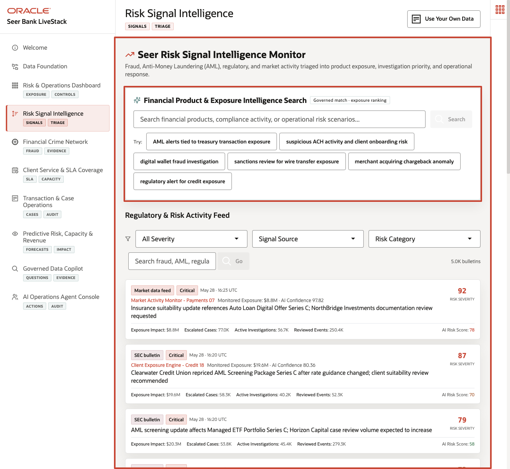
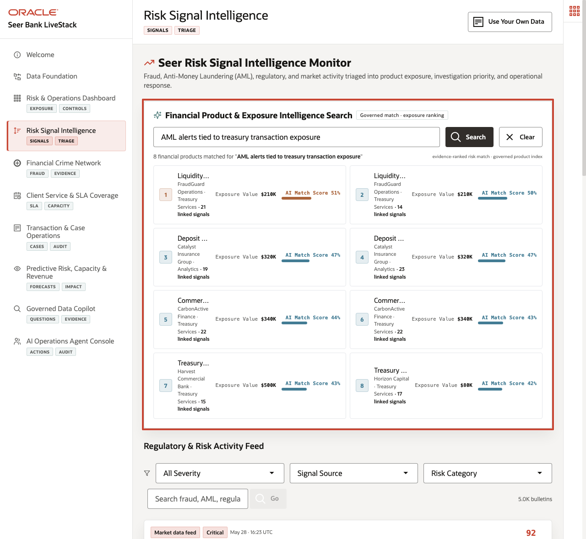
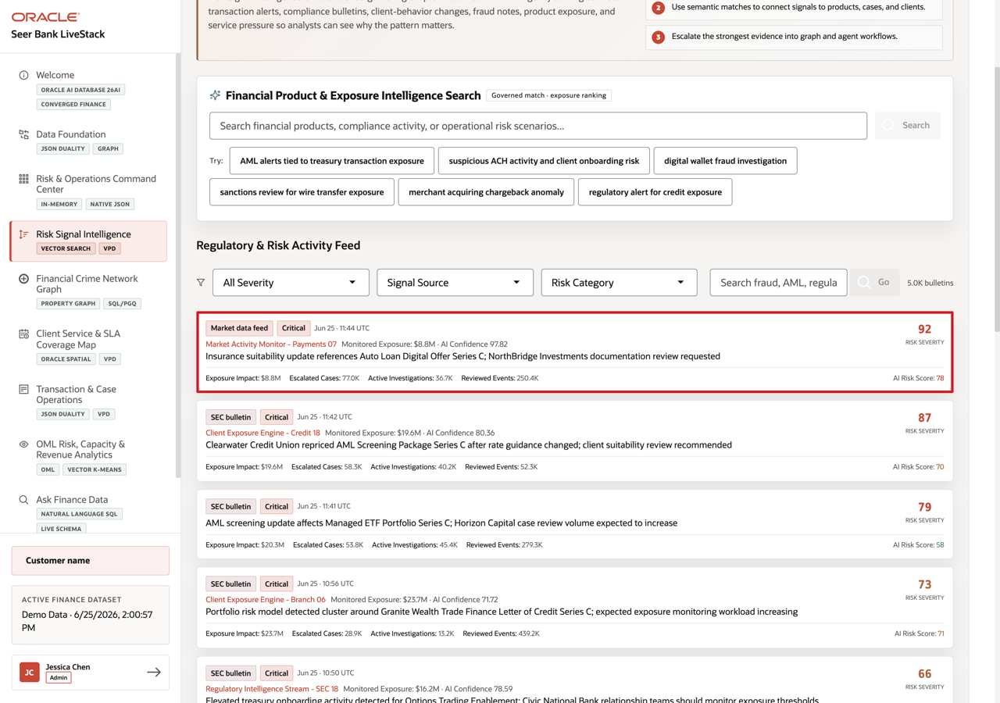
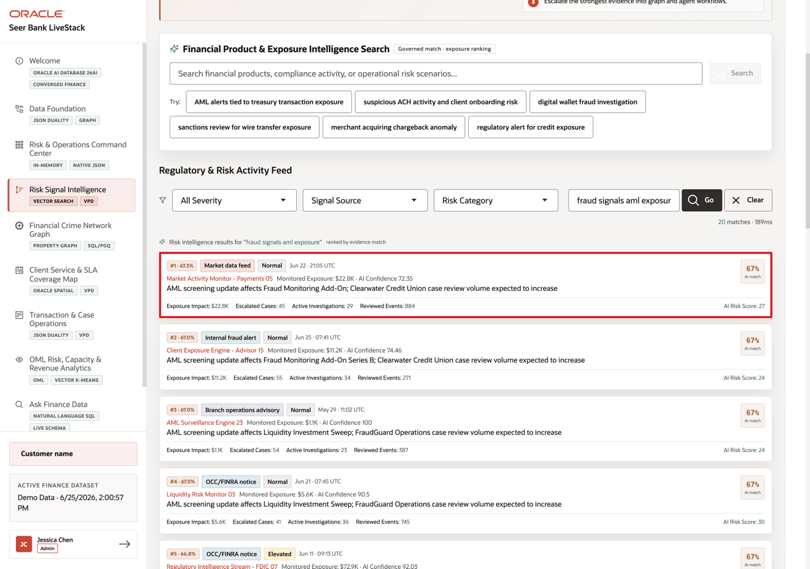

# Scene 4 Risk Signal Intelligence

## Introduction

**Regulatory & Market Signals** helps compliance and risk teams identify emerging issues before they become separate escalations. The page connects plain-language regulatory, market, branch, fraud, and product-risk signals to specific financial products and institutions that may need review.

Secure semantic search is difficult to implement when financial product data, compliance bulletins, embeddings, search indexes, and security policies live in separate systems. Finance teams often have to move sensitive signal text into external AI services, synchronize vector indexes, duplicate product catalogs, and then rebuild access control outside the database.

**Oracle AI Database** helps address these challenges by keeping vector search, SQL, row-level security, and operational finance data together. In this scene, Oracle AI Database can create embeddings inside the database, so sensitive product and regulatory signal data does not need to be sent to external AI services or exposed through another processing layer.

**Oracle Vector Search** can embed a business query, compare it against financial product or signal embeddings, and return ranked matches while Oracle security policies continue to govern which data the user can see.

Estimated Time: **10 minutes**

### Objectives

In this scene, you will learn what finance decision the page supports, what evidence the user should inspect, and what action the business may take next.

## Task 1: Review the Risk Signal Intelligence page

Perform the following set of steps to show how risk and compliance users can search by risk intent, not only by exact product names, regulatory terms, or manually curated tags.

1. Click **Risk Signal Intelligence** in the sidebar.
2. Review **Financial Product & Exposure Intelligence Search** at the top of the page. This section searches the financial product catalog by meaning, not only by exact keywords.
3. Review **Regulatory & Risk Activity Feed** below it. This section searches regulatory notices, market activity, internal fraud alerts, branch advisories, and credit-risk bulletins.
4. Keep the **Oracle Internals** sidebar collapsed while following the screenshots. If you expand it, it shows that the page uses `VECTOR_EMBEDDING`, `VECTOR_DISTANCE(COSINE)`, approximate nearest-neighbor search, product embeddings, signal embeddings, semantic matches, and VPD-based row-level security.

These embedded product and signal representations let finance users search by risk intent instead of relying only on exact product names, regulatory language, or manually maintained tags.

**Notes:**
- The system ranks results by meaning similarity. Then mention VECTOR_DISTANCE as the database capability that performs that comparison.
- Access controls help ensure users see only the financial data they are allowed to see, which matters for clients, transactions, cases, regional access, and AI.

## Task 2: Run Financial Product & Exposure Intelligence Search

Perform the following set of steps to show how a vague risk question can become a ranked list of products and institutions that may need exposure review, underwriting-capacity checks, or deeper signal analysis.

1. In **Financial Product & Exposure Intelligence Search**, click the demo query **mortgage pre-approval risk**.
2. Review the returned product matches.

The demo query is embedded at runtime and compared against financial product embeddings stored in Oracle AI Database. The results show ranked products, institution, category, exposure value, linked signal count, and AI match score. In the current live stack, the query returns **Mortgage Pre-Approval** from **NorthBridge Investments** first, with **$995K** exposure value, **18** linked signals, and an AI match score around **64%**.

**Note:** Sample values may change after data refreshes or rebuilds. Verify live output before presenting, then explain the business takeaway.

This helps compliance and product-risk users turn vague business language into a concrete review list for exposure checks, underwriting capacity, signal analysis, or escalation.

## Task 3: Review Regulatory & Risk Activity Feed

Perform the following set of steps to see where risk attention is building across sources, severity labels, affected products, exposure, and operational metrics.

1. Scroll to **Regulatory & Risk Activity Feed**.
2. Review the default feed. Each bulletin shows signal source, severity, timestamp, monitored exposure, AI confidence, signal text, exposure impact, escalated cases, active investigations, reviewed events, and AI risk score.
3. Use the severity, signal source, or risk category filters if you want to narrow the feed.

This section helps the user monitor where risk attention is building. For example, the live feed includes high-severity bulletins such as **AML Screening Package Series C** at **Clearwater Credit Union** and treasury onboarding activity tied to exposure thresholds.

A high-severity bulletin can indicate a regulatory obligation, fraud workflow, product exposure change, or service-capacity issue worth investigating.

## Task 4: Run a Regulatory & Risk Activity Feed query

Perform the following set of steps to investigate a specific risk theme across bulletins and signals that may use different wording. This helps users find relevant regulatory and market activity faster.

1. In the Regulatory & Risk Activity Feed search field, enter `fraud signals aml exposure`.
2. Click **Go**.
3. Review the ranked bulletin matches.

The result view changes from the default feed to vector search results for the query. Each result shows match rank and similarity percentage, signal source, severity label, timestamp, monitored exposure, AI confidence, signal text, and operational metrics.

This shows how Oracle AI Database can search unstructured regulatory and market language semantically while still keeping the search tied to governed financial product and exposure data.

In the current live stack, the query returns **AML screening update affects Fraud Monitoring Add-On; Clearwater Credit Union case review volume expected to increase** from **Market Activity Monitor - Payments 05** with an AI match score around **67%**.

**Note:** Sample values may change after data refreshes or rebuilds. Verify live output before presenting, then explain the business takeaway.

*You can move to the next scene.*

## Credits & Build Notes
- **Author** - Oracle LiveLabs Team
- **Last Updated By/Date** - Oracle LiveLabs Team, 2026-05-28
