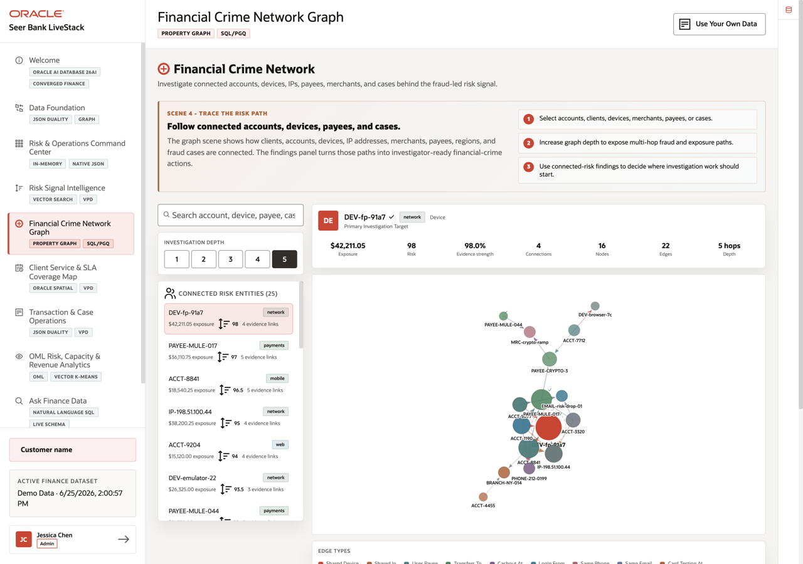
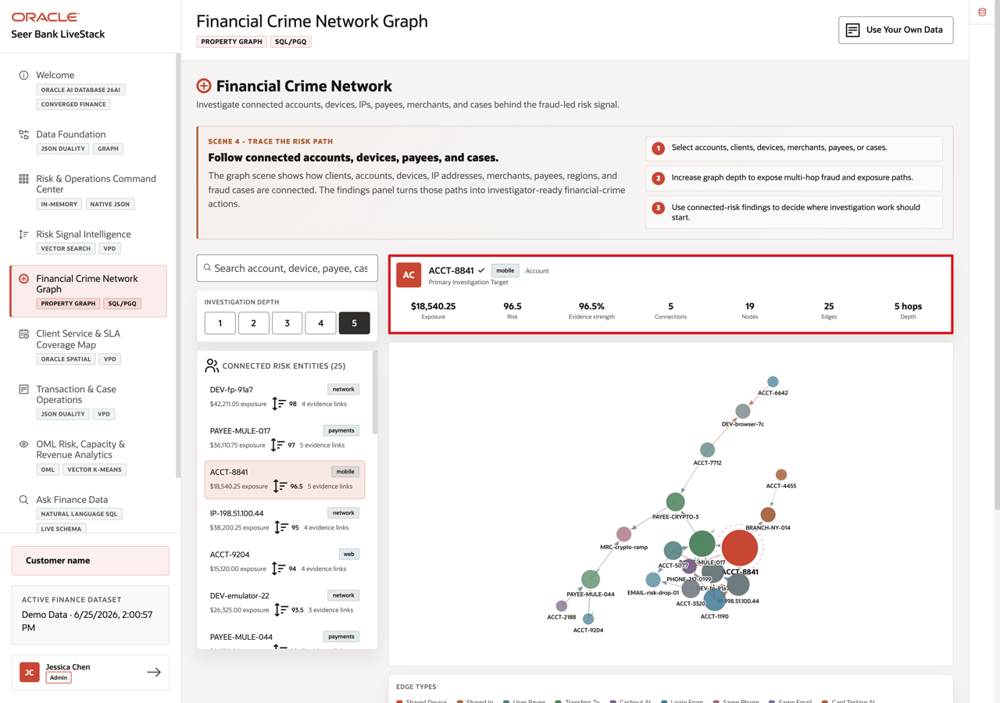
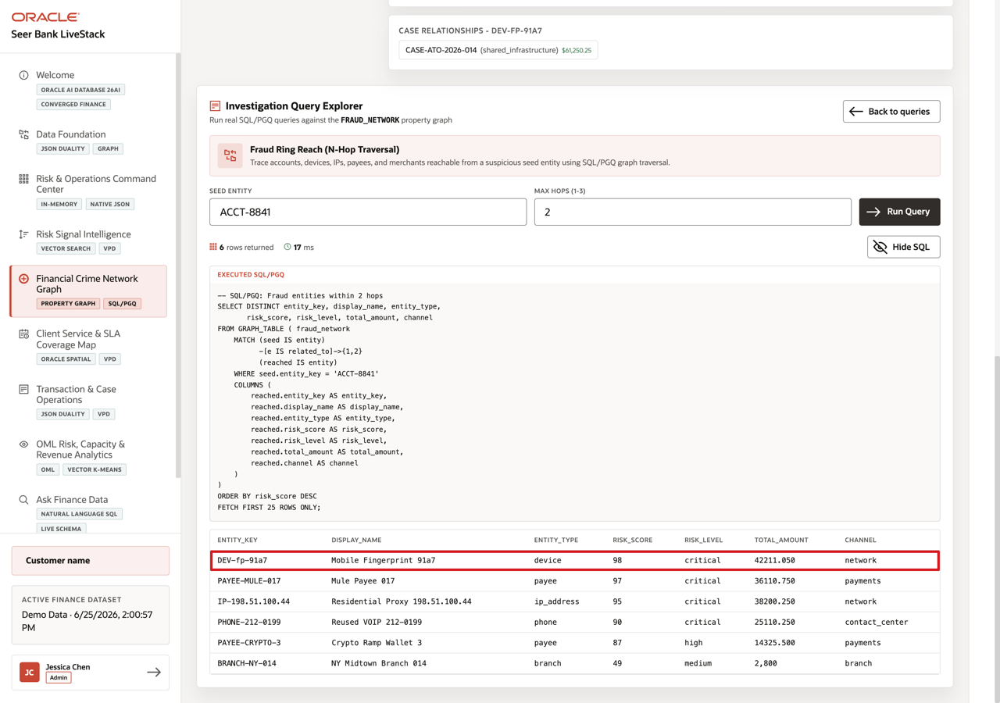
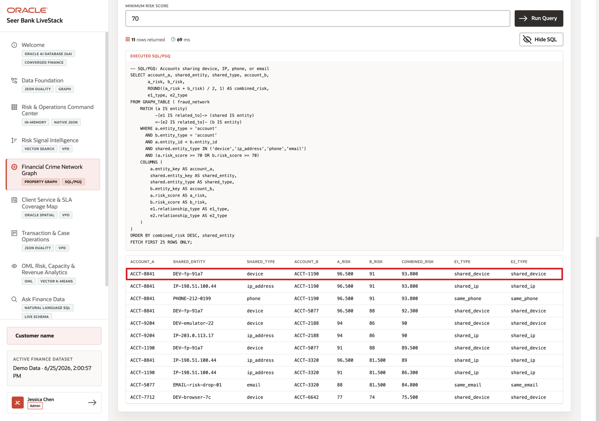
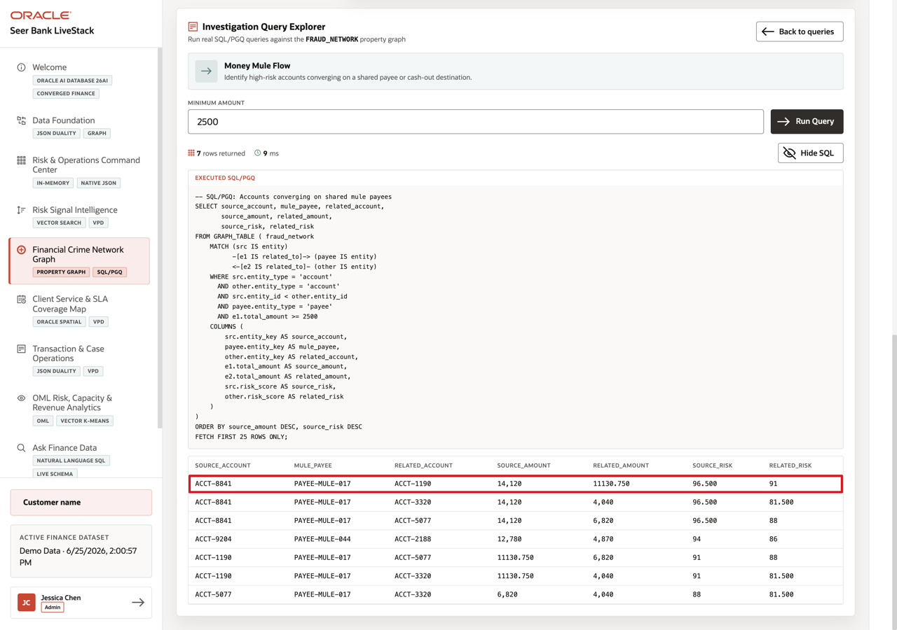
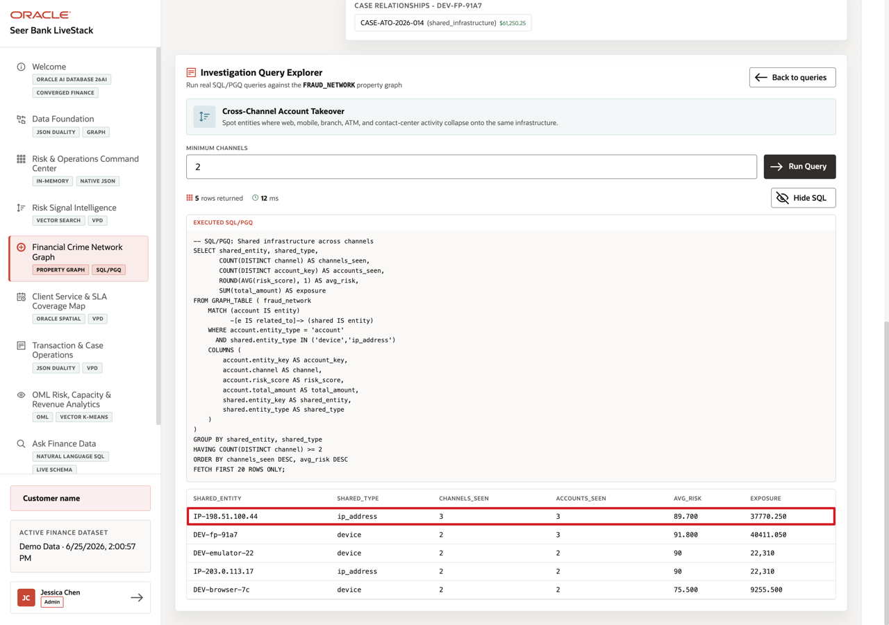
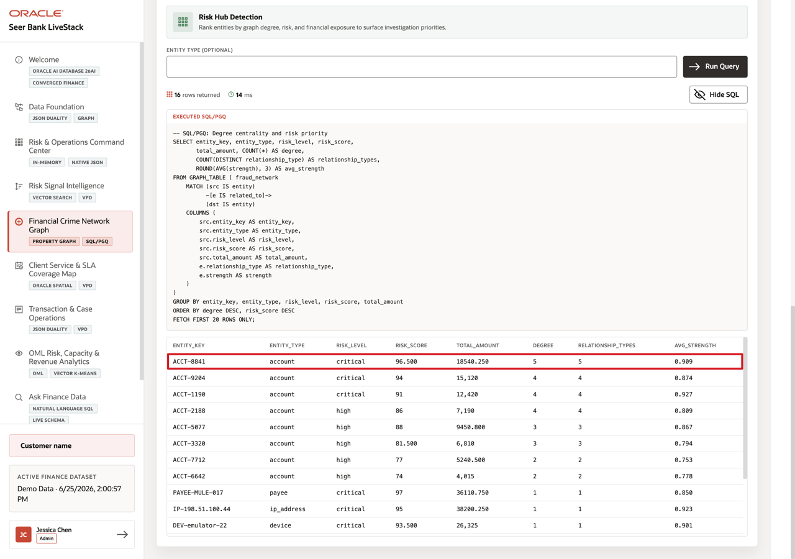

# Scene 5 Financial Crime Network

## Introduction

**Financial Crime Network** helps investigators see whether accounts, devices, IP addresses, payees, branches, and cases are connected. Instead of reviewing one alert at a time, the user can inspect relationship patterns that may reveal account takeover, mule activity, shared infrastructure, or high-risk hubs.

Finance teams struggle when the information needed for one decision lives in separate tools. That separation slows action, increases reconciliation work, and makes it harder to trust the result.

Oracle AI Database helps answer relationship questions, such as which accounts share infrastructure, where money may flow, or which entities act as risk hubs.

Estimated Time: **10 minutes**

### Objectives

In this scene, you will learn what finance decision the page supports, what evidence the user should inspect, and what action the business may take next.

## Task 1: Review the Financial Crime Network page

Perform the following set of steps to move beyond individual alerts. The graph helps investigators see relationships among accounts, devices, IP addresses, payees, channels, branches, and cases.

1. Click **Financial Crime Network** in the sidebar.
2. Review the connected risk entity list on the left. The list includes risk score, exposure, channel, and number of graph links.
3. Set **Investigation Depth** to **5** to expose the full multi-hop pattern used in this walkthrough.
4. Review the graph workspace. The graph connects accounts, devices, IP addresses, payees, branches, phones, emails, merchants, and cases through relationship types such as shared device, shared IP, uses payee, same phone, and opened with.

In the current demo dataset, investigation account **ACCT-8841** has **$18,540.25** exposure and a risk score of **96.5**. At 5 hops, its network contains **19** nodes and **25** edges. Use that account to set the scene: the investigator is not reviewing a single alert, but a connected account-takeover and mule-payment pattern.

**Note:** Sample values may change after data refreshes or rebuilds. Verify live output before presenting, then explain the business takeaway.

## Task 2: Inspect the selected account data point

Perform the following set of steps to compare its direct risk score with the surrounding relationship pattern. The account matters because shared infrastructure and mule-payment links can reveal more risk than a single alert.

1. Select **ACCT-8841** if it is not already selected.
2. Review the account metrics above the graph. The selected account shows **$18,540.25** exposure, **96.5** risk score, **96.5%** evidence strength, **5** direct connections, **19** nodes, **25** edges, and **5** hops.
3. Compare the account row on the left with the graph on the right. The row tells you the account's direct risk context; the graph shows how that account connects to devices, payees, IP addresses, phone numbers, and a case.
4. Use the visible relationships as the demo evidence: **shared_device** to **DEV-fp-91a7** with strength **0.982**, **uses_payee** to **PAYEE-MULE-017** with strength **0.971**, **shared_ip** to **IP-198.51.100.44** with strength **0.963**, and **same_phone** to **PHONE-212-0199** with strength **0.934**.

Focus on ACCT-8841 because its relationships suggest shared infrastructure and mule-payment behavior, which are stronger investigation clues than a risk score alone.

## Task 3: Run Fraud Ring Reach

Perform the following set of steps to identify high-risk entities within the account’s investigation radius. This helps investigators prioritize which connected devices, payees, IP addresses, or accounts deserve closer review.

1. Scroll to **Investigation Query Explorer**.
2. Select **Fraud Ring Reach (N-Hop Traversal)**.
3. Use the default seed entity **ACCT-8841** and set **Max Hops** to **2**.
4. Click **Run Query**.
5. Review the returned entities.

Focus on the top results. In the current demo dataset, the query returns **6** reachable entities. The top result is **DEV-fp-91a7**, a device with risk score **98**, followed by **PAYEE-MULE-017** with risk score **97** and **IP-198.51.100.44** with risk score **95**. This is the point of the graph query: reach is not just a count of connected nodes. It shows which high-risk entities sit within the account's investigation radius.

**Note:** Sample values may change after data refreshes or rebuilds. Verify live output before presenting, then explain the business takeaway.

## Task 4: Run Shared Device/IP Cluster

Perform the following set of steps to find accounts connected by the same device or IP address. This can support account linking, escalation, case merge decisions, or deeper account-takeover investigation.

1. Click **Back to queries** if you are still viewing the previous query result.
2. Select **Shared Device/IP Cluster**.
3. Use the default **Minimum Risk Score** value of **70**.
4. Click **Run Query**.
5. Review the account pairs and shared entities returned by the graph query.

Focus on the first row. The query shows **ACCT-8841** sharing **DEV-fp-91a7** with **ACCT-1190**, with a combined risk score of **93.8**. This helps a financial-crime user identify a device fingerprint that connects multiple risky accounts and may justify account linking, escalation, or a case merge.

**Note:** Sample values may change after data refreshes or rebuilds. Verify live output before presenting, then explain the business takeaway.

## Task 5: Run Money Mule Flow

Perform the following set of steps to see whether multiple risky accounts connect to the same payee destination. This helps explain possible mule behavior and supports investigation prioritization.

1. Click **Back to queries**.
2. Select **Money Mule Flow**.
3. Use the default **Minimum Amount** value of **2500**.
4. Click **Run Query**.
5. Review the source account, mule payee, related account, and amount columns.

Focus on the first row. In the current demo dataset, **ACCT-8841** connects to **PAYEE-MULE-017**, which is also connected to **ACCT-1190**. The source amount is **$14,120.00** and the related amount is **$11,130.75**. This gives the investigator a concrete money-mule pattern to explain: multiple risky accounts converge on the same payee destination.

**Note:** Sample values may change after data refreshes or rebuilds. Verify live output before presenting, then explain the business takeaway.

## Task 6: Run Cross-Channel Account Takeover

 Perform the following set of steps to identify infrastructure that appears across multiple channels, such as mobile, web, branch, ATM, or contact center. This helps investigators see fraud patterns that would be missed inside a single channel.

1. Click **Back to queries**.
2. Select **Cross-Channel Account Takeover**.
3. Use the default **Minimum Channels** value of **2**.
4. Click **Run Query**.
5. Review the shared infrastructure, channel count, account count, average risk, and exposure columns.

Focus on **IP-198.51.100.44**. The query identifies this IP address as shared infrastructure across **3** channels and **3** accounts, with average risk **89.7** and exposure of **$37,770.25**. This result helps show how account-takeover evidence can span mobile, web, branch, ATM, or contact-center activity instead of staying inside one channel.

**Note:** Sample values may change after data refreshes or rebuilds. Verify live output before presenting, then explain the business takeaway.

## Task 7: Run Risk Hub Detection

Perform the following set of steps to find entities that connect many high-risk relationships. These hubs can help investigators decide where to focus first.

1. Click **Back to queries**.
2. Select **Risk Hub Detection**.
3. Leave **Entity Type** blank so the query ranks all entity types.
4. Click **Run Query**.
5. Review the returned rows.

Focus on the top result. In the current demo dataset, **ACCT-8841** is ranked as a risk hub with **5** graph relationships, **5** relationship types, risk score **96.5**, total amount **$18,540.25**, and average relationship strength **0.909**. This result is useful because it turns the visual graph into an investigation priority signal.

**Note:** Sample values may change after data refreshes or rebuilds. Verify live output before presenting, then explain the business takeaway.

The query runs against the `FRAUD_NETWORK` property graph using SQL/PGQ-style traversal and aggregation. A financial-crime team can use the same approach to identify shared devices, mule flows, cross-channel takeover infrastructure, and high-degree risk hubs from governed Oracle data.

*You can move to the next scene.*

## Credits & Build Notes
- **Author** - Oracle LiveLabs Team
- **Last Updated By/Date** - Oracle LiveLabs Team, 2026-06-29
