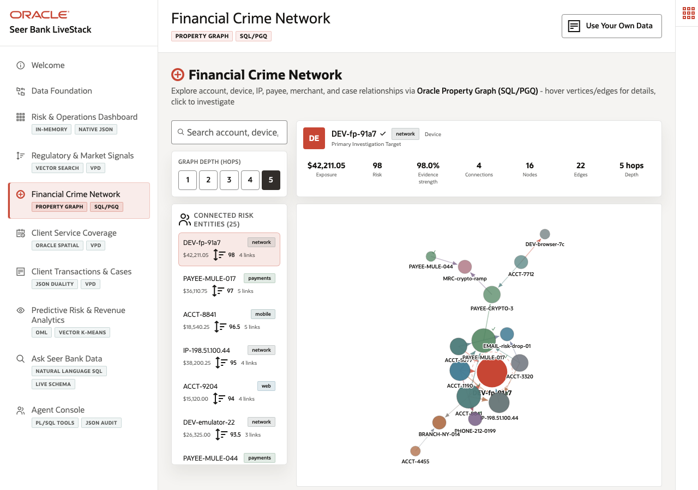

# Scene 5: Financial Crime Network

## Introduction

A financial-crime investigator needs to see whether suspicious accounts, devices, IP addresses, payees, merchants, cards, branches, and cases are connected. Flat transaction lists make this difficult because fraud patterns often depend on relationships. This scene uses Oracle Property Graph and SQL/PGQ patterns to expose connected risk.

Estimated Time: 10 minutes

### Objectives

In this scene, you will:
- Open the **Financial Crime Network** page.
- Investigate a suspicious seed entity.
- Review graph nodes, edges, depth, exposure, and risk score.
- Connect the graph evidence to fraud investigation outcomes.

## Task 1: Start with a suspicious account

1. Click **Financial Crime Network**.
2. Use the search box to find `ACCT-8841`, or use the first selected account if it is already visible.
3. Set graph depth to 2 hops for a compact investigation view.
4. Point out the live seed entity **Premier Checking 8841**. The verified deployment reported risk score 96.5, exposure $18,540.25, 5 direct connections, and a 2-hop network with 11 nodes and 16 edges.

This gives the investigator a concrete starting point rather than a generic graph picture.

## Task 2: Explain the connected evidence

1. Review the linked entities around `ACCT-8841`.
2. Use these live relationships as your walkthrough points:
   - `shared_device` to **DEV-fp-91a7** with strength 0.982.
   - `shared_ip` to **IP-198.51.100.44** with strength 0.963.
   - `uses_payee` to **PAYEE-MULE-017** with strength 0.971.
   - `same_phone` to **PHONE-212-0199** with strength 0.934.
3. Hover or click nodes when presenting to show details such as entity type, risk level, city, exposure, and event count.

The evidence point is that the account is not suspicious in isolation. It sits in a connected account-takeover and mule-payment pattern.

## Task 3: Use the graph query cards

1. Review the example query cards, such as **Fraud Ring Reach**, **Shared Device/IP Cluster**, **Money Mule Flow**, **Cross-Channel Account Takeover**, and **Risk Hub Detection**.
2. Run one query only if you have time; otherwise explain that each card maps to a graph traversal pattern.
3. Open **Oracle Internals** to show SQL/PGQ, `GRAPH_TABLE()`, n-hop traversal, vertex and edge tables, and case evidence.

## Credits & Build Notes
- **Author** - Oracle LiveLabs Team
- **Last Updated By/Date** - Oracle LiveLabs Team, 2026-05-20
- **Build Notes** - Graph evidence was verified with `/api/graph/influencers`, `/api/graph/network/1?depth=2`, and `/api/graph/example-queries`.
