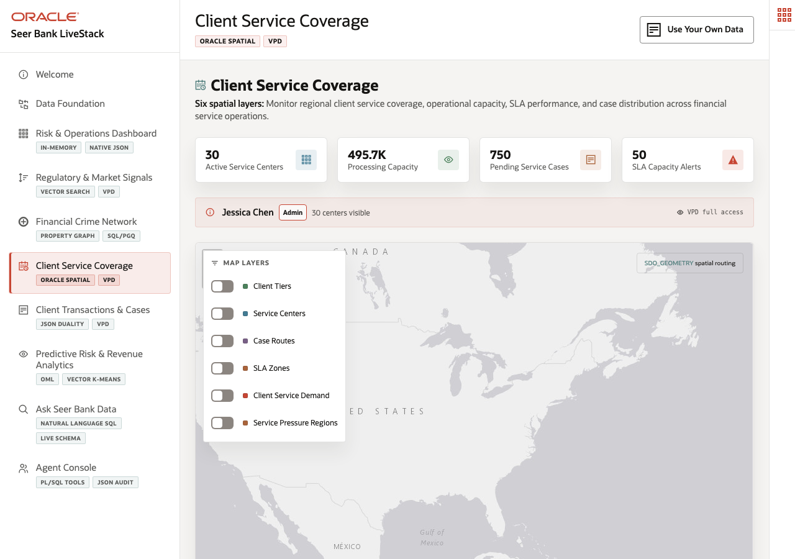

# Scene 6: Client Service Coverage

## Introduction

A Seer Bank client-service operations manager needs to understand service-center capacity, SLA zones, case routes, client tiers, and regional service pressure. Geography matters because customer experience and compliance exposure depend on where clients and service teams are located. This scene shows Oracle Spatial supporting service coverage decisions.

Estimated Time: 10 minutes

### Objectives

In this scene, you will:
- Open **Client Service Coverage**.
- Review service-center, capacity, pending case, and SLA alert metrics.
- Toggle spatial layers on the map.
- Use a concrete region, center, and capacity alert as demo evidence.

## Task 1: Review the coverage overview

1. Click **Client Service Coverage**.
2. Review the top cards for active service centers, processing capacity, pending service cases, and SLA capacity alerts.
3. Point to a live service-center example. The verified stack included **Aberdeen East Coast Banking Center** in Maryland with 240,000 capacity units, 5.2 percent load, 54 products available, and 23 pending shipments/cases.

The operations manager can use this page to explain where capacity exists before drilling into routes or demand pressure.

## Task 2: Compare map layers and demand regions

1. Toggle layers such as **Client Tiers**, **Service Centers**, **Case Routes**, **SLA Zones**, **Client Service Demand**, and **Service Pressure Regions**.
2. Use **New York Metro** as a concrete region: the live data reported demand index 91, average 7-day forecast 199, and peak social factor 2.08.
3. Point out that the deployment reported 120 database-backed fulfillment zones generated from Oracle spatial geometry.

The map turns client service risk into a spatial decision instead of a spreadsheet-only queue.

## Task 3: Inspect a capacity alert

1. Review the capacity or alert list on the page.
2. Use **Client Profitability Analysis** at **Middletown Mid-Atlantic Branch Hub** as an example: the live alert showed quantity on hand 10, reorder point 41, deficit -31, and critical capacity status.
3. Open **Oracle Internals** and point to `SDO_GEOMETRY`, `SDO_GEOM.SDO_DISTANCE`, `SDO_BUFFER`, R-Tree spatial index, GeoJSON conversion, and VPD controls.

## Credits & Build Notes
- **Author** - Oracle LiveLabs Team
- **Last Updated By/Date** - Oracle LiveLabs Team, 2026-05-20
- **Build Notes** - Spatial evidence was verified with `/api/fulfillment/centers`, `/api/fulfillment/inventory-alerts`, `/api/fulfillment/zones`, and `/api/fulfillment/demand-regions`.
