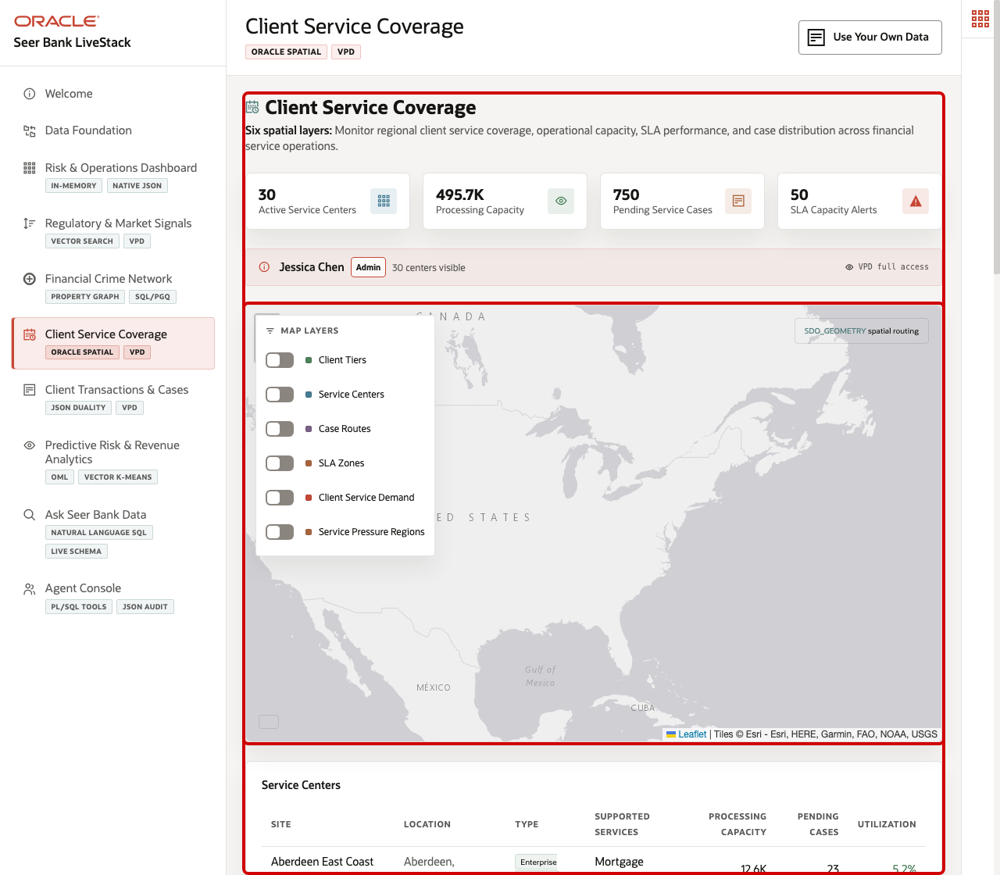
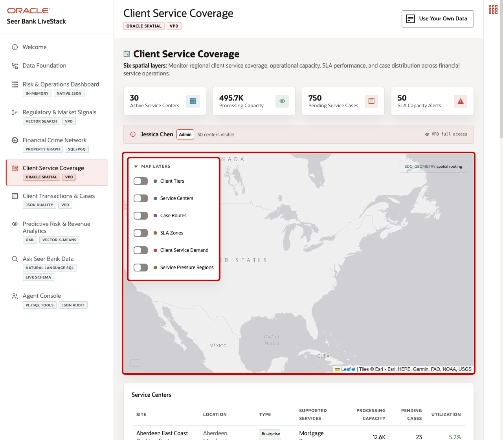
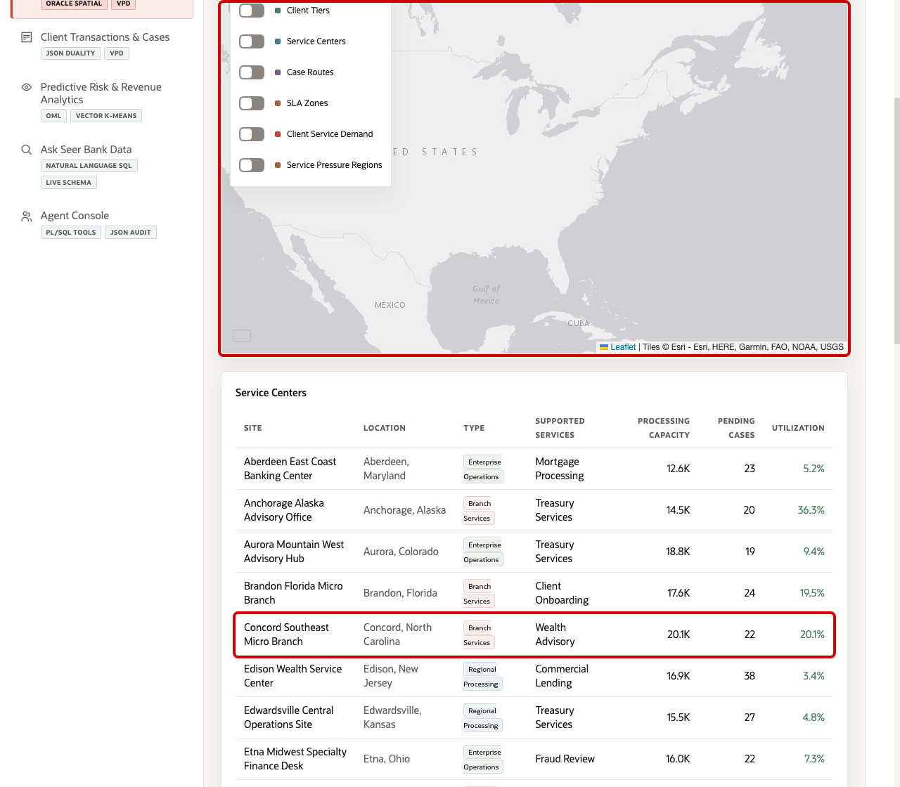
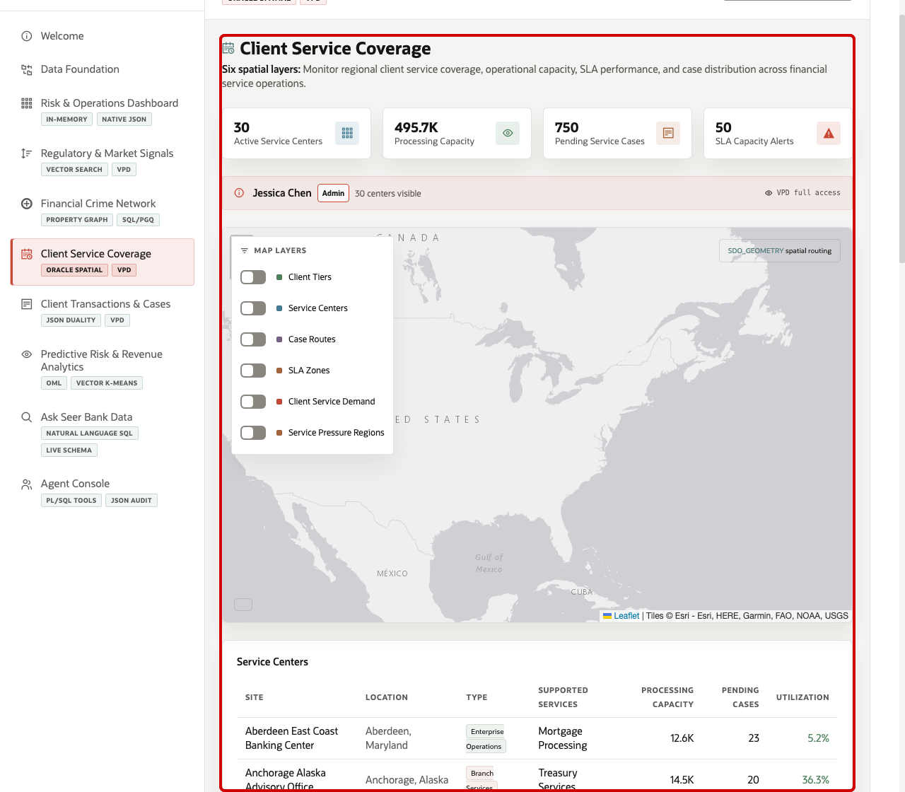

# Scene 6 Client Service Coverage

## Introduction

A client-service operations manager, branch network planner, SLA owner, or compliance operations lead uses this page to understand where client demand, service-center capacity, case activity, and regional service coverage are putting pressure on the banking network. This persona needs to answer practical questions quickly: which regions are heating up, which centers have capacity, where service cases are already pending, and which products may need attention before SLA performance is affected.

This is difficult to implement when branch systems, client geography, service case queues, product capacity, SLA zones, and forecasting signals live in separate applications. Teams may have a dashboard for cases, a different tool for maps, another report for service-center capacity, and a separate forecast file. That separation makes it hard to explain why a service action should be taken now.

Oracle AI Database helps address these challenges by keeping spatial, relational, service-center, client, case, demand forecast, and security-governed data together. Oracle Spatial stores service centers, SLA zones, clients, routes, and demand regions as `SDO_GEOMETRY`. SQL can use distance, buffered zones, and GeoJSON conversion to power the map and operational tables without moving the data into a separate GIS platform. The Oracle Internals sidebar shows the SQL evidence behind the page, including `SDO_GEOM.SDO_DISTANCE`, `SDO_BUFFER`, `SDO_UTIL.TO_GEOJSON`, and the VPD policy that controls service-center visibility.

Estimated Time: 10 minutes

### Objectives

In this scene, you will:
- Review the **Client Service Coverage** page and the main service KPIs.
- Explore spatial demand and SLA coverage layers on the map.
- Inspect service-center load and pending case context.
- Investigate a capacity alert that combines product position, service demand, and compliance pressure.
- Understand how Oracle Spatial and governed operational data support location-aware finance decisions.

## Task 1: Review the client-service network context

1. Click **Client Service Coverage** in the sidebar.
2. Review the KPI tiles at the top of the page. They summarize active service centers, processing capacity, pending service cases, and SLA capacity alerts.
3. Review the VPD banner below the tiles. It shows which demo user is active and whether the page is using full access or a region-filtered service view.
4. Review the map workspace. This is where service centers, SLA zones, client tiers, case routes, demand density, and service-pressure regions can be layered together.

In the current demo dataset, the page shows **30** active service centers, about **495.7K** units of processing capacity, **750** pending service cases, and **50** SLA capacity alerts. Use those numbers to set the operational scene: this is not a single branch decision, but a network decision across service capacity, geography, and active client demand.

## Task 2: Explore spatial demand and service coverage

1. In **Map Layers**, turn on **SLA Zones** and **Service Pressure Regions** if they are not already active.
2. Review the dashed service-zone rings around service locations. These show how coverage changes by service tier.
3. Review the service-pressure polygons. The demand index color scale helps identify regions where demand pressure is higher.
4. Open the collapsed **Oracle Internals** sidebar if you want to inspect the spatial SQL behind the map.

Use the map to explain how the same database can serve operational and spatial questions. Service teams can look at client tiers and service-center coverage together with regional demand signals. In the current demo dataset, **New York Metro** has demand index **91**, average 7-day forecast **203**, peak signal factor **2.08x**, and **2** forecasted products. The same page also uses **120** database-backed service-zone records generated from Oracle spatial geometry.

## Task 3: Inspect service-center load

1. Scroll to **Service Centers**.
2. Review the center name, location, type, supported services, total capacity, pending service cases, and load percentage.
3. Focus on **Concord Southeast Micro Branch** as one example. In the current dataset, it is a **Branch Services** location in **Concord, North Carolina**, with **77** products available, about **20.1K** units of capacity, **22** pending service cases, and **20.1%** load.
4. Compare this row with other centers to understand where there may be available capacity or regional pressure.

This table helps the user move from a map-level network view to a center-level operating view. A service operations manager can see which centers have service depth, where case activity is already queued, and whether load levels leave room to absorb demand.

## Task 4: Investigate a capacity alert

1. Scroll to **SLA Capacity Alerts - Compliance and Onboarding Pressure**.
2. Review the top alert rows. Critical rows indicate products or service workflows where available capacity is below the operational threshold.
3. Focus on **Client Profitability Analysis** at **Middletown Mid-Atlantic Branch Hub**.
4. Interpret the row: **10** units are available, the reorder point is **41**, the deficit is **-31**, and the capacity status is **critical**.

This is the data point to emphasize during the demo. The story is that a client analytics product has limited service capacity at a specific branch hub. The operational response could be to shift work to another center, expand analyst coverage, adjust onboarding timing, or alert the compliance team before SLA pressure becomes visible to clients.

The value of Oracle AI Database is that the alert is not calculated in isolation. It combines financial product, service-center, capacity, regional demand, and spatial data in one governed platform, then presents the result in the same interface as maps, SLA zones, and center load.

You can move to the next scene.

## Credits & Build Notes
- **Author** - Oracle LiveLabs Team
- **Last Updated By/Date** - Oracle LiveLabs Team, 2026-05-21
