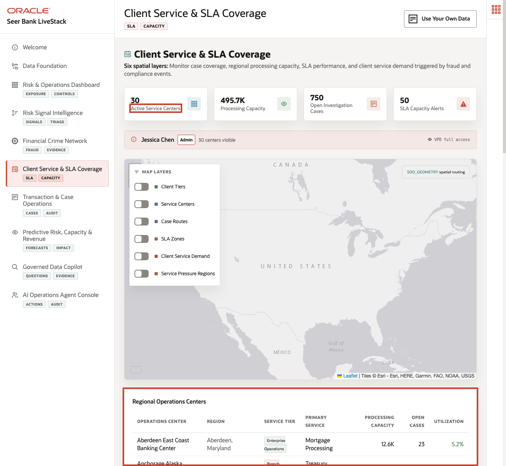
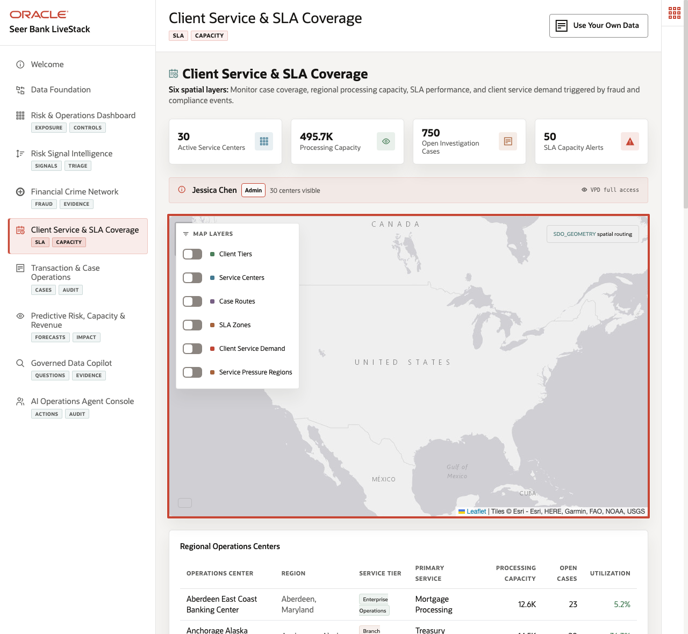
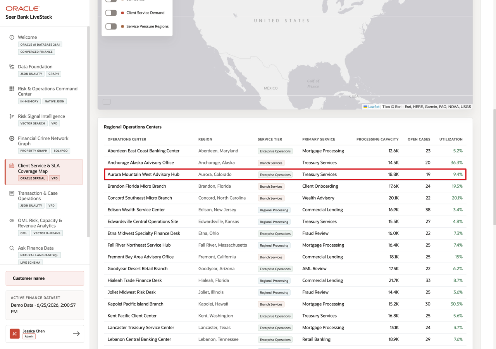
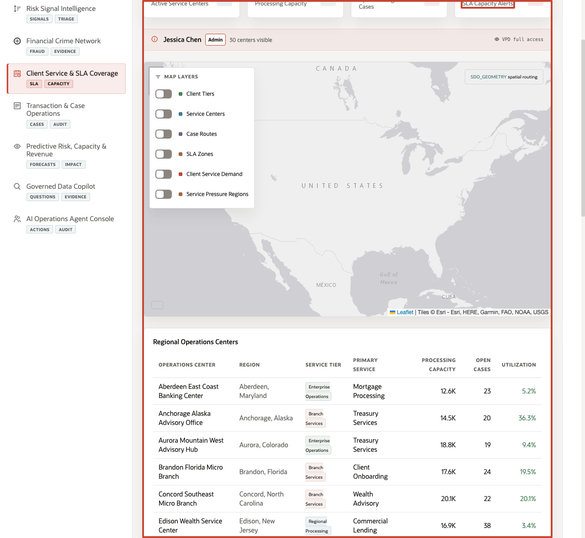

# Scene 6 Client Service & SLA Coverage

## Introduction

**Client Service Coverage** helps operations teams decide where service demand may exceed capacity. The page connects client geography, service-center coverage, case activity, product demand, and SLA pressure so teams can act before service performance is affected.

Finance teams struggle when the information needed for one decision lives in separate tools. That separation slows action, increases reconciliation work, and makes it harder to trust the result.

**Oracle AI Database** helps address these challenges by keeping spatial, relational, service-center, client, case, demand forecast, and security-governed data together. Oracle Spatial stores service centers, SLA zones, clients, routes, and demand regions as `SDO_GEOMETRY`.

SQL can use distance, buffered zones, and GeoJSON conversion to power the map and operational tables without moving the data into a separate GIS platform. The Oracle Internals sidebar shows the SQL evidence behind the page, including `SDO_GEOM.SDO_DISTANCE`, `SDO_BUFFER`, `SDO_UTIL.TO_GEOJSON`, and the VPD policy that controls service-center visibility.

Estimated Time: **10 minutes**

### Objectives

In this scene, you will learn what finance decision the page supports, what evidence the user should inspect, and what action the business may take next.

## Task 1: Review the client-service network context

Perform the following set of steps to understand whether client demand can be handled within available coverage, capacity, and SLA expectations.

1. Click **Client Service & SLA Coverage** in the sidebar.
2. Review the KPI tiles at the top of the page. They summarize active service centers, processing capacity, pending service cases, and SLA capacity alerts.
3. Review the VPD banner below the tiles. It shows which demo user is active and whether the page is using full access or a region-filtered service view.
4. Review the map workspace. This is where service centers, SLA zones, client tiers, case routes, demand density, and service-pressure regions can be layered together.

In the current demo dataset, the page shows **30** active service centers, about **495.7K** units of processing capacity, **750** pending service cases, and **50** SLA capacity alerts. Use those numbers to set the operational scene: this is not a single branch decision, but a network decision across service capacity, geography, and active client demand.

**Note:** Sample values may change after data refreshes or rebuilds. Verify live output before presenting, then explain the business takeaway.

## Task 2: Explore spatial demand and service coverage

Perform the following set of steps to see how client location, service-center reach, demand level, and SLA zones affect service decisions.

1. In **Map Layers**, turn on **SLA Zones** and **Service Pressure Regions** if they are not already active.
2. Review the dashed service-zone rings around service locations. These show how coverage changes by service tier.
3. Review the service-pressure polygons. The demand index color scale helps identify regions where demand pressure is higher.
4. Open the collapsed **Oracle Internals** sidebar if you want to inspect the spatial SQL behind the map.

Use the map to explain how the same database can serve operational and spatial questions. Service teams can look at client tiers and service-center coverage together with regional demand signals.

In the current demo dataset, **New York Metro** has demand index **91**, average 7-day forecast **203**, peak signal factor **2.08x**, and **2** forecasted products. The same page also uses **120** database-backed service-zone records generated from Oracle spatial geometry.

**Note:** Sample values may change after data refreshes or rebuilds. Verify live output before presenting, then explain the business takeaway.

## Task 3: Inspect service-center load

Perform the following set of steps to identify centers that may be overloaded or underused. This helps operations teams consider routing, staffing, or capacity adjustments.

1. Scroll to **Service Centers**.
2. Review the center name, location, type, supported services, total capacity, pending service cases, and load percentage.
3. Focus on **Aurora Mountain West Advisory Hub** or **Aberdeen East Coast Banking Center** as one example. The current live stack shows service tiers such as **Enterprise Operations** and supported-service labels such as **Treasury Services** or **Mortgage Processing**.
4. Compare this row with other centers to understand where there may be available capacity or regional pressure.

This table helps the user move from a map-level network view to a center-level operating view. A service operations manager can see which centers have service depth, where case activity is already queued, and whether load levels leave room to absorb demand.

## Task 4: Investigate a capacity alert

Perform the following set of steps to decide whether the business should shift work, expand specialist coverage, adjust onboarding timing, or alert compliance teams before SLA pressure affects clients.

1. Scroll to **SLA Capacity Alerts - Compliance and Onboarding Pressure**.
2. Review the top alert rows. Critical rows indicate products or service workflows where available capacity is below the operational threshold.
3. Focus on **Client Profitability Analysis** at **Middletown Mid-Atlantic Branch Hub**.
4. Interpret the row: **10** units are available at **Middletown Mid-Atlantic Branch Hub**, with an active signal factor of **1x** and a capacity-alert state that needs operational review.

This is the data point to emphasize during the demo. The story is that a client analytics product has limited service capacity at a specific branch hub while signal pressure is active. The operational response could be to shift work to another center, expand analyst coverage, adjust onboarding timing, or alert the compliance team before SLA pressure becomes visible to clients.

he business value is that teams can make the decision from connected, governed data. **Oracle AI Database** provides the shared foundation that keeps the data, analytics, and AI workflow aligned.

*You can move to the next scene.*

## Credits & Build Notes
- **Author** - Oracle LiveLabs Team
- **Last Updated By/Date** - Oracle LiveLabs Team, 2026-05-28
