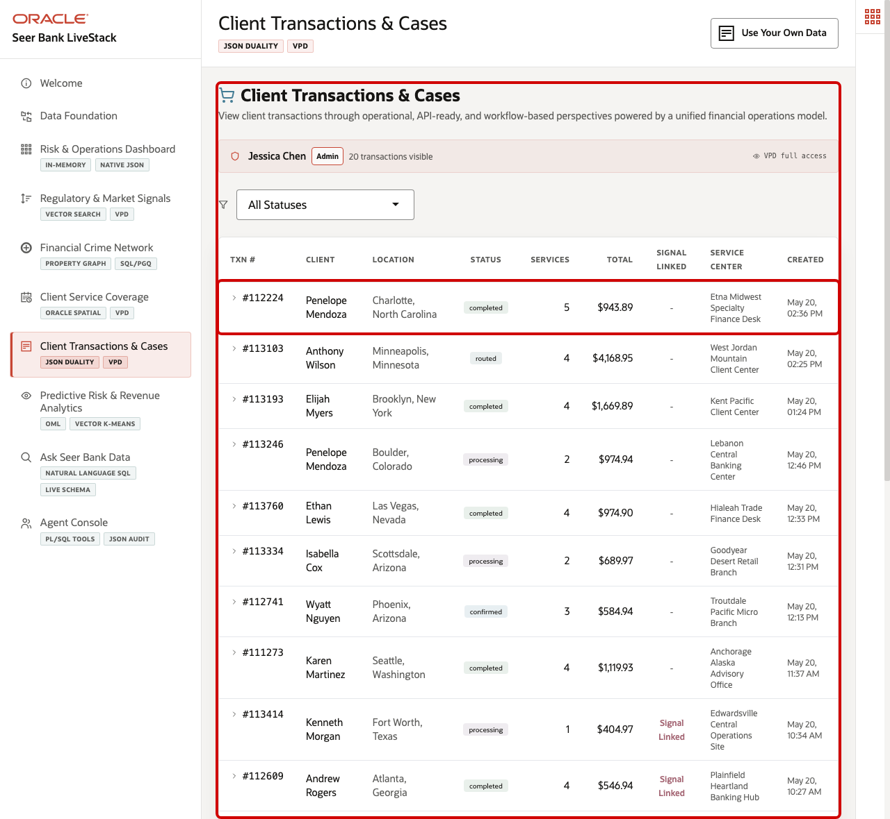
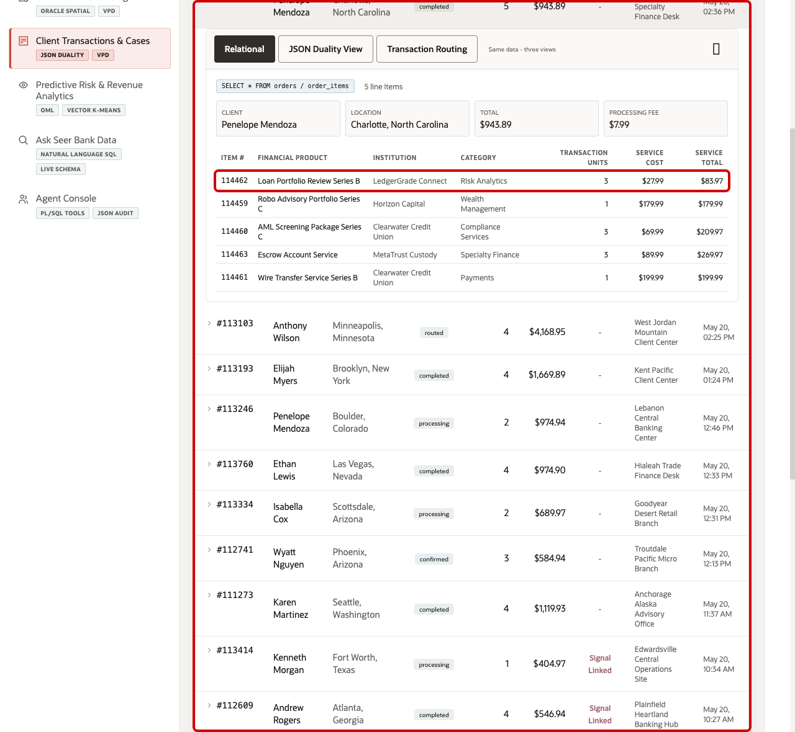
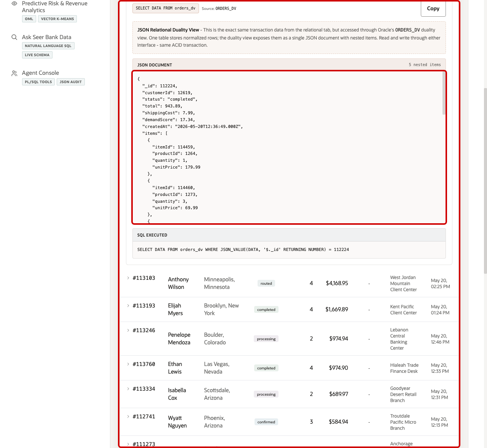
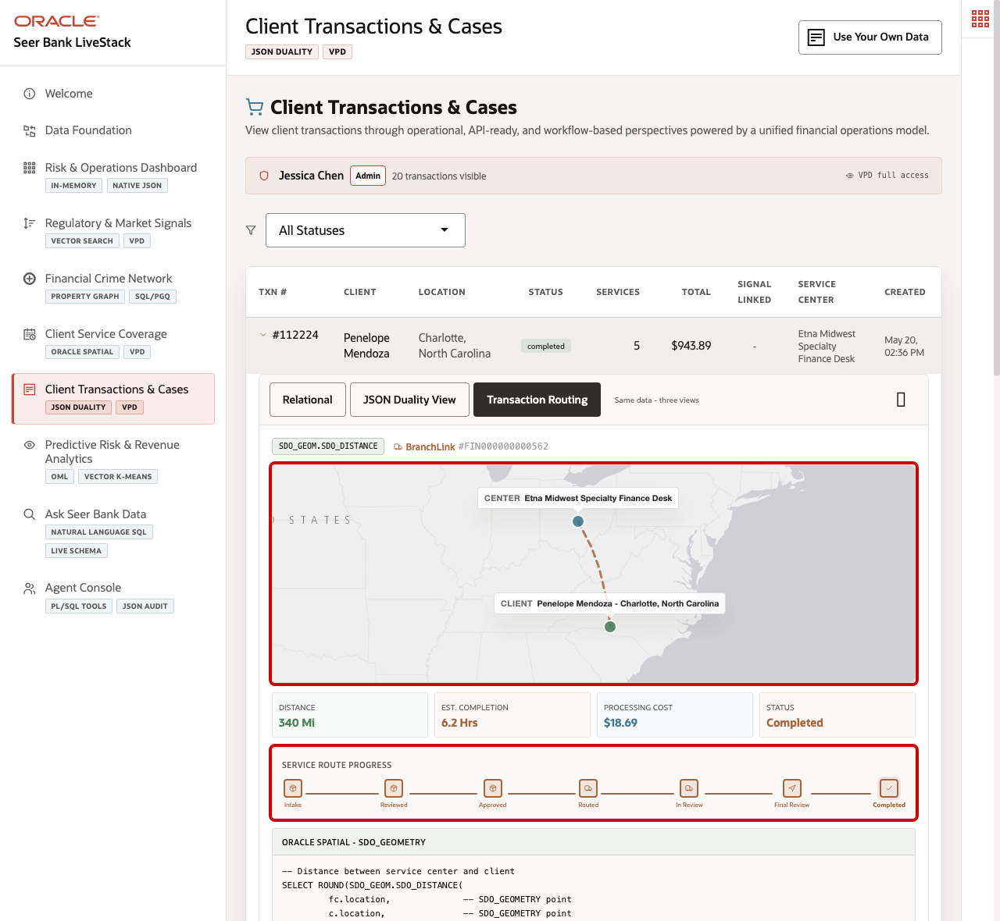

# Scene 7 Client Transactions & Cases

## Introduction

A finance application owner, service operations manager, customer support lead, or partner integration architect uses this page to understand a client transaction from multiple angles. This persona needs a reliable operational view for service teams, a transactional view for case management, an API-friendly document view for applications and partners, and spatial context for service routing.

This is difficult to implement when transaction headers, service line items, client data, service centers, route records, and API payloads are handled in separate systems. Financial institutions often duplicate the same transaction data into a relational database, a document store, a search index, and integration payloads. Each copy creates synchronization risk, stale service answers, and extra engineering work whenever the transaction model changes.

Oracle AI Database helps address these challenges by keeping the transaction record in one governed data platform while exposing it through the shape each workflow needs. Relational tables provide ACID transactions, foreign keys, and operational SQL. JSON Relational Duality Views expose the same transaction as a nested JSON document for application and API use cases. Oracle Spatial adds route and distance context for service visibility, and VPD policies can control which transactions each user can see.

Estimated Time: 10 minutes

### Objectives

In this scene, you will:
- Review the **Client Transactions & Cases** page and the active transaction workspace.
- Inspect a specific transaction row in the table.
- Open the same transaction as relational operational detail.
- Compare that same transaction with the JSON document returned by `ORDERS_DV`.
- Review the service route and service-center context for the transaction.

## Task 1: Review the transaction workspace

1. Click **Client Transactions & Cases** in the sidebar.
2. Review the VPD banner below the page subtitle. It shows the active demo user and whether the user has full access or a region-filtered transaction view.
3. Review the status filter and the transaction table.
4. Focus on transaction **#112224**.

In the current demo dataset, transaction **#112224** is for **Penelope Mendoza** in **Charlotte, North Carolina**. It is marked **completed**, contains **5** service line items, totals **$943.89**, and is handled by **Etna Midwest Specialty Finance Desk**. This transaction will be the data point used through the rest of the scene.

## Task 2: Inspect the relational transaction detail

1. Click transaction **#112224**.
2. Confirm the **Relational** tab is selected.
3. Review the client, location, total, service cost, and line-item table.
4. Review the services in the transaction, such as **Loan Portfolio Review Series B**, **Robo Advisory Portfolio Series C**, **AML Screening Package Series C**, **Escrow Account Service**, and **Wire Transfer Service Series B**.

This view is useful for operations and service teams because it shows normalized transactional data in a format that is easy to validate. The transaction header, client, financial product, category, quantity, unit price, and line total are connected through relational joins while preserving ACID consistency.

## Task 3: Compare the JSON Duality View

1. Click **JSON Duality View** in the expanded transaction panel.
2. Review the source label **ORDERS_DV**.
3. Review the JSON document for transaction **112224**.
4. Notice that the document contains the transaction id, client id, status, total, service cost, demand score, created date, nested line items, and metadata.

This is the key point of the page. The JSON document is not a separate copy of the transaction. It is the same transaction data exposed through an Oracle JSON Relational Duality View. Application teams and partner APIs can work with a transaction-shaped JSON document, while operations teams can continue to use relational tables and SQL. Both interfaces read from the same governed transaction model.

## Task 4: Review service route and fulfillment context

1. Click **Transaction Routing** in the expanded transaction panel.
2. Review the service center and client locations on the map.
3. Review the route context below the map: distance, estimated completion time, processing cost, and transaction status.
4. Review the service route progress timeline.

For transaction **#112224**, the page shows a route from **Etna Midwest Specialty Finance Desk** to **Penelope Mendoza** in **Charlotte, North Carolina**. The transaction is completed, the distance is about **340 miles**, the estimated completion time is about **6.2 hours**, and the processing cost is **$18.69**. This connects the transaction record to service visibility, not just API payloads or transaction totals.

The value of Oracle AI Database is that the same transaction can support client service, operations, partner integration, and route analysis without splitting the story across separate persistence layers. Relational data, JSON Duality documents, spatial distance, route state, and row-level access controls all work from the same connected finance data foundation.

You can move to the next scene.

## Credits & Build Notes
- **Author** - Oracle LiveLabs Team
- **Last Updated By/Date** - Oracle LiveLabs Team, 2026-05-21
