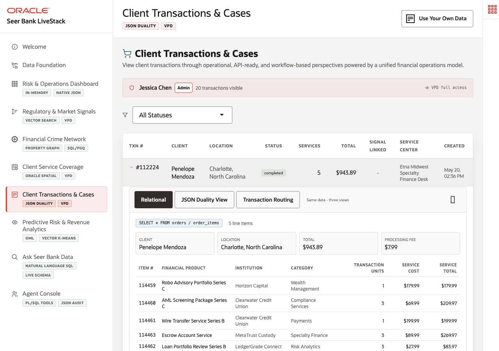

# Scene 7: Client Transactions & Cases

## Introduction

A finance application owner needs transaction data that works for operations teams and modern APIs at the same time. Relational tables are needed for integrity and reporting, while application teams often want document-shaped payloads. This scene shows Oracle JSON Relational Duality views over the same governed transaction data.

Estimated Time: 10 minutes

### Objectives

In this scene, you will:
- Open **Client Transactions & Cases**.
- Expand a client transaction.
- Compare relational, JSON duality, and routing views.
- Explain why document APIs and relational integrity can share one Oracle source of truth.

## Task 1: Expand a live transaction

1. Click **Client Transactions & Cases**.
2. Expand transaction `#112224` if it is visible, or expand the first transaction in the table.
3. Use the verified transaction as your evidence point: order `112224` for **Penelope Mendoza** in Charlotte, North Carolina, completed for $943.89 and routed to **Etna Midwest Specialty Finance Desk**.
4. Point out the service mix in the expanded transaction, including **Robo Advisory Portfolio Series C**, **AML Screening Package Series C**, **Wire Transfer Service Series B**, **Escrow Account Service**, and **Loan Portfolio Review Series B**.

This lets the presenter show a real finance case instead of a generic JSON example.

## Task 2: Compare relational and JSON views

1. In the expanded panel, select **Relational** and review the normalized transaction and line-item fields.
2. Select **JSON Duality View** and show the `ORDERS_DV` document projection.
3. Use the live JSON document as evidence: it exposes `_id`, `customerId`, `status`, `total`, `shippingCost`, `demandScore`, `createdAt`, and nested `items`.

The story is that app teams can serve document-shaped APIs while Oracle remains the ACID system of record.

## Task 3: Review transaction routing context

1. Select **Transaction Routing**.
2. Point out any visible distance, status, processing cost, route, or service-center details.
3. Explain that transaction routing connects the same order to Oracle Spatial service context from Scene 6.

## Credits & Build Notes
- **Author** - Oracle LiveLabs Team
- **Last Updated By/Date** - Oracle LiveLabs Team, 2026-05-20
- **Build Notes** - Transaction evidence was verified with `/api/orders/112224` and `/api/orders/112224/duality`.
