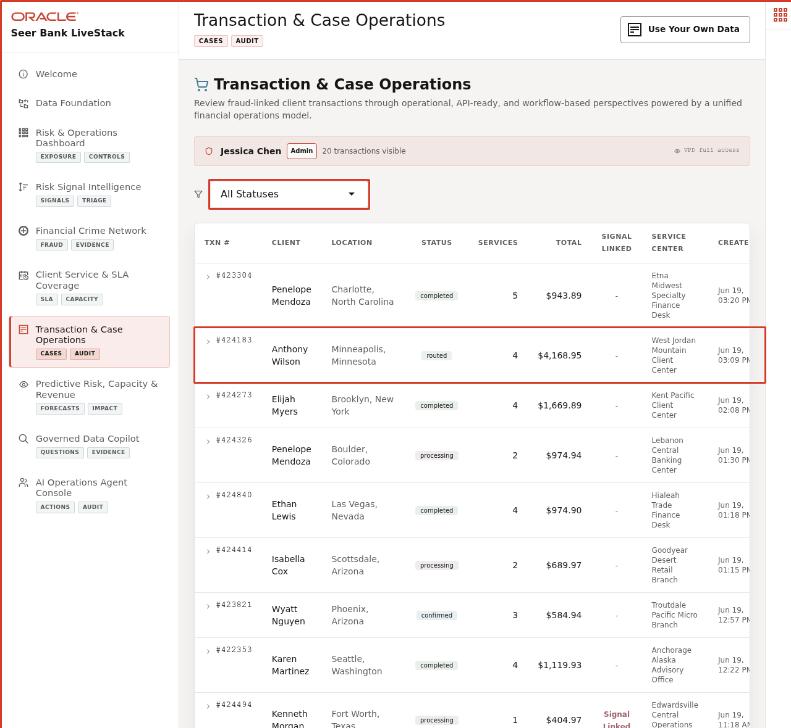
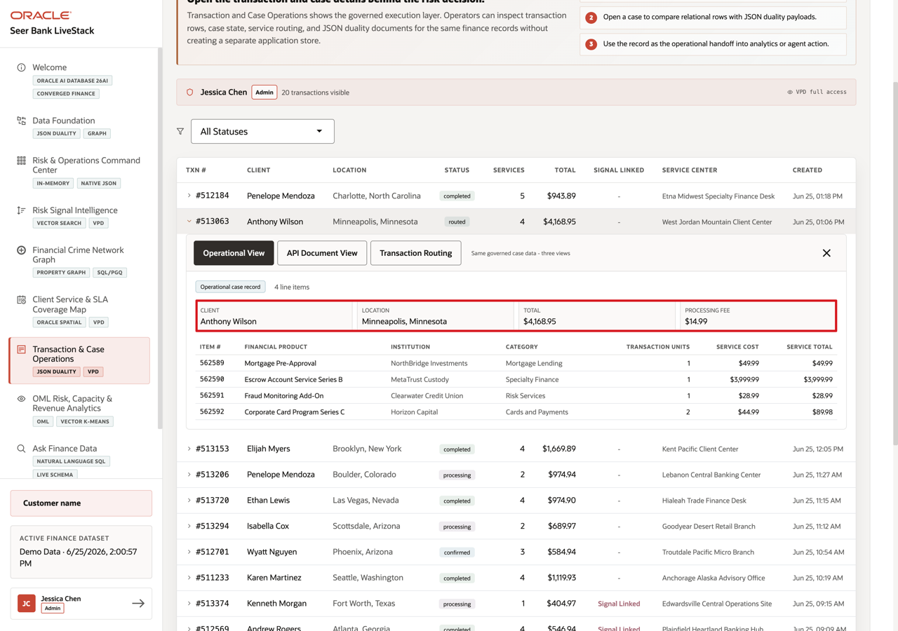
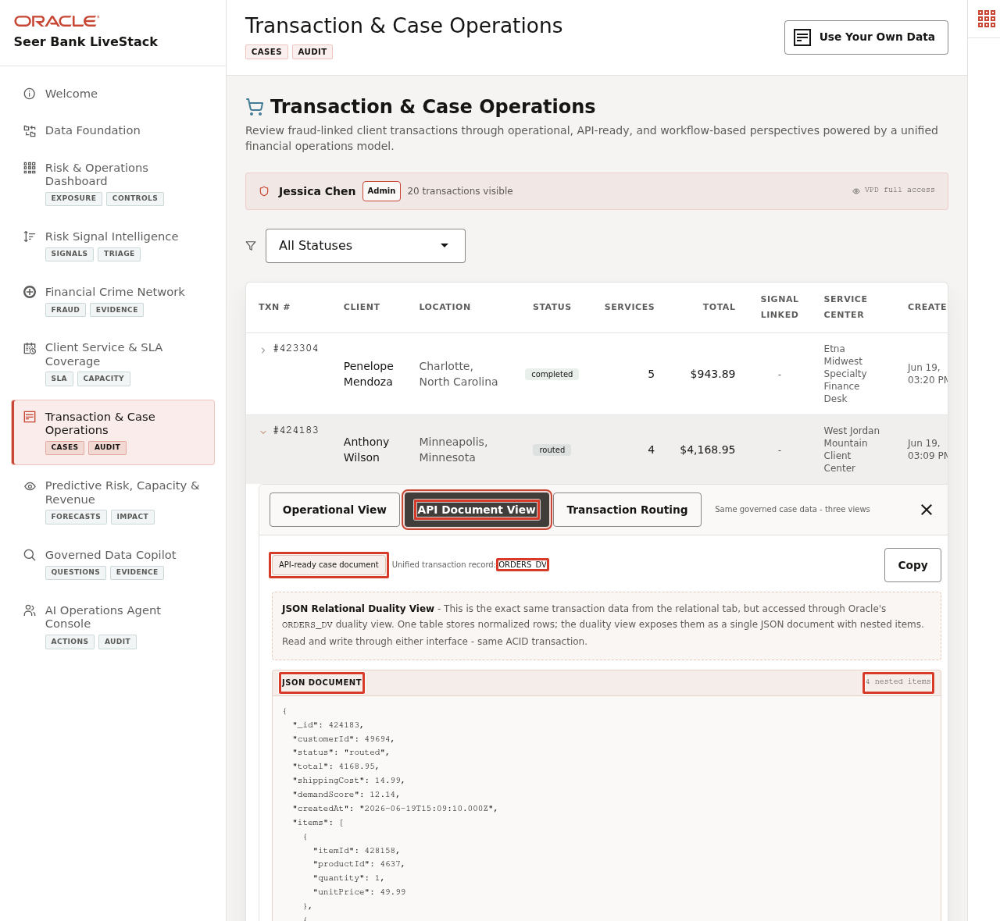
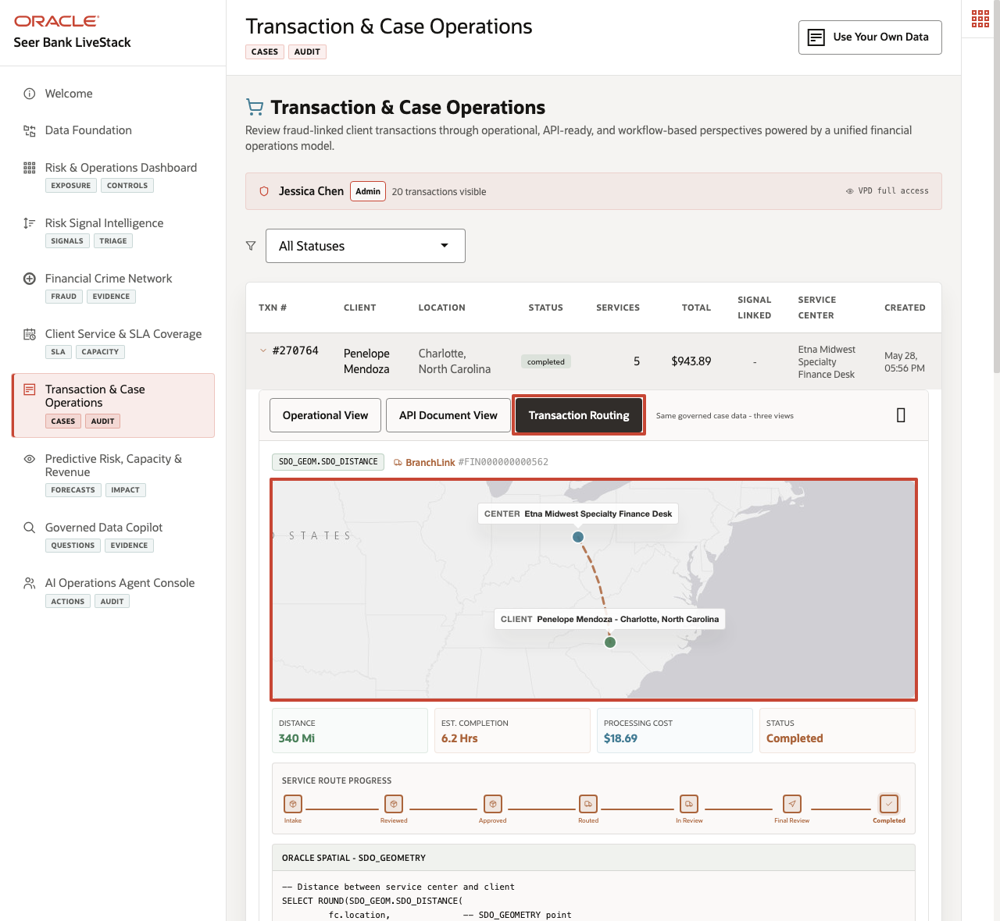

# Scene 7 Transaction & Case Operations

## Introduction

**Client Transactions & Cases** shows how one transaction can serve several finance workflows at once. Service teams need operational detail, case teams need transaction context, applications need a document-shaped view, and operations teams need route and service visibility.

Finance teams struggle when the information needed for one decision lives in separate tools. That separation slows action, increases reconciliation work, and makes it harder to trust the result.

**Oracle AI Database** helps address these challenges by keeping the transaction record in one governed data platform while exposing it through the shape each workflow needs. Relational tables provide ACID transactions, foreign keys, and operational SQL.

**JSON Relational Duality Views** expose the same transaction as a nested JSON document for application and API use cases. Oracle Spatial adds route, distance, and recommended service-center context for service visibility, and VPD policies can control which transactions each user can see.

Estimated Time: **10 minutes**

### Objectives

In this scene, you will learn what finance decision the page supports, what evidence the user should inspect, and what action the business may take next.

## Task 1: Review the transaction workspace

Perform the following set of steps to establish the transaction context and confirm that the user can inspect operational detail, access controls, and service status from one place.

1. Click **Transaction & Case Operations** in the sidebar.
2. Review the VPD banner below the page subtitle. It shows the active demo user and whether the user has full access or a region-filtered transaction view.
3. Review the status filter and the transaction table.
4. Focus on transaction **#424183**.

In the current demo dataset, transaction **#424183** is for **Anthony Wilson** in **Minneapolis, Minnesota**. It is marked **routed**, contains **4** service line items, totals **$4,168.95**, and is currently assigned to **West Jordan Mountain Client Center**. This transaction will be the data point used through the rest of the scene.

**Note:** Sample values may change after data refreshes or rebuilds. Verify live output before presenting, then explain the business takeaway.

## Task 2: Inspect the relational transaction detail

Perform the following set of steps to see the precise client, product, quantity, price, and line-item information that service and operations teams need for validation.

1. Click transaction **#424183**.
2. Confirm the **Operational View** tab is selected.
3. Review the client, location, total, processing fee, and line-item table.
4. Review the services in the transaction: **Fraud Monitoring Add-On**, **Escrow Account Service Series B**, **Corporate Card Program Series C**, and **Mortgage Pre-Approval**.

This view helps service teams answer client and case questions quickly because transaction header, client, product, quantity, price, and line-item details are visible in one place.

## Task 3: Compare the API Document View

Perform the following set of steps to show that the same transaction can support internal operations and application or partner needs without creating separate versions of the record.

1. Click **API Document View** in the expanded transaction panel.
2. Review the source label **ORDERS_DV**.
3. Review the JSON document for transaction **424183**.
4. Notice that the document contains the transaction id, client id, status, total, shipping cost, demand score, created date, nested line items, and metadata.

The key point is that the transaction is not copied into a separate document store. The same trusted transaction can appear as operational detail or as a document shape for applications.

## Task 4: Review service route and recommended service center

Perform the following set of steps to connect the transaction record to service location, distance, capacity coverage, product coverage, and the recommended routing decision.

1. Click **Transaction Routing** in the expanded transaction panel.
2. Review the service center and client locations on the map.
3. Review the **Recommended Service Center** comparison panel.
4. Compare the current assigned center with the recommended center.
5. Review the distance difference, capacity coverage, service coverage, and reason score.

The `optimal_fulfillment` function is the database recommendation source for this panel. Given an order id, it reads the current assigned center, customer location, requested products and quantities, active service centers, and available inventory by center and product. It then uses Oracle Spatial distance in kilometers plus service coverage, available units, capacity margin, and a balanced score to return the top recommended centers and the currently assigned center for comparison.

For transaction **#424183**, the current assigned center is **West Jordan Mountain Client Center** in **West Jordan, Utah**. The recommended center is **Edwardsville Central Operations Site** in **Edwardsville, Kansas**. The recommendation has full service coverage for the transaction, is **670.21 km** from the client, has an estimated completion time of **8.4 hours**, and is **925.79 km** closer than the current assigned center. The recommendation score is **85.0**. The current assigned center covers only **2 of 4** product lines and ranks **11**, so this is a strong example of the application detecting a better operational routing decision.

**Note:** Sample values may change after data refreshes or rebuilds. Verify live output before presenting, then explain the business takeaway.

The business value is that teams can make the decision from connected, governed data. Oracle AI Database provides the shared foundation that keeps the data, analytics, and AI workflow aligned.

Relational data, JSON Duality documents, spatial distance, `optimal_fulfillment`, route state, and row-level access controls all work from the same connected finance data foundation.

*You can move to the next scene.*

## Credits & Build Notes
- **Author** - Oracle LiveLabs Team
- **Last Updated By/Date** - Oracle LiveLabs Team, 2026-06-22
