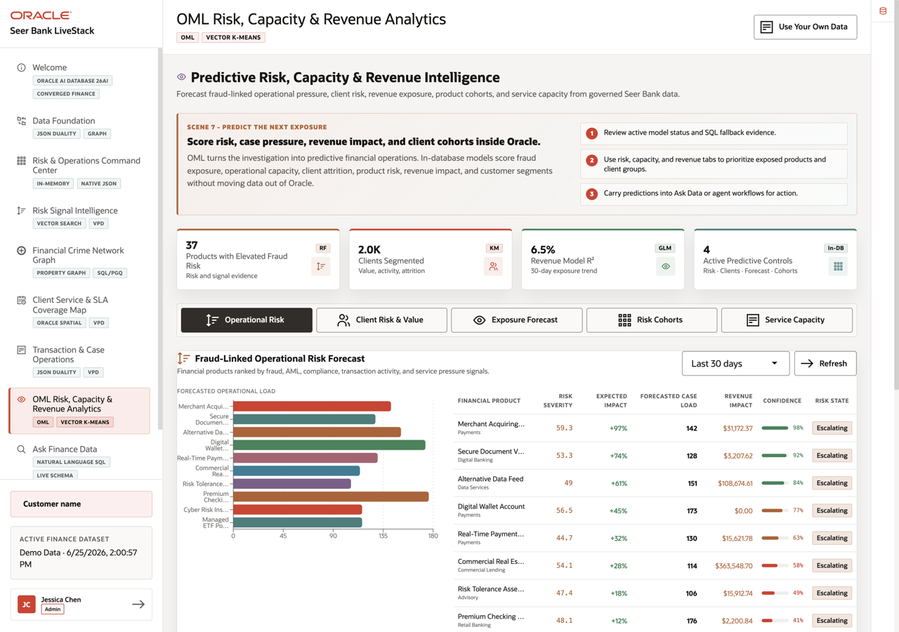
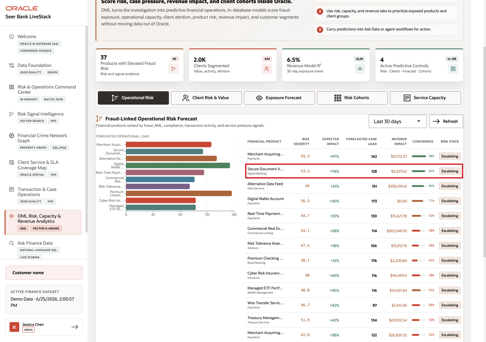
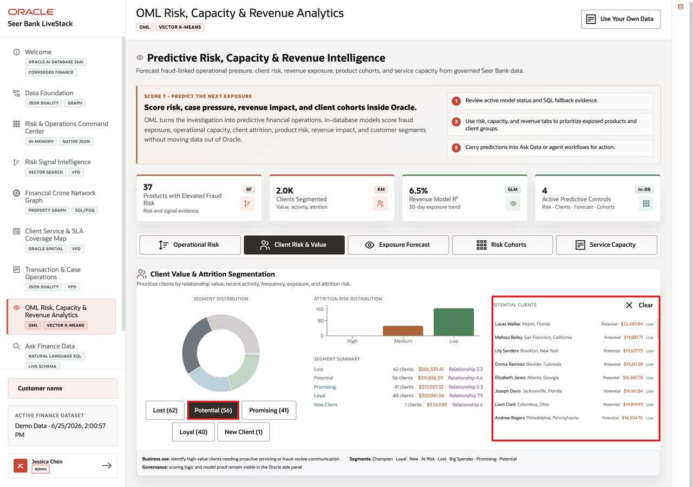
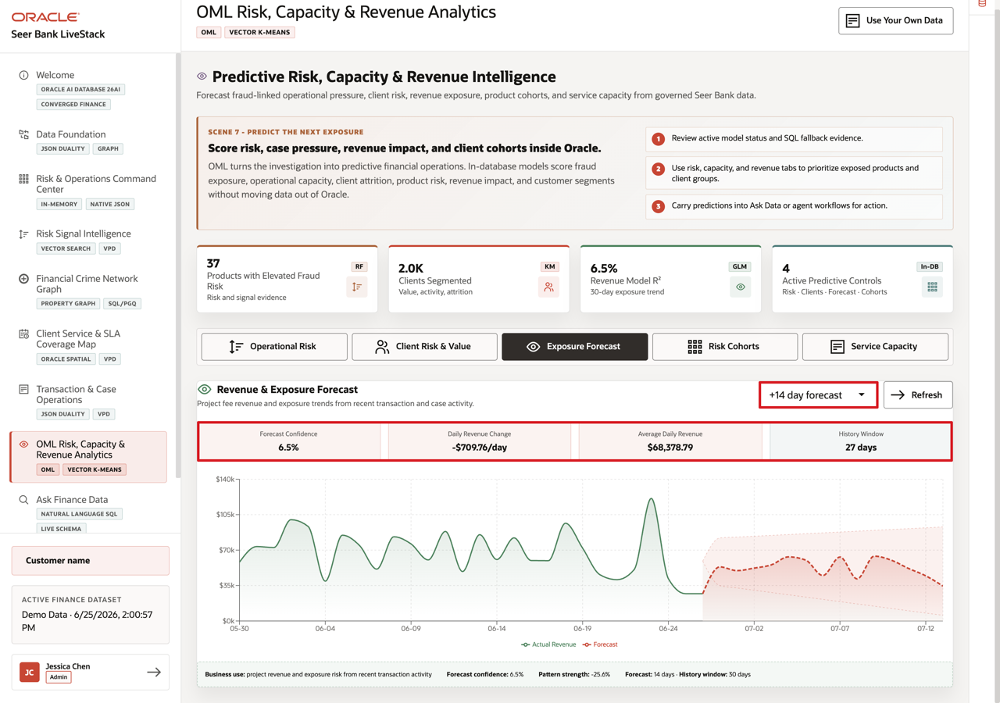
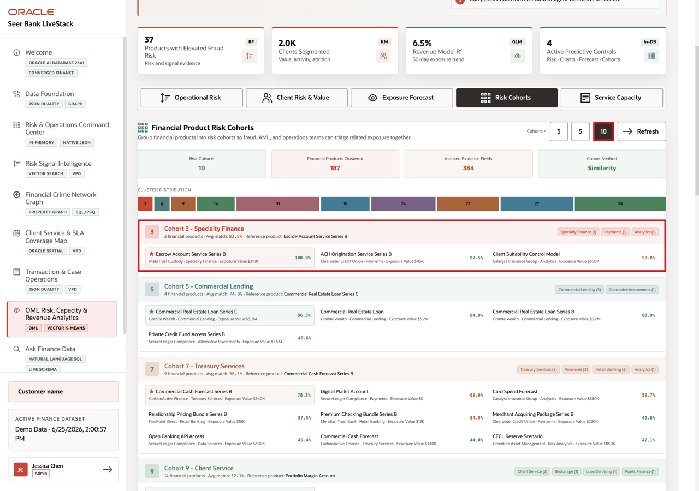
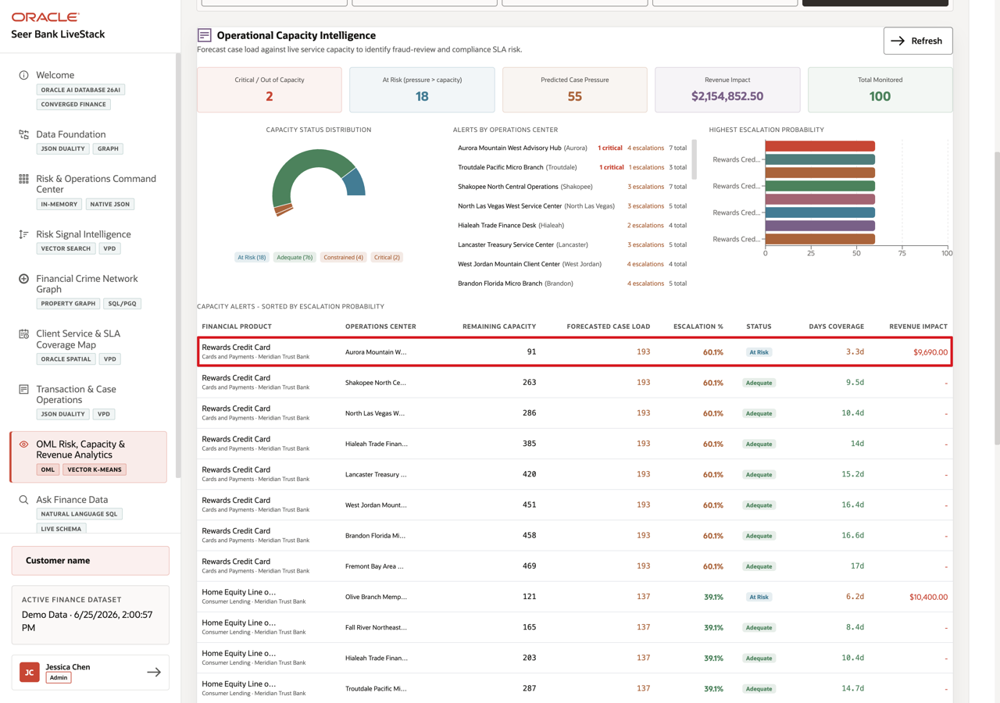

# Scene 8 Predictive Risk, Capacity & Revenue

## Introduction

**Predictive Risk, Capacity & Revenue Intelligence** helps finance teams decide which model signals should become action. The page brings together operational risk, client risk and value, exposure forecasts, risk cohorts, and service-capacity risk so teams can plan coverage, engagement, and revenue actions with better evidence.

Finance teams struggle when the information needed for one decision lives in separate tools. That separation slows action, increases reconciliation work, and makes it harder to trust the result.

**Oracle AI Database** helps address these challenges by keeping machine learning close to governed finance data. Oracle Machine Learning models can be trained, persisted, and scored in the database with `DBMS_DATA_MINING`, `PREDICTION()`, `PREDICTION_PROBABILITY()`, and `CLUSTER_ID()`. SQL regression, RFM segmentation, vector-based product grouping, and service-capacity risk scoring can run from the same connected data foundation that powers the rest of the LiveStack Demo.

Estimated Time: **10 minutes**

### Objectives

In this scene, you will learn what finance decision the page supports, what evidence the user should inspect, and what action the business may take next.

## Task 1: Review the predictive analytics workspace

Perform the following set of steps as a set of decision tools. Each tab supports an action, such as product-risk review, client targeting, revenue planning, behavior analysis, or service-capacity protection.

1. Click **OML Risk, Capacity & Revenue Analytics** in the sidebar.
2. Review the four summary cards at the top of the page: products with elevated risk, clients segmented, revenue model R2, and active in-database ML patterns.
3. Review the mode tabs: **Operational Risk**, **Client Risk & Value**, **Exposure Forecast**, **Risk Cohorts**, and **Service Capacity**.

In the current demo dataset, the page shows **37** products with elevated fraud risk, **2.0K** clients segmented, **6.5%** revenue model R2, and **4** active predictive controls. Use this opening view to set the scene: this page is not a separate data science notebook. It is a business-facing analytics surface backed by in-database scoring and SQL.

**Note:** Sample values may change after data refreshes or rebuilds. Verify live output before presenting, then explain the business takeaway.

## Task 2: Inspect Operational Risk and Case Pressure

Perform the following set of steps to find financial products where predicted demand or risk may require service coverage, compliance review, product messaging, or operational planning.

1. Stay on the **Operational Risk** tab.
2. Use the scoring window selector if you want to change the time window, then click **Refresh**.
3. Review the bar chart and financial product table.
4. Focus on **Secure Document Vault Series B**.

In the current demo dataset, **Secure Document Vault Series B** in **Digital Banking** shows risk severity **53.3**, **+74%** expected impact, **128** forecasted cases, **$3,207.62** revenue impact, **92%** confidence, and an **Escalating** risk state.

**Note:** Sample values may change after data refreshes or rebuilds. Verify live output before presenting, then explain the business takeaway.

This gives the product risk user a concrete question to answer: should the institution increase service coverage, prepare compliance review capacity, or adjust product messaging before operational pressure turns into a client-impact issue?

Product risk matters because it can trigger action: review exposure, prepare service coverage, adjust product messaging, or involve compliance before pressure affects clients.

## Task 3: Filter Client Risk & Value segments

Perform the following set of steps to turn model output into usable client lists for retention, outreach, advisor follow-up, service action, or campaign planning.

1. Click **Client Risk & Value**.
2. Review the segment distribution and segment summary.
3. Click **Potential (56)** or another segment button.
4. Review the filtered client list on the right.

In the current demo dataset, the visible segment distribution includes **Lost (62)**, **Potential (56)**, **Promising (41)**, **Loyal (40)**, and **New Client (1)**. Selecting **Potential (56)** filters the client list so the user can inspect the people behind that segment, including relationship value, location, and attrition risk.

**Notes:** Sample values may change after data refreshes or rebuilds. Verify live output before presenting, then explain the business takeaway.

This is useful because a segment can become an action list, such as advisor outreach for promising clients, retention work for at-risk clients, or tailored service follow-up for loyal clients.

## Task 4: Change the Exposure Forecast horizon

Perform the following set of steps to see how the outlook changes over time. Planners should review both the forecast and model-quality indicators before deciding how much confidence to place in the result.

1. Click **Exposure Forecast**.
2. Change the forecast horizon to **+14 day forecast**.
3. Click **Refresh** if the page does not update automatically.
4. Review the model quality cards and the forecast chart.

In the current demo dataset, the 14-day forecast view shows **6.5%** forecast confidence, daily revenue change of **-$709.76/day**, average daily revenue of **$68,378.79**, and a **27-day** history window. The low confidence is an important demo talking point: the page is not hiding model quality. A planner should treat the forecast as directional context instead of over-trusting it.

**Note:** Sample values may change after data refreshes or rebuilds. Verify live output before presenting, then explain the business takeaway.

The chart separates actual revenue, forecast revenue, trend, moving average, and confidence bands. This helps a finance planner explain the difference between observed revenue history and projected revenue instead of presenting a single unexplained number.

## Task 5: Change Risk Cohorts

Perform the following set of steps to explore groups of products with similar patterns. This can support product comparison, offer bundling, risk review, and lookalike analysis.

1. Click **Risk Cohorts**.
2. Click **10** in the **Cohorts =** control.
3. Review the cluster summary cards and distribution bar.
4. Review one cluster card and its product assignments.

In the current demo dataset, switching to **10** cohorts groups **187** financial products. Focus on **Cohort 3 - Specialty Finance**, which contains **3** products with an average match of **83.8%** and uses **Escrow Account Service Series B** as the reference product. The same cohort includes **ACH Origination Service Series B** and **Client Suitability Control Model**, showing how related risk evidence can be reviewed together.

**Note:** Sample values may change after data refreshes or rebuilds. Verify live output before presenting, then explain the business takeaway.

This helps a finance user understand how AI-assisted grouping can support product discovery, product risk comparison, offer bundling, and lookalike product analysis. Oracle AI Database can combine vector similarity and SQL analytics without copying product data into a separate vector-only system.

## Task 6: Review Service Capacity

Perform the following set of steps to connect predicted service pressure with available capacity, escalation probability, coverage days, and revenue at risk.

1. Click **Service Capacity**.
2. Review the capacity summary cards.
3. Scroll to **Capacity Alerts - Sorted by OML Escalation Probability**.
4. Focus on **Rewards Credit Card** at **Aurora Mountain West Advisory Hub**.

In the current demo dataset, **Rewards Credit Card** at **Aurora Mountain West Advisory Hub** shows **91** remaining case-processing capacity units, a forecasted case load of **193**, **60.1%** escalation probability, **At Risk** status, **3.3** days of coverage, and **$9,690.00** revenue impact. This turns the model output into an operational action: the user can identify where demand is stronger than available capacity and prioritize staffing, routing, or product-operations decisions.

**Note:** Sample values may change after data refreshes or rebuilds. Verify live output before presenting, then explain the business takeaway.

The business value is that teams can make the decision from connected, governed data. Oracle AI Database provides the shared foundation that keeps the data, analytics, and AI workflow aligned.

*You can move to the next scene.*

## Credits & Build Notes
- **Author** - Oracle LiveLabs Team
- **Last Updated By/Date** - Oracle LiveLabs Team, 2026-06-29
