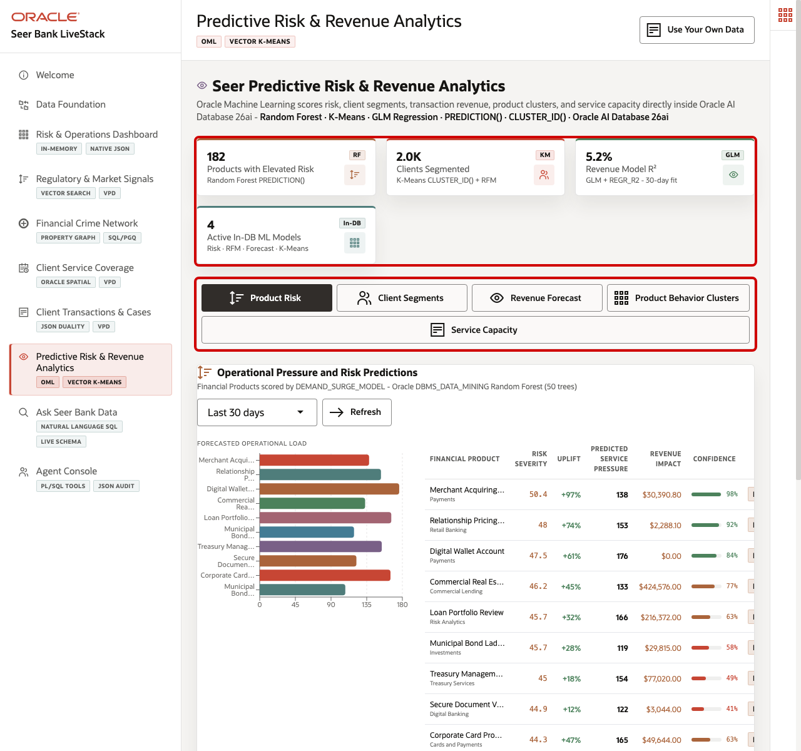
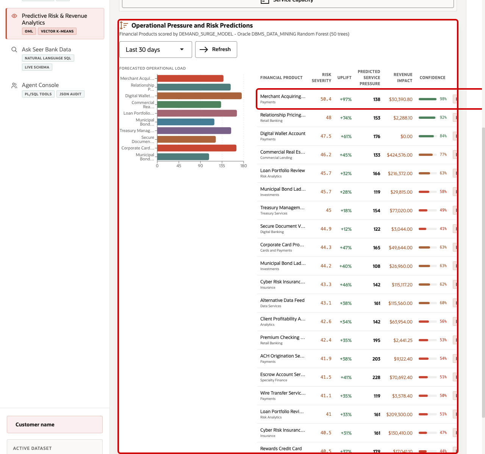
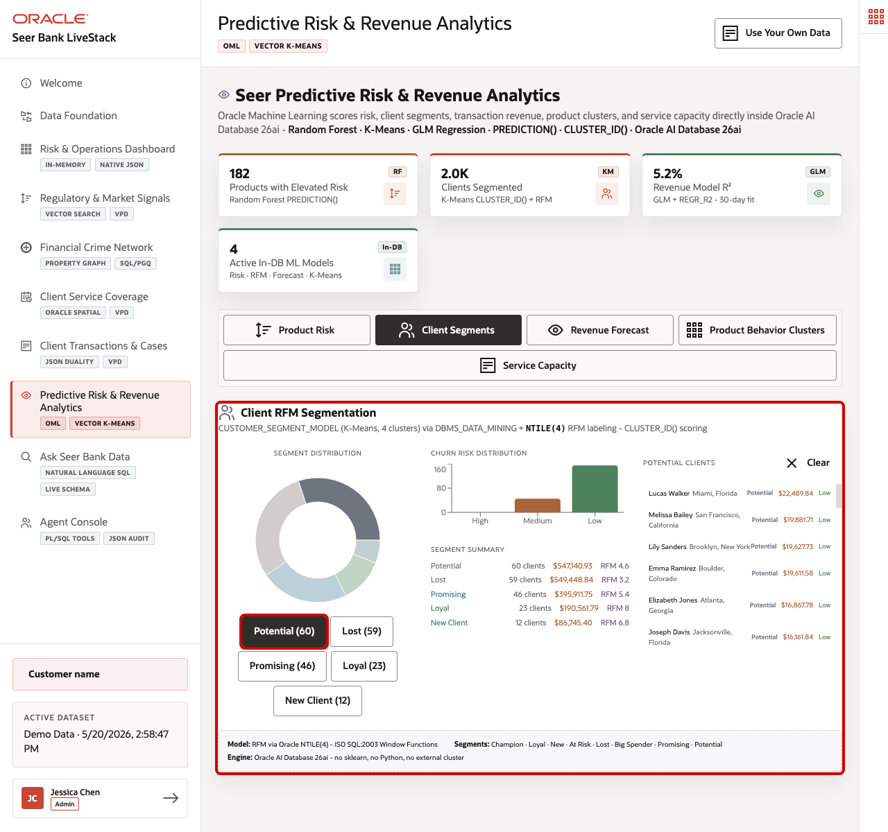
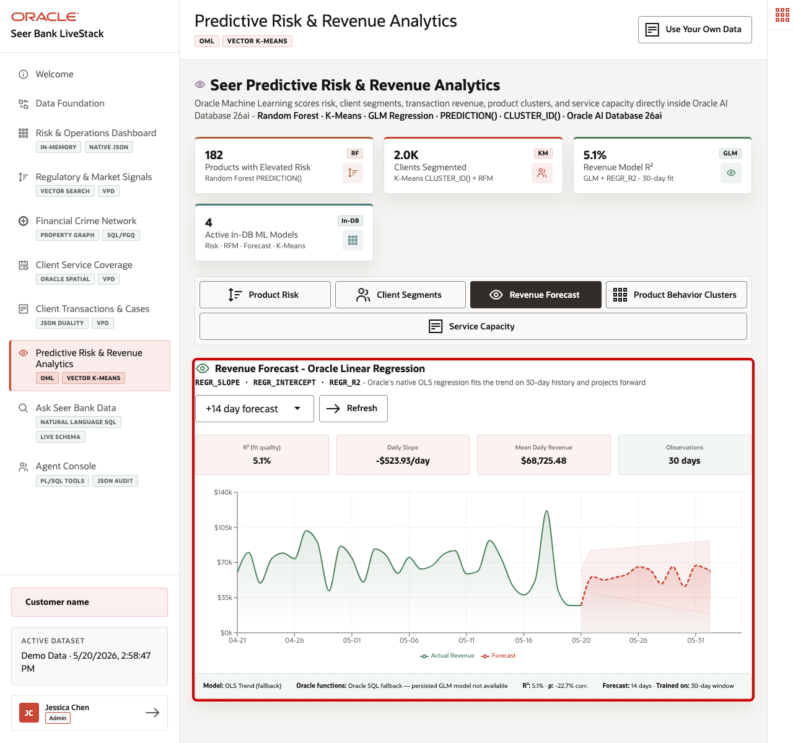
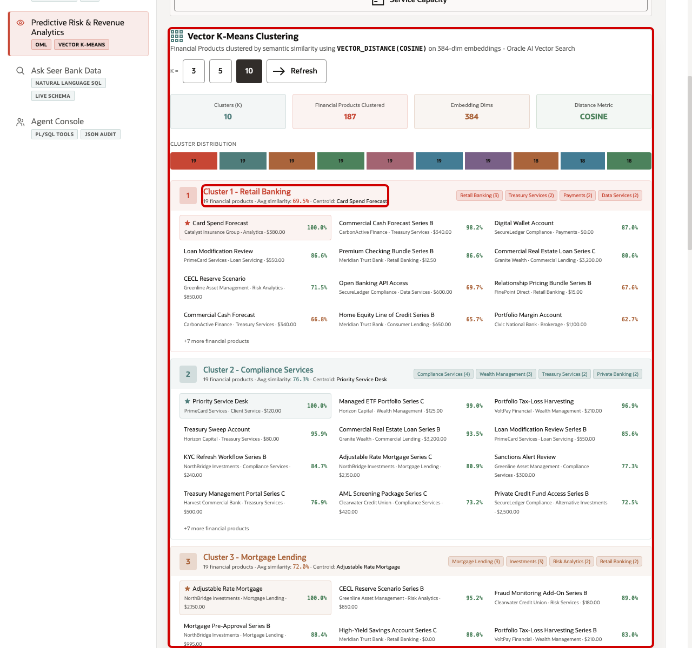
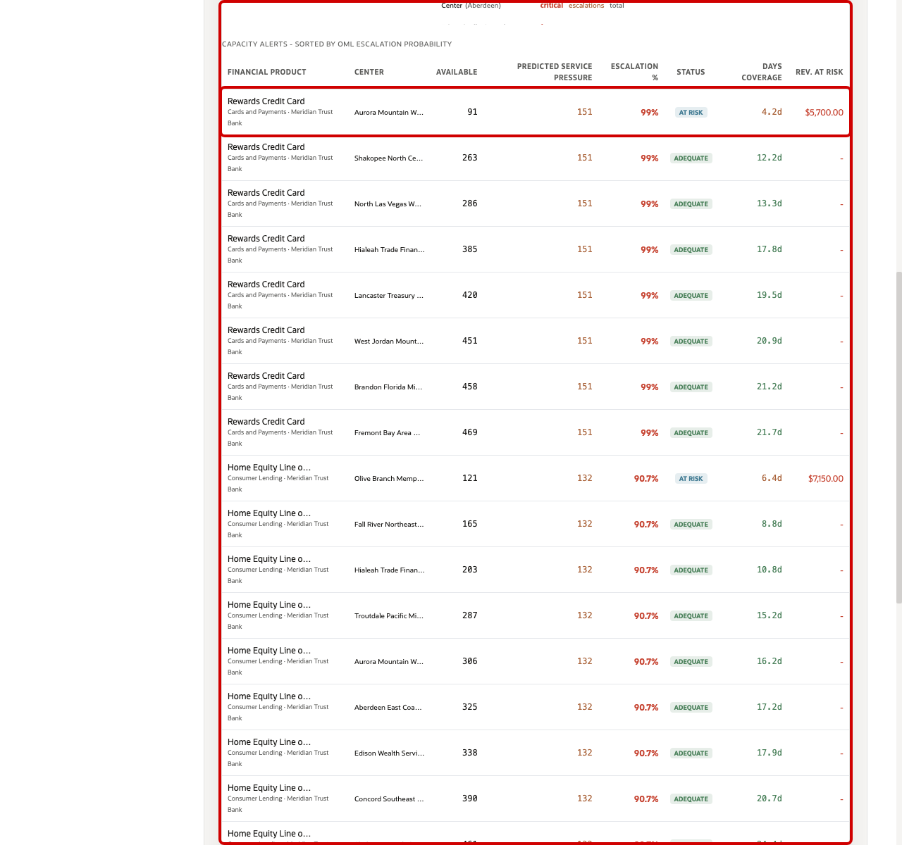

# Scene 8 Predictive Risk & Revenue Analytics

## Introduction

A finance analytics manager, product risk lead, client segmentation analyst, revenue planner, or service capacity owner uses this page to understand which predictive signals should drive action. This persona needs to know which financial products are under pressure, which client groups need different engagement, how revenue is trending, which products behave alike, and where forecasted service demand may create capacity risk.

This is difficult to implement when predictive work is split across notebooks, exported CSV files, BI extracts, external ML services, and separate operational systems. Finance teams can lose trust in predictions when model features are stale, scoring jobs run away from the live data, or the explanation behind a forecast is disconnected from the transaction, client, product, and service-capacity records that business users rely on.

Oracle AI Database helps address these challenges by keeping machine learning close to governed finance data. Oracle Machine Learning models can be trained, persisted, and scored in the database with `DBMS_DATA_MINING`, `PREDICTION()`, `PREDICTION_PROBABILITY()`, and `CLUSTER_ID()`. SQL regression, RFM segmentation, vector-based product grouping, and service-capacity risk scoring can run from the same connected data foundation that powers the rest of the LiveStack Demo.

Estimated Time: 10 minutes

### Objectives

In this scene, you will:
- Review the **Predictive Risk & Revenue Analytics** workspace and summary cards.
- Inspect the **Product Risk** results and interpret the predicted service pressure for a financial product.
- Filter **Client Segments** and review the clients behind a selected segment.
- Change the **Revenue Forecast** horizon and interpret the model quality cards and chart.
- Change the **Product Behavior Clusters** cluster count and review product cluster assignments.
- Review **Service Capacity** and connect predicted demand to capacity risk.

## Task 1: Review the predictive analytics workspace

1. Click **Predictive Risk & Revenue Analytics** in the sidebar.
2. Review the four summary cards at the top of the page: products with elevated risk, clients segmented, revenue model R2, and active in-database ML patterns.
3. Review the mode tabs: **Product Risk**, **Client Segments**, **Revenue Forecast**, **Product Behavior Clusters**, and **Service Capacity**.

In the current demo dataset, the page shows **182** products with elevated risk signals, **2.0K** clients segmented, a revenue model R2 of about **5.1%**, and **4** active in-database ML patterns. Use this opening view to set the scene: this page is not a separate data science notebook. It is a business-facing analytics surface backed by in-database scoring and SQL.

## Task 2: Inspect Product Risk and Operational Pressure

1. Stay on the **Product Risk** tab.
2. Use the scoring window selector if you want to change the time window, then click **Refresh**.
3. Review the bar chart and financial product table.
4. Focus on the first row, **Merchant Acquiring Package Series B**.

In the current demo dataset, **Merchant Acquiring Package Series B** from **Clearwater Credit Union** shows risk severity **50.4**, **+97%** uplift, **138** predicted service-pressure units, about **$30.4K** revenue impact, and **98%** confidence. This gives the product risk user a concrete question to answer: should the institution increase service coverage, prepare compliance review capacity, or adjust product messaging before operational pressure turns into a client-impact issue?

The important point is that the product risk score is not only a chart decoration. It is a scored signal coming from product, transaction, risk-signal, and momentum features. Oracle AI Database keeps those features and the model score inside the same governed finance data platform.

## Task 3: Filter Client Segments

1. Click **Client Segments**.
2. Review the segment distribution and segment summary.
3. Click **Potential (60)** or another segment button.
4. Review the filtered client list on the right.

In the current demo dataset, the segment distribution includes **Potential (60)**, **Lost (59)**, **Promising (46)**, **Loyal (23)**, and **New Customer (12)**. Selecting **Potential (60)** filters the client list so the user can inspect the people behind that segment, including spend, location, RFM score, and churn risk.

This is useful for banking, wealth, and client-service teams because segmentation becomes operational. The team can move from a model result to the client records that need a campaign, retention action, service follow-up, or advisor outreach without exporting the data to another tool.

## Task 4: Change the Revenue Forecast horizon

1. Click **Revenue Forecast**.
2. Change the forecast horizon to **+14 day forecast**.
3. Click **Refresh** if the page does not update automatically.
4. Review the model quality cards and the forecast chart.

In the current demo dataset, the 14-day forecast view shows about **5.1%** R2, a daily slope of about **-$524/day**, mean daily revenue of about **$68.7K**, and **30** observations. The low R2 is an important demo talking point: the page is not hiding model quality. It shows when a simple 30-day revenue trend is weak, so a planner can treat the forecast as directional context instead of over-trusting it.

The chart separates actual revenue, forecast revenue, trend, moving average, and confidence bands. This helps a finance planner explain the difference between observed revenue history and projected revenue instead of presenting a single unexplained number.

## Task 5: Change Product Behavior Clusters

1. Click **Product Behavior Clusters**.
2. Click **10** in the **K =** control.
3. Review the cluster summary cards and distribution bar.
4. Review one cluster card and its product assignments.

In the current demo dataset, switching to **K = 10** clusters groups **187** financial products. One visible example is **Cluster 1**, with **Card Spend Forecast** as the centroid product, **19** financial products, and product assignments such as Commercial Cash Forecast Series B, Digital Wallet Account, Loan Modification Review, and Merchant Acquiring Package Series B.

This helps a finance user understand how AI-assisted grouping can support product discovery, product risk comparison, offer bundling, and lookalike product analysis. Oracle AI Database can combine vector similarity and SQL analytics without copying product data into a separate vector-only system.

## Task 6: Review Service Capacity

1. Click **Service Capacity**.
2. Review the capacity summary cards.
3. Scroll to **Capacity Alerts - Sorted by OML Escalation Probability**.
4. Focus on **Rewards Credit Card** at **Aurora Mountain West Advisory Hub**.

In the current demo dataset, **Rewards Credit Card** shows **91** units available, **151** predicted service-pressure units, **99%** escalation probability, **AT_RISK** status, about **4.2** days of coverage, and about **$5.7K** revenue at risk. This turns the model output into an operational action: the user can identify where demand is stronger than available capacity and prioritize staffing, routing, or product-operations decisions.

The value of Oracle AI Database is that this capacity signal combines the risk prediction model, demand forecasts, service capacity, financial products, and service centers in one governed system. The same data foundation supports predictive scoring, operational joins, and business-facing workflow decisions.

You can move to the next scene.

## Credits & Build Notes
- **Author** - Oracle LiveLabs Team
- **Last Updated By/Date** - Oracle LiveLabs Team, 2026-05-21
