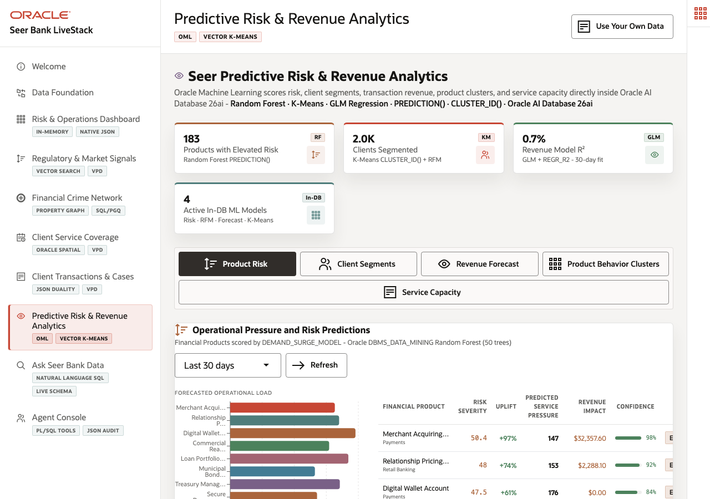

# Scene 8: Predictive Risk & Revenue Analytics

## Introduction

A Seer Bank analytics lead needs to forecast product pressure, segment clients, estimate revenue trends, cluster product behavior, and assess service capacity without exporting governed finance data to separate notebooks. This scene shows predictive and analytic scoring close to the Oracle data foundation.

Estimated Time: 10 minutes

### Objectives

In this scene, you will:
- Open **Predictive Risk & Revenue Analytics**.
- Review product risk, client segments, revenue forecast, behavior clusters, and service capacity tabs.
- Use live model outputs as finance evidence.
- Explain when the deployed stack is using persisted models versus Oracle SQL fallback scoring.

## Task 1: Review product risk and pressure predictions

1. Click **Predictive Risk & Revenue Analytics**.
2. Start on **Product Risk**.
3. Use **Merchant Acquiring Package Series B** from Clearwater Credit Union as a live evidence point. The verified stack scored it with 99 percent surge probability, predicted demand 147, 97 percent uplift, 98 percent confidence, and $32,357.60 revenue opportunity.
4. Point out that the page also reported 183 products with surge pressure and 2,000 total clients in the summary.

This lets the presenter tie signal activity, transaction history, and revenue exposure to a specific finance product.

## Task 2: Compare the analytic tabs

1. Click **Client Segments** and review RFM segments. The verified stack reported five segment groups: Potential, Lost, Promising, Loyal, and New Customer.
2. Click **Revenue Forecast** and point to the 7-day forecast. The live model metadata reported Oracle `REGR_SLOPE / REGR_R2`, 31 observations, mean daily revenue $67,346.67, and daily slope -$210.21.
3. Click **Product Behavior Clusters** and use **Card Spend Forecast** as a centroid example. The live K=5 cluster run grouped 187 products and placed 38 products in the first cluster.
4. Click **Service Capacity** and use **Rewards Credit Card** at **Aurora Mountain West Advisory Hub** as an example: predicted demand 151, 99 percent surge probability, 4.2 days of supply, and $5,700 revenue at risk.

## Task 3: Explain the Oracle execution model

1. Open **Oracle Internals**.
2. Point to DBMS Data Mining, SQL regression, vector K-means, forecast tables, and service-capacity semantic layers.
3. If the deployment reports zero persisted models active, explain that the app still executes deterministic Oracle SQL fallback scoring in the database. The demo value remains the same: scoring happens close to governed finance data, with no external data copy required for the presenter workflow.

## Credits & Build Notes
- **Author** - Oracle LiveLabs Team
- **Last Updated By/Date** - Oracle LiveLabs Team, 2026-05-20
- **Build Notes** - Analytics evidence was verified with `/api/ml/summary`, `/api/ml/demand-forecast`, `/api/ml/customer-segments`, `/api/ml/revenue-forecast`, `/api/ml/vector-clusters`, and `/api/ml/inventory-intelligence`.
