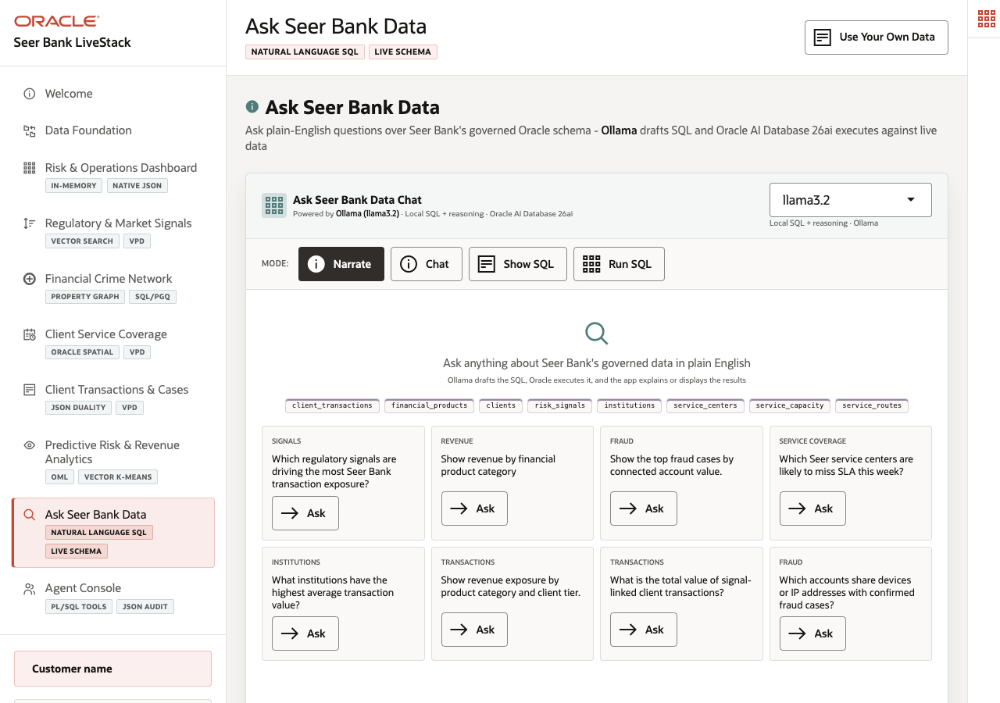

# Scene 9: Ask Seer Bank Data

## Introduction

A business analyst at Seer Bank wants to ask finance questions without waiting for a custom report. The challenge is keeping answers grounded in governed data rather than letting a language model invent results. This scene shows Ollama helping draft SQL while Oracle AI Database executes against the live schema.

Estimated Time: 10 minutes

### Objectives

In this scene, you will:
- Open **Ask Seer Bank Data**.
- Ask a plain-English finance question.
- Compare Narrate, Chat, Show SQL, and Run SQL modes.
- Show that Oracle remains the query execution layer.

## Task 1: Ask a revenue question

1. Click **Ask Seer Bank Data**.
2. Confirm that the runtime profile is `SC_LLAMA_PROFILE` using the `llama3.2` model.
3. Select **Show SQL**.
4. Ask `Show revenue by financial product category`.
5. Review the generated SQL before running it.

The verified stack generated SQL that joins `order_items`, `orders`, and `products`, groups by `p.category`, counts distinct orders, and sums line-item revenue. Use that SQL as your evidence point.

## Task 2: Compare answer modes

1. Ask the same question in **Narrate** mode to get a business explanation.
2. Switch to **Run SQL** to execute and return rows from Oracle.
3. Use the mode switch to explain the governance pattern: the model helps translate intent, but Oracle executes the SQL and returns the data.

The presenter should emphasize that natural language is the interface, not the system of record.

## Task 3: Show the Oracle Internals panel

1. Open **Oracle Internals**.
2. Point to **Ollama Runtime**, **Oracle SQL Execution**, **Generated SQL Inspection**, and **Live Oracle Schema**.
3. Explain the flow shown in the panel: question, schema context, SQL generation, Oracle execution, and UI response.

## Credits & Build Notes
- **Author** - Oracle LiveLabs Team
- **Last Updated By/Date** - Oracle LiveLabs Team, 2026-05-20
- **Build Notes** - Select AI evidence was verified with `/api/selectai/profiles` and `/api/selectai/showsql`.
