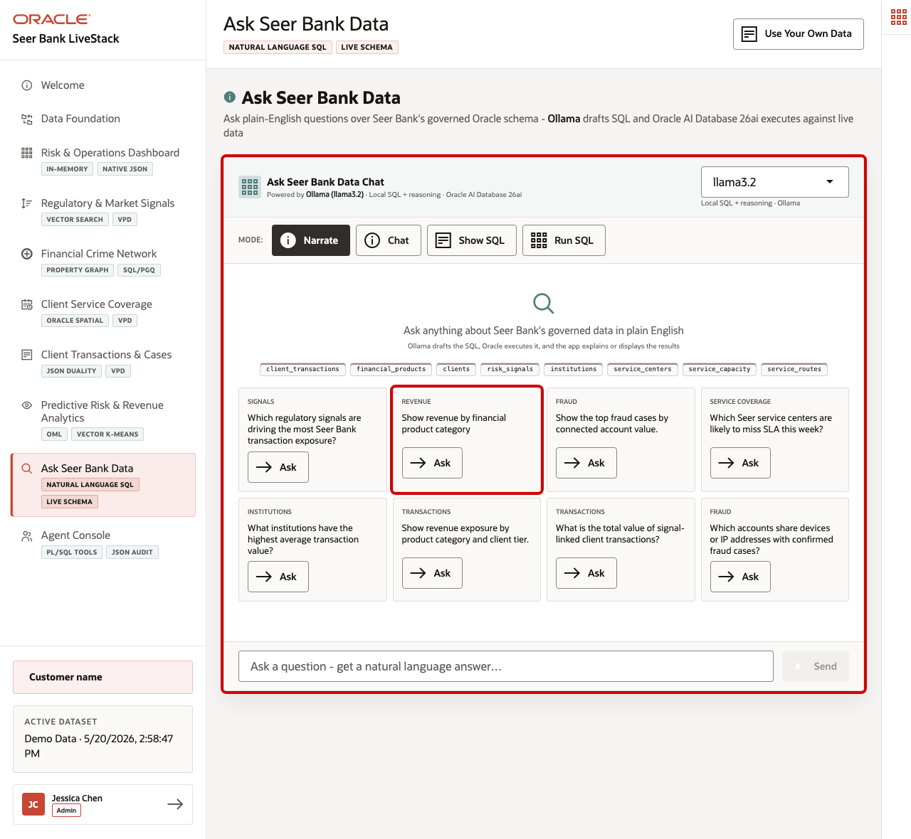
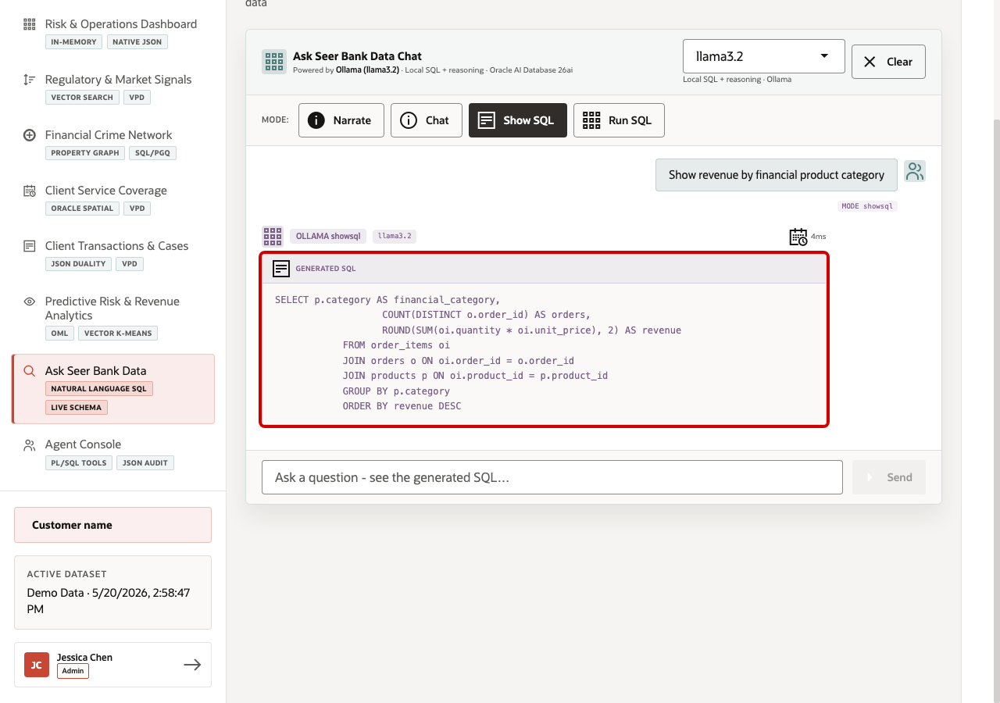
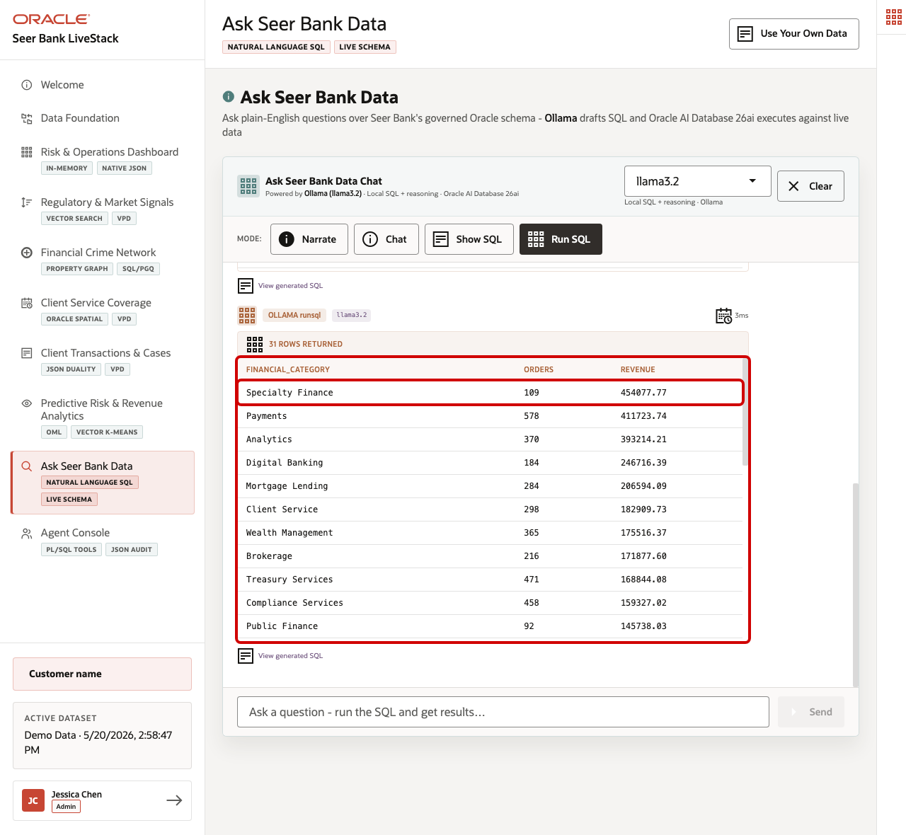

# Scene 9 Ask Seer Bank Data

## Introduction

A finance business analyst, product operations lead, client-service analyst, or risk reporting manager uses this page when they need an answer before a custom report can be built. This persona may know the business question clearly, but not the exact schema, joins, filters, or SQL needed to answer it.

This is difficult to implement safely because natural-language data access can create governance risk. A language model may generate invalid SQL, reference the wrong tables, hide the logic behind an answer, or expose more data than the user should see. Financial institutions need self-service analytics, but data teams still need traceability, read-only execution, and a clear source of truth.

Oracle AI Database helps address these challenges by keeping query execution grounded in the live finance schema. In this LiveStack Demo, the app sends the business question and schema context to the local Ollama runtime, validates the generated SQL path, and uses Oracle AI Database 26ai as the execution authority. The user can inspect generated SQL before execution, run the SQL to return rows, or use narrative modes when they want a summarized answer.

Estimated Time: 10 minutes

### Objectives

In this scene, you will:
- Review the **Ask Seer Bank Data** workspace, runtime profile, and query modes.
- Use **Show SQL** to inspect generated SQL before execution.
- Use **Run SQL** to return live rows from Oracle AI Database.
- Explore a specific data point about revenue by financial product category.
- Understand how natural-language access can remain transparent and database-governed.

## Task 1: Review the Ask Seer Bank Data workspace

1. Click **Ask Seer Bank Data** in the sidebar.
2. Review the runtime profile in the top right of the chat card. The current demo uses the local **llama3.2** runtime through the **SC_LLAMA_PROFILE** profile.
3. Review the four modes: **Narrate**, **Chat**, **Show SQL**, and **Run SQL**.
4. Review the example question tiles.
5. Focus on the **Revenue** question: **Show revenue by financial product category**.

Use this page to explain the balance between business access and technical governance. The user starts with plain English, but the system still exposes SQL and keeps Oracle as the execution engine.

## Task 2: Inspect generated SQL

1. Click **Show SQL**.
2. Click **Ask** on **Show revenue by financial product category**.
3. Review the generated SQL.

The generated SQL joins `order_items`, `orders`, and `products`, groups by `p.category`, counts distinct orders, and sums line-item revenue. This is the governance moment in the scene: the business user can inspect the query path before asking the database to return rows.

The value is not only convenience. The page makes the generated SQL visible, uses read-only query execution, and keeps the answer grounded in Oracle data rather than treating the language model response as the source of truth.

## Task 3: Run the SQL and inspect the returned data

1. Click **Clear** if the generated SQL result is still visible.
2. Click **Run SQL**.
3. Click **Ask** on the same **Show revenue by financial product category** question.
4. Review the returned table.
5. Focus on the first row: **Specialty Finance**.

In the current demo dataset, the question returns **31** rows. The first row is **Specialty Finance**, with **109** orders and **$454,077.77** revenue. The next visible categories include **Payments** with **578** orders and **$411,723.74** revenue, and **Analytics** with **370** orders and **$393,214.21** revenue.

This is the data point to emphasize during the demo. The natural-language question surfaces a concrete revenue ranking that could matter to product management, finance operations, and client-service planning. A business user can discover the revenue pattern without writing SQL, while the SQL and database result remain visible for trust.

## Task 4: Explain the governance pattern

Use the completed query to explain the pattern behind the page:

1. The user asks a finance question in plain English.
2. The app builds prompt and schema context for the selected runtime profile.
3. Ollama drafts SQL or a response plan.
4. Oracle AI Database executes the generated SQL against the live schema.
5. The UI returns either visible SQL, raw rows, or a narrated answer.

This pattern matters because financial institutions want faster answers, but they also need governed access. Ask Seer Bank Data shows how natural-language analytics can be useful without hiding the query path or replacing the database as the trusted execution layer.

You can move to the next scene.

## Credits & Build Notes
- **Author** - Oracle LiveLabs Team
- **Last Updated By/Date** - Oracle LiveLabs Team, 2026-05-21
