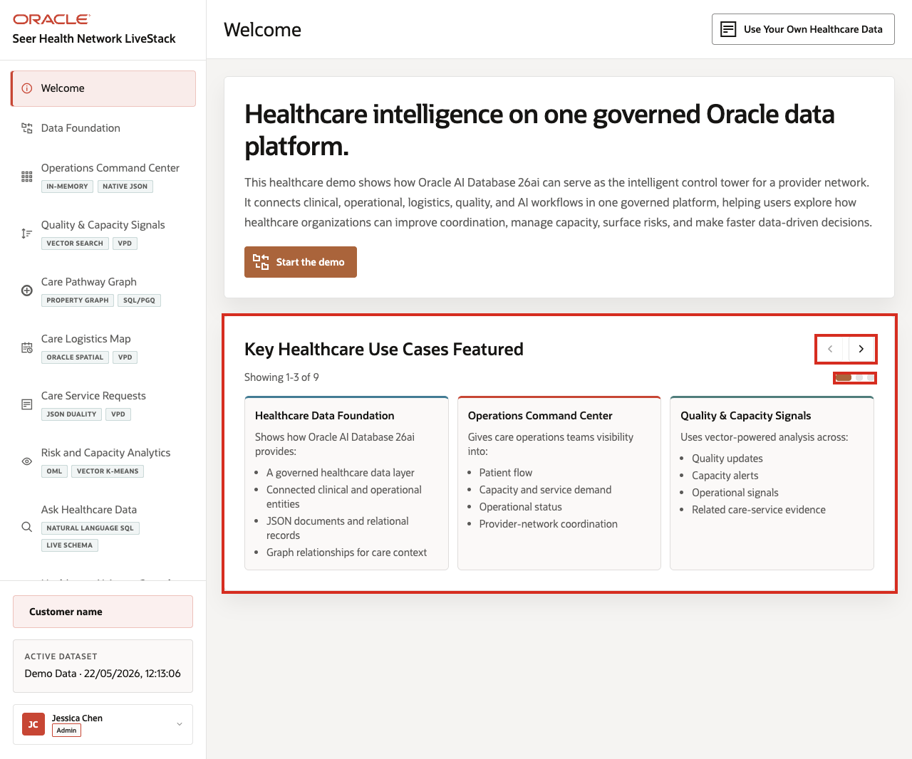
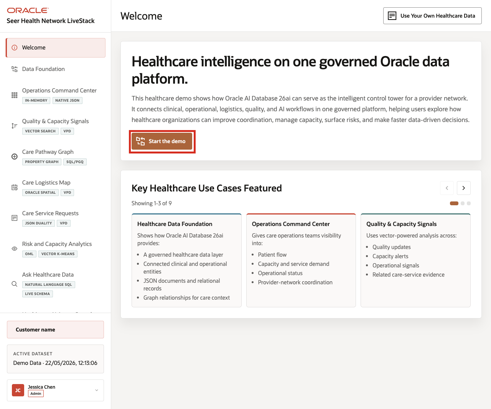

# Scene 1 Welcome and Demo Orientation

## Introduction

This opening scene gives users a quick roadmap for the healthcare demo. The carousel previews the use cases covered in the LiveStack, so the audience can see how the walkthrough moves from data foundation to operations, quality signals, care pathways, logistics, analytics, natural-language access, and AI-assisted decisions.

Estimated Time: **5 minutes**

### Objectives

In this scene, you will learn what healthcare decision the page supports, what evidence the user should inspect, and what action the team may take next.

## Task 1: Review the use case carousel

Review the carousel first so the audience understands the full healthcare operations journey. Each tile previews a business problem the demo will address, such as capacity pressure, quality signals, care logistics, service requests, analytics, or AI-assisted action.

1. Read the three visible use case tiles.
2. Click the right carousel arrow to move forward.
3. Continue until you have reviewed all visible healthcare use cases.
4. Use the left carousel arrow if you want to return to earlier tiles.

    

The welcome page frames the demo as healthcare intelligence on one governed Oracle data platform. The carousel introduces how the LiveStack connects care operations, capacity and service demand, quality and capacity signals, care pathway relationships, care logistics, service requests, analytics, natural-language data access, and AI-assisted operations.

## Task 2: Continue the demo

After the audience understands the demo themes, continue to the data foundation page to begin the guided healthcare workflow.

1. Click **Start the demo**.

    

2. Confirm the demo moves to **Data Foundation**.

Use this transition to explain that the welcome page is the orientation layer. The next scene prepares the governed healthcare dataset that powers every later workflow.

## Credits & Build Notes
- **Author** - Oracle LiveLabs Team
- **Last Updated By/Date** - Oracle LiveLabs Team, 2026-05-22
