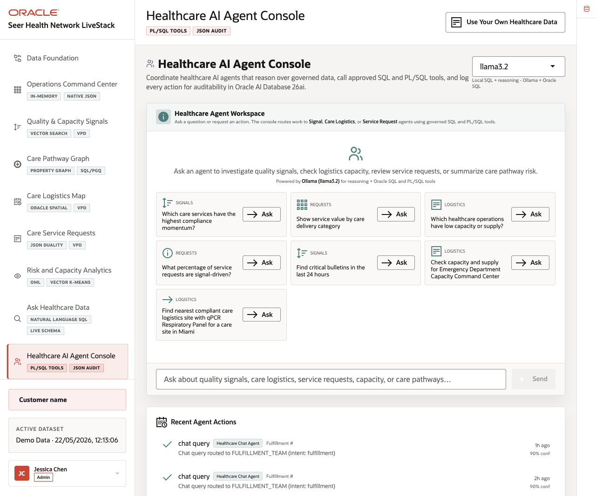
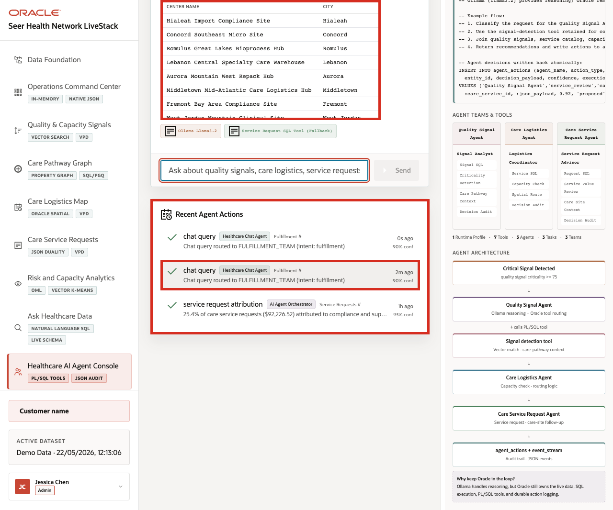
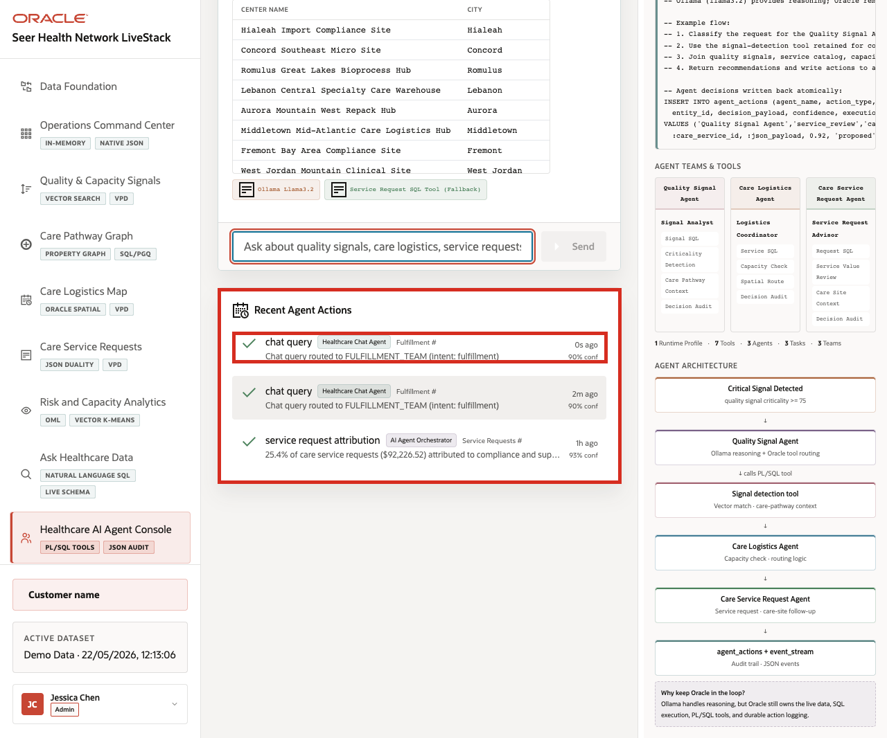

# Scene 10 Healthcare AI Agent Console

## Introduction

**Healthcare AI Agent Console** shows how AI assistance can support operational decisions without becoming a black box. When an agent helps with logistics, signal review, or service follow-up, users need to see the specialist path, tools used, data returned, confidence, and audit record.

Healthcare teams struggle when the information needed for one decision lives in separate tools. That separation slows action, increases reconciliation work, and makes it harder to trust the result.

Oracle AI Database helps address these challenges by keeping the source data, SQL execution, PL/SQL tools, and durable action logging in the database. In this LiveStack Demo, the app orchestrates the agent workflow, Ollama provides reasoning, and Oracle AI Database 26ai executes the governed data operations.

Estimated Time: **10 minutes**

### Objectives

In this scene, you will learn what healthcare decision the page supports, what evidence the user should inspect, and what action the team may take next.

## Task 1: Review the agent console workspace

The user should notice the runtime profile, example questions, specialist routing, recent actions, and confidence information before running an agent task.

1. Click **Healthcare AI Agent Console** in the sidebar.
2. Review the runtime profile selector. The current demo uses **llama3.2** through Ollama-backed reasoning.
3. Review the example questions in the agent workspace.
4. Review **Recent Agent Actions** below the workspace.
5. Focus on the logistics example: **Find nearest compliant care logistics site with qPCR Respiratory Panel for a care site in Miami**.

The user is not looking at a generic chatbot. They are using an operational agent surface where healthcare questions are routed to specialist workflows and logged for review.

## Task 2: Run the logistics agent question

Perform the following set of steps to show how the agent identifies care logistics sites that may support a specific healthcare service request while exposing the data and tool path behind the answer.

1. Click **Ask** on **Find nearest compliant care logistics site with qPCR Respiratory Panel for a care site in Miami**.

    

2. Review the agent response at the top of the chat output.
3. Review the returned care logistics site table.
4. Review the tool and runtime badges below the response.

In the current demo dataset, the agent routes the request to the **Care Logistics Agent** path and returns a care logistics overview with **10** active care logistics sites. The visible table includes **Hialeah Import Compliance Site** in Florida, **Concord Southeast Micro Site** in North Carolina, **Romulus Great Lakes Bioprocess Hub** in Michigan, **Lebanon Central Specialty Care Warehouse** in Tennessee, and **Aurora Mountain West Repack Hub** in Colorado. The response exposes the Ollama runtime and service request SQL tool path.

**Note:** Sample values may change after data refreshes or rebuilds. Verify live output before presenting, then explain the business takeaway.

After showing the returned care logistics sites, explain what the operator can decide next: compare compliant sites, review capacity, route a follow-up, or investigate logistics constraints.

## Task 3: Review the agent action audit trail

Perform the following set of steps to show that AI-assisted actions do not disappear after the conversation. Operators, architects, and auditors can review what the agent did, which route it used, and how confident the system was.

1. Scroll to **Recent Agent Actions**.

    

2. Review the newest action row.
3. Confirm that the row shows a **chat query** routed to the logistics-oriented agent path. In the current UI, the compatibility audit label may appear as `FULFILLMENT_TEAM`, but the runbook context is healthcare care logistics.
4. Review the confidence value.

In the current demo dataset, the completed chat action is logged with **90%** confidence. The audit row appears above the earlier service request attribution action.

**Note:** Sample values may change after data refreshes or rebuilds. Verify live output before presenting, then explain the business takeaway.

The governance point is that agent decisions should be observable after the conversation, with action history available for operators, architects, and auditors.

The business value is that teams can make the decision from connected, governed data. Oracle AI Database provides the shared foundation that keeps operational data, analytics, and AI workflows aligned.

*You can move to the next scene.*

## Credits & Build Notes
- **Author** - Oracle LiveLabs Team
- **Last Updated By/Date** - Oracle LiveLabs Team, 2026-05-22
