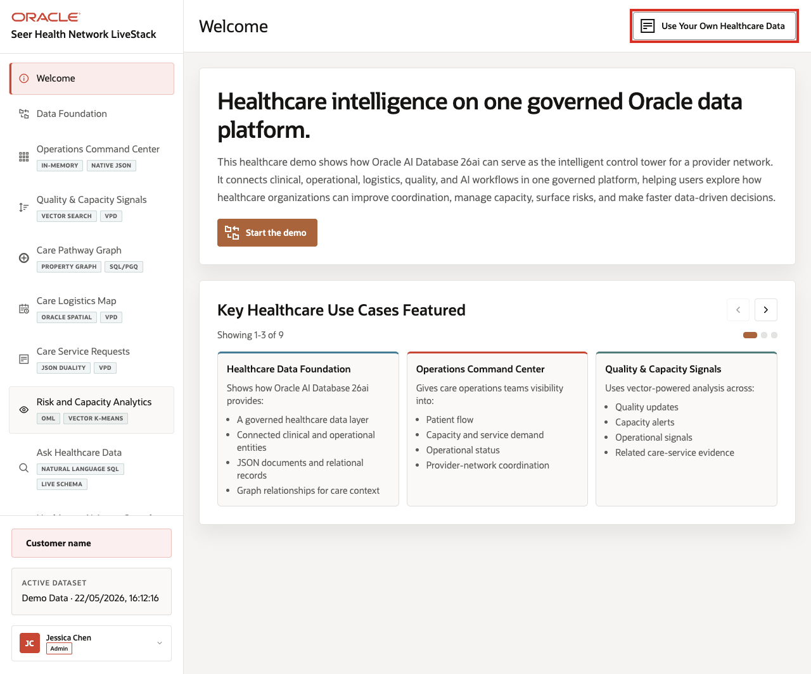
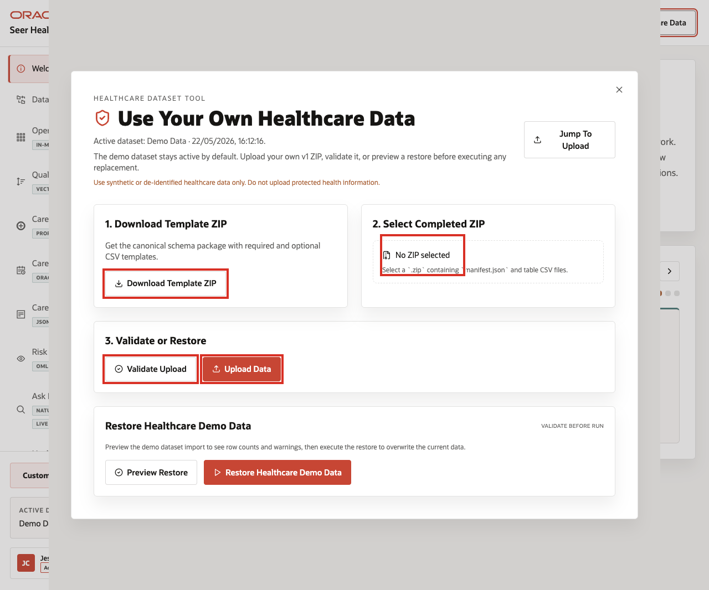
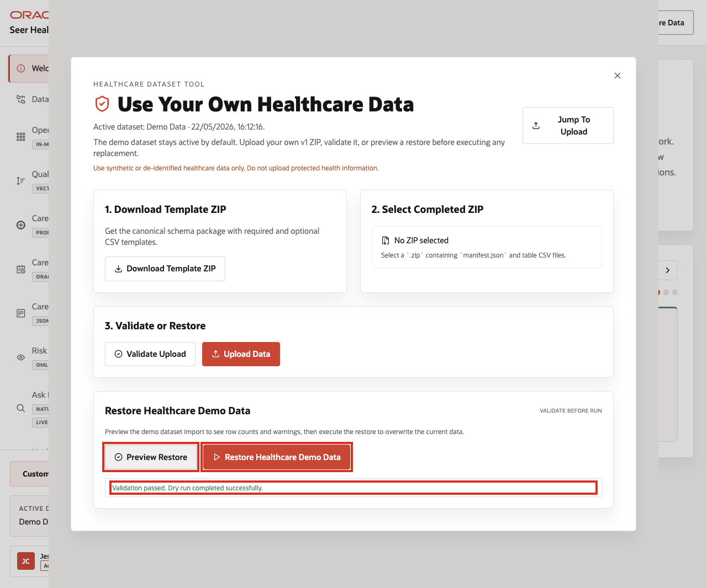

# Scene 11 Use Your Own Healthcare Data

## Introduction

**Use Your Own Healthcare Data** shows how users can replace or restore the dataset through the application while keeping the demo safe and repeatable.

The workflow supports template download, ZIP validation, upload, seeded-data restore, and the expectation that only synthetic or de-identified healthcare data is used.

This scene matters because a healthcare LiveStack is most useful when teams can map the demo pattern to their own terminology and sample data. The application makes that workflow explicit while keeping the seeded Seer Health Network data available as a known-good baseline.

Estimated Time: **10 minutes**

### Objectives

In this scene, you will learn what healthcare decision the page supports, what evidence the user should inspect, and what action the team may take next.

## Task 1: Open the dataset tool

Perform the following set of steps to show where users can manage datasets and to reinforce the key safety rule: use only synthetic or de-identified healthcare data, never protected health information.

1. From any application scene, click **Use Your Own Healthcare Data** in the top bar.
2. Review the modal title and active dataset line.
3. Confirm that the modal warns users to use synthetic or de-identified healthcare data only and not to upload protected health information.
4. Review the main sections: **Download Template ZIP**, **Select Completed ZIP**, **Validate or Restore**, and **Restore Healthcare Demo Data**.

    

In the current demo, the modal shows the active dataset as **Demo Data** and provides a workflow for a v1 ZIP that contains `manifest.json` and table CSV files.

**Note:** Use only synthetic or de-identified healthcare data. Do not upload protected health information into the demo environment.

## Task 2: Review the template and upload workflow

Perform the following set of steps to show how custom datasets stay repeatable. The template defines the expected structure, validation checks the completed ZIP, and upload remains a deliberate action.

1. Click **Download Template ZIP** to download the canonical schema package.
2. Review **Select Completed ZIP**. The control expects a `.zip` containing `manifest.json` and table CSV files.
3. Review the **Validate Upload** and **Upload Data** actions.
4. Explain that validation should run before data replacement.

    

This workflow keeps custom demos repeatable and safe: the template defines the structure, validation checks the package, upload is explicit, and seeded data remains available for reset.

## Task 3: Preview or restore the seeded dataset

Perform the following set of steps to return the demo to a known-good baseline after testing custom synthetic or de-identified data.

1. In **Restore Healthcare Demo Data**, click **Preview Restore**.
2. Review the row counts, warnings, or issues returned by the preview.
3. If you need to return the demo to the seeded baseline, click **Restore Healthcare Demo Data** after the preview enables the action.
4. Close the dataset manager when finished.

    

Use this scene to explain the operating guardrail: teams can bring synthetic or de-identified data into the LiveStack, but the seeded dataset remains available as a known baseline.

You can move to the download lab when you want to run the Healthcare LiveStack locally.

## Credits & Build Notes
- **Author** - Oracle LiveLabs Team
- **Last Updated By/Date** - Oracle LiveLabs Team, 2026-05-26
- **Screenshot source** - Captured from `http://193.123.39.205:8505/`.
