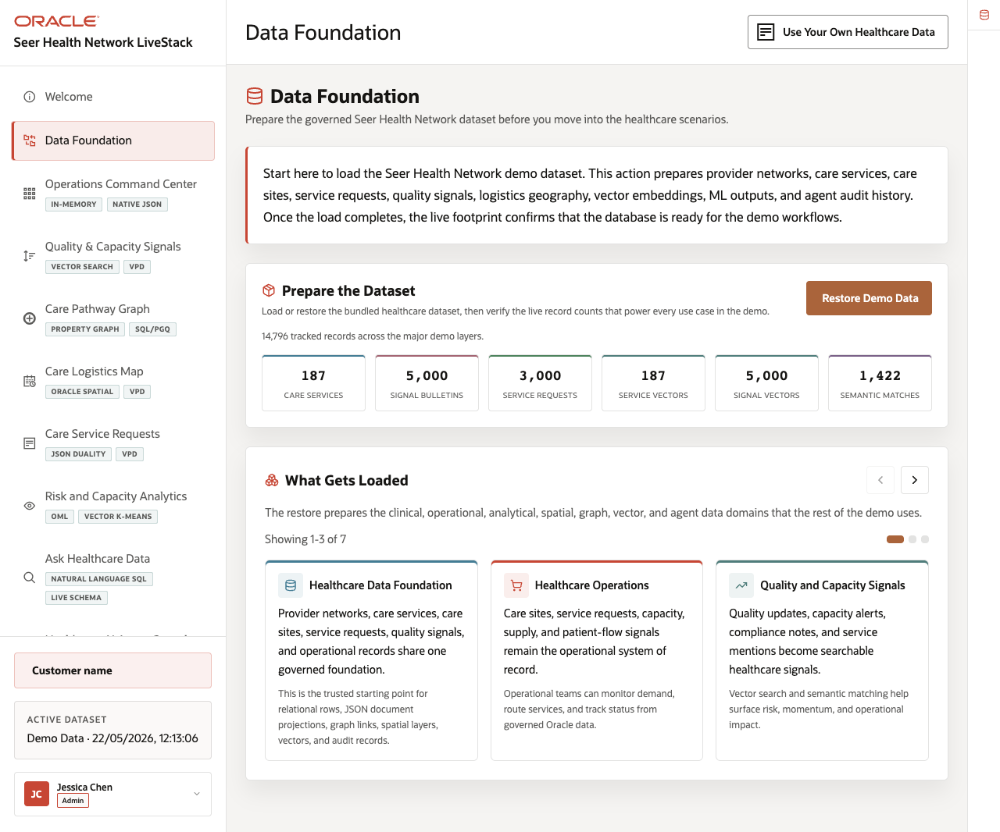
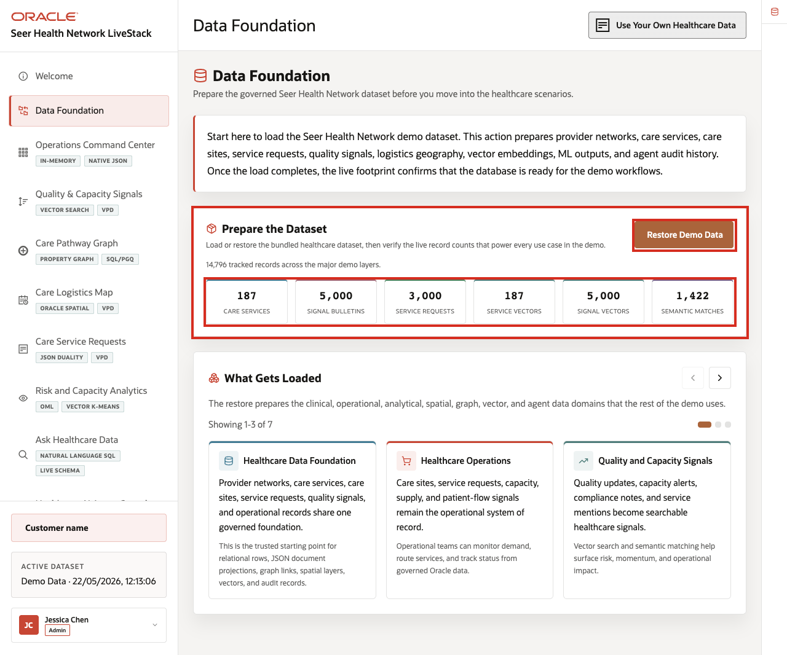
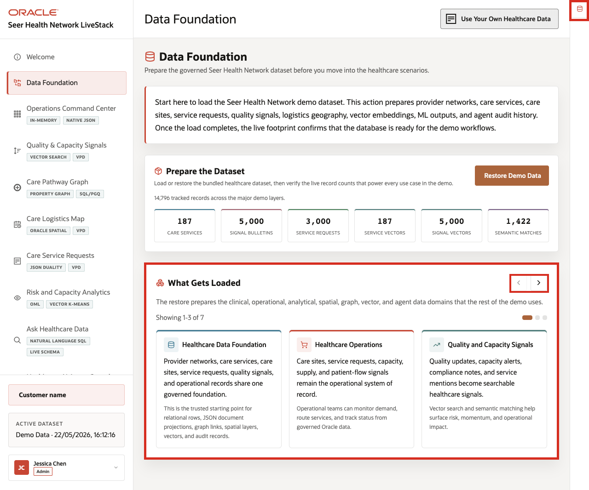
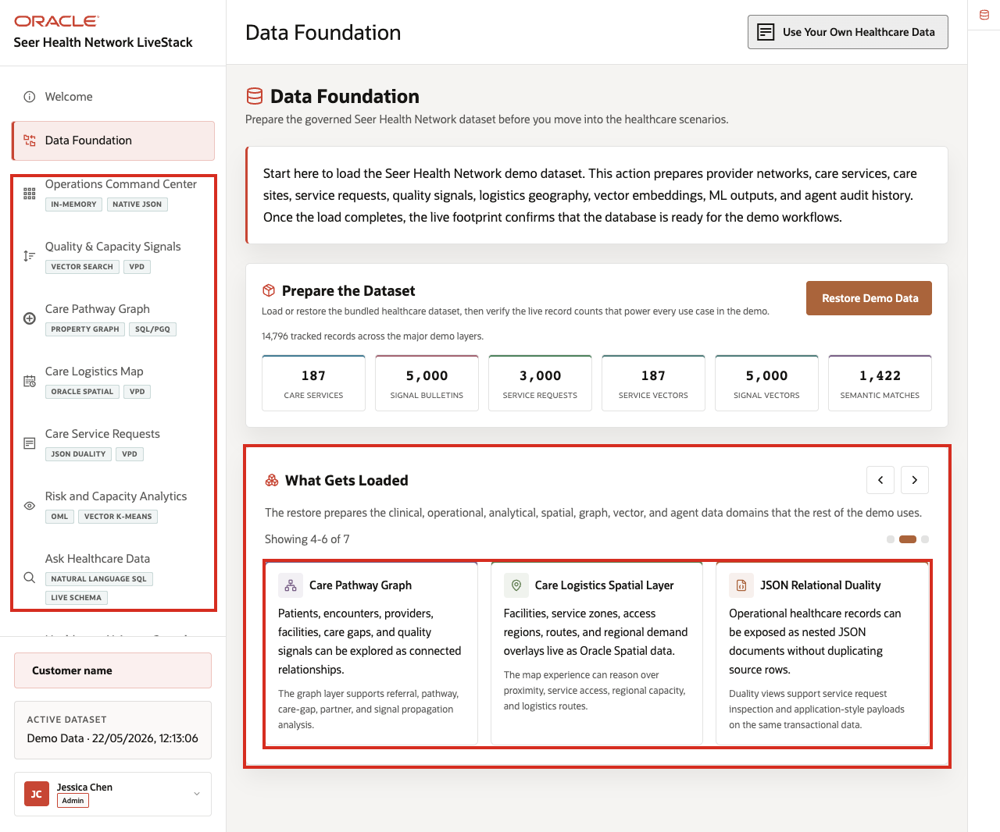

# Scene 2 Healthcare Data Foundation

## Introduction

This scene prepares the trusted **Seer Health Network** dataset used throughout the demo. Loading or restoring the data gives every later screen the same governed starting point, so dashboards, searches, graph views, logistics maps, analytics, and AI actions all reflect the same healthcare data foundation.

Use this scene to show that later pages are not separate demos. They are different healthcare workflows running on one governed data foundation.

Estimated Time: **5 minutes**

### Objectives

In this scene, you will learn what healthcare decision the page supports, what evidence the user should inspect, and what action the team may take next.

**Note:** Review the Oracle Internals sidebar after the business flow is clear. Use it to connect the visible healthcare outcome to the database capabilities behind the page.

## Task 1: Prepare the dataset

Perform the following set of steps to so every later scene starts from the same trusted healthcare baseline. This makes the dashboard, signal search, graph, map, analytics, Ask Data, and agent results easier to compare and trust.

1. From the welcome page, click **Start the demo**, or click **Data Foundation** in the sidebar.
2. In **Prepare the Dataset**, click **Restore Demo Data** if the dataset needs to be reset to the seeded baseline.
3. Wait for the operation to complete.
4. Review the record counts below the action.

    

In the current demo dataset, the page shows **14,796** tracked records across the major demo layers, including **187** care services, **5,000** signal bulletins, **3,000** service requests, **187** service vectors, **5,000** signal vectors, and **1,422** semantic matches.

Use these counts to show that the dataset supports operational, analytical, spatial, graph, vector, and audit workflows, not just a single dashboard.

**Note:** Sample values may change after data refreshes or rebuilds. Verify live output before presenting, then explain the business takeaway.

## Task 2: Review what gets loaded

Perform the following set of steps to show that the demo uses recognizable healthcare data: care services, care sites, service requests, quality signals, logistics geography, graph relationships, vectors, machine learning outputs, and agent actions.

1. Scroll to **What Gets Loaded**.
2. Review the first three carousel cards: **Healthcare Data Foundation**, **Healthcare Operations**, and **Quality and Capacity Signals**.
3. Use the right carousel arrow to review the remaining data groups.
4. Click the **Oracle Internals** icon on the far-right rail to expand the sidebar, then review the Oracle capability notes.

    

The carousel explains the shared data model in business terms: provider networks, care services, care sites, service requests, quality signals, logistics geography, graph links, vectors, ML outputs, and agent actions. The sidebar ties that story to Oracle capabilities such as relational data, JSON Duality Views, property graph, Oracle Spatial, vector search, in-database ML, and the agent audit trail.

## Task 3: Connect the foundation to the rest of the demo

Use this page as the bridge into the operating story. The same governed foundation will support the command center, signal search, care pathway graph, logistics map, service requests, analytics, natural-language questions, and AI agent workflows.

    

The business value is that teams can make the decision from connected, governed data. Oracle AI Database provides the shared foundation that keeps operational data, analytics, and AI workflows aligned.

*You can move to the next scene.*

## Credits & Build Notes
- **Author** - Oracle LiveLabs Team
- **Last Updated By/Date** - Oracle LiveLabs Team, 2026-05-22
