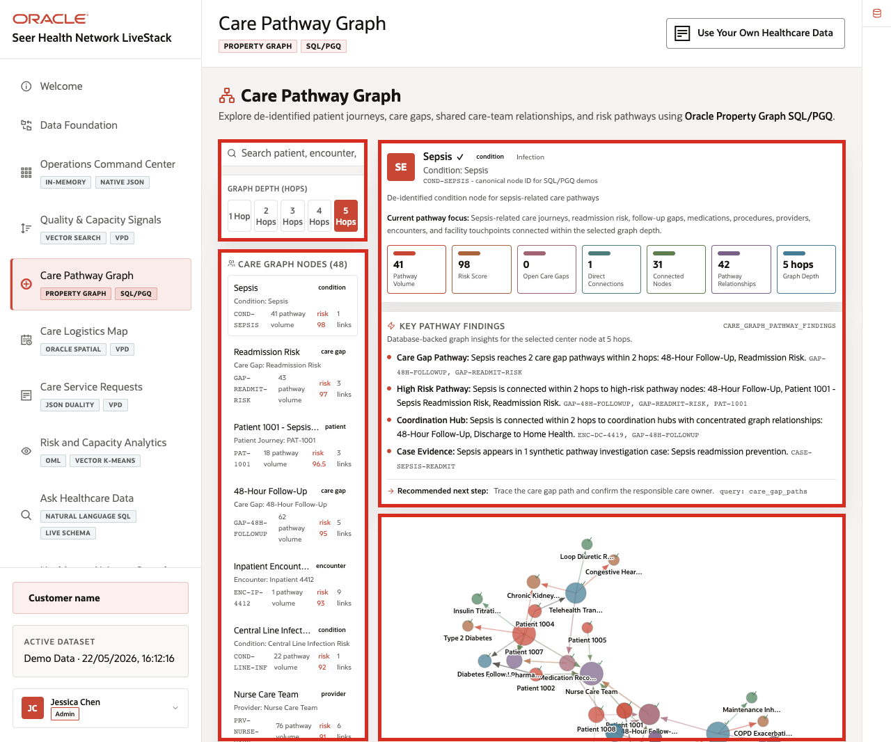

# Scene 5 Care Pathway Graph

## Introduction

**Care Pathway Graph** helps users understand healthcare relationships that are difficult to see in isolated rows. The page connects de-identified patient journeys, encounters, providers, facilities, care gaps, medications, lab results, and quality signals so teams can reason across the pathway, not just one record at a time.

Healthcare teams struggle when the information needed for one decision lives in separate tools. That separation slows action, increases reconciliation work, and makes it harder to trust the result. Oracle AI Database helps answer relationship questions, such as how a patient journey connects to care gaps, encounters, providers, and quality signals.

Estimated Time: **10 minutes**

### Objectives

In this scene, you will learn what healthcare decision the page supports, what evidence the user should inspect, and what action the team may take next.

## Task 1: Review the graph workspace

Perform the following set of steps to see how pathway relationships connect patient journeys, encounters, care gaps, providers, facilities, and quality signals.

1. Click **Care Pathway Graph** in the sidebar.
2. Review the graph depth controls: **1 Hop**, **2 Hops**, **3 Hops**, **4 Hops**, and **5 Hops**.
3. Review the search field for patient, encounter, care gap, or provider lookup.
4. Review **Care Graph Nodes**.
5. Open or review the **Oracle Internals** sidebar on the right.

    

In the current demo dataset, the page shows **48** care graph nodes. Visible nodes include **Sepsis**, **Readmission Risk**, **Patient 1001 - Sepsis Readmission Risk**, **48-Hour Follow-Up**, **Inpatient Encounter 4412**, **Central Line Infection Risk**, **Nurse Care Team**, **Piperacillin/Tazobactam**, and **Dr. Hannah Lee - Hospitalist**.

**Note:** Sample values may change after data refreshes or rebuilds. Verify live output before presenting, then explain the business takeaway.

## Task 2: Explore a pathway-risk example

Perform the following set of steps to show how connected evidence can reveal care gaps, follow-up needs, provider context, and facility relationships that are hard to understand from isolated records.

1. In the node list, locate **Patient 1001 - Sepsis Readmission Risk**.
2. Review the node type, identifier, pathway volume, risk score, and link count.
3. Compare it with nearby care-gap and encounter nodes such as **Readmission Risk**, **48-Hour Follow-Up**, and **Inpatient Encounter 4412**.
4. Change the graph depth from **1 Hop** to **2 Hops** or **3 Hops** to explain how relationship scope changes.

    

Use this example to show why graph context matters: a patient journey, care gap, encounter, medication, provider, and facility are more informative together than as isolated records.

## Task 3: Explain the Oracle graph pattern

Perform the following set of steps to explain that the graph is an analysis view over governed healthcare data. It helps users ask relationship-aware questions while keeping the data connected to the same operational foundation.

1. Review the **Graph Query Explorer** area.
2. Review the Oracle Internals content that references property graph and SQL/PGQ.
3. Explain that the graph is an analysis view over governed healthcare data rather than a disconnected copy.

    

The business value is that teams can make the decision from connected, governed data. Oracle AI Database provides the shared foundation that keeps operational data, analytics, and AI workflows aligned.

*You can move to the next scene.*

## Credits & Build Notes
- **Author** - Oracle LiveLabs Team
- **Last Updated By/Date** - Oracle LiveLabs Team, 2026-05-22
