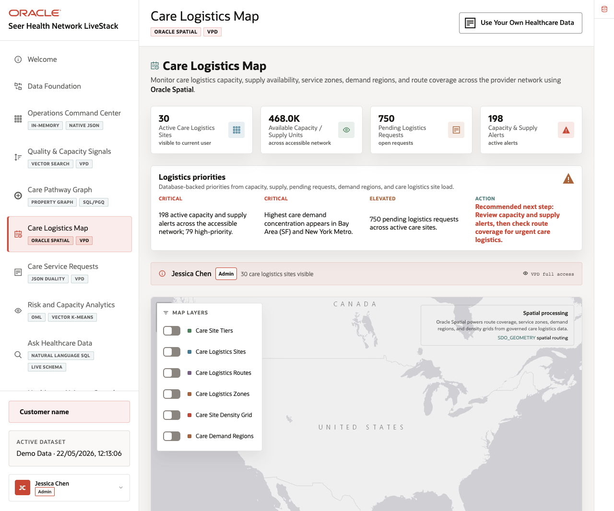
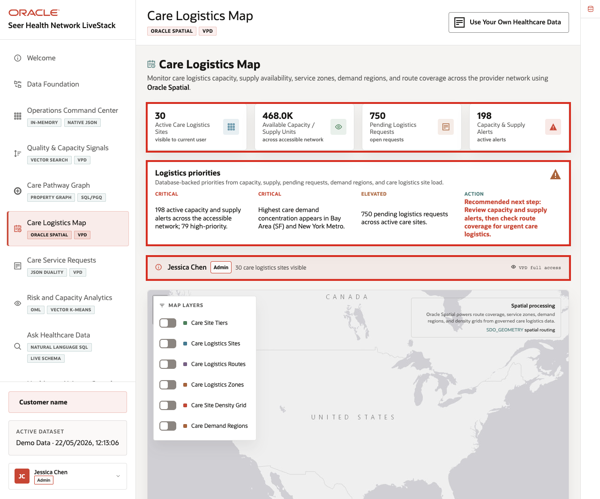

# Scene 6 Care Logistics Map

## Introduction

**Care Logistics Map** helps teams decide where care demand, site capacity, supply constraints, and logistics coverage intersect. The page gives a geographic operating view so users can compare sites, routes, zones, demand regions, and capacity alerts in one place.

Location-aware healthcare decisions are difficult when care sites, logistics sites, routes, service zones, density grids, and demand regions live outside the operational data platform. Teams may export to a GIS tool, but then lose the connection to current service requests, supply levels, access controls, and operational status.

Oracle AI Database helps address these challenges by keeping spatial geometry and operational records together. In this scene, Oracle Spatial powers care logistics sites, routes, service zones, demand regions, and proximity context in the same application that manages the rest of the healthcare data.

Estimated Time: **10 minutes**

### Objectives

In this scene, you will learn what healthcare decision the page supports, what evidence the user should inspect, and what action the team may take next.

## Task 1: Review logistics priorities

Perform the following set of steps to understand where demand, capacity, supply alerts, and service coverage may require attention.

1. Click **Care Logistics Map** in the sidebar.
2. Review the stat cards across the top of the page.
3. Review **Logistics priorities** to the right of the cards.
4. Review the active user and VPD banner.

    

**Note:** Access controls help ensure users see only the healthcare data they are allowed to see, which matters for care sites, service requests, operational records, and AI governance.

In the current demo dataset, the page shows **30** active care logistics sites visible to the current user, about **468.0K** available capacity or supply units, **750** pending logistics requests, and **198** active capacity and supply alerts. The priority panel flags **79** high-priority alerts, demand concentration in **Bay Area (SF)** and **New York Metro**, and a recommendation to review capacity and supply alerts before checking route coverage.

**Note:** Sample values may change after data refreshes or rebuilds. Verify live output before presenting, then explain the business takeaway.

## Task 2: Toggle spatial layers

Perform the following set of steps to compare different logistics questions: where sites are located, how routes connect, which zones are covered, where care sites are dense, and where demand regions are active.

1. Review the map and its layer controls.
2. Toggle **Care Logistics Sites**.
3. Toggle **Care Logistics Routes** and **Care Logistics Zones**.
4. Toggle **Care Site Density Grid** and **Care Demand Regions**.
5. Review how the map changes as layers are added or removed.

    

The layer controls let different users answer different operating questions, such as where demand is concentrated, which routes matter, which zones are covered, and which sites may need capacity attention

## Task 3: Compare site data with the map

Perform the following set of steps to connect visual location context with concrete operating records such as capacity, pending requests, alerts, load, and status.

1. Scroll to the **Care Logistics Sites** table.
2. Review columns for site location, site type, services supported, capacity or supply units, pending requests, alerts, current load, and status.
3. Focus on visible sites such as **Aberdeen East Coast Specialty Care Warehouse**, **Anchorage Alaska Care Logistics Site**, **Aurora Mountain West Repack Hub**, **Concord Southeast Micro Site**, and **Edison Northeast Care Logistics Depot**.
4. Use the table to connect map markers to concrete operating records.

    

The business value is as follows:

- Teams can make the decision from connected, governed data. Oracle AI Database provides the shared foundation that keeps operational data, analytics, and AI workflows aligned. 
- Access controls help ensure users see only the healthcare data they are allowed to see, which matters for care sites, service requests, operational records, and AI governance. 
- Location intelligence stays connected to operational records, so users can compare route coverage and proximity with capacity, pending requests, alerts, and access controls.

*You can move to the next scene.*

## Credits & Build Notes
- **Author** - Oracle LiveLabs Team
- **Last Updated By/Date** - Oracle LiveLabs Team, 2026-05-22
