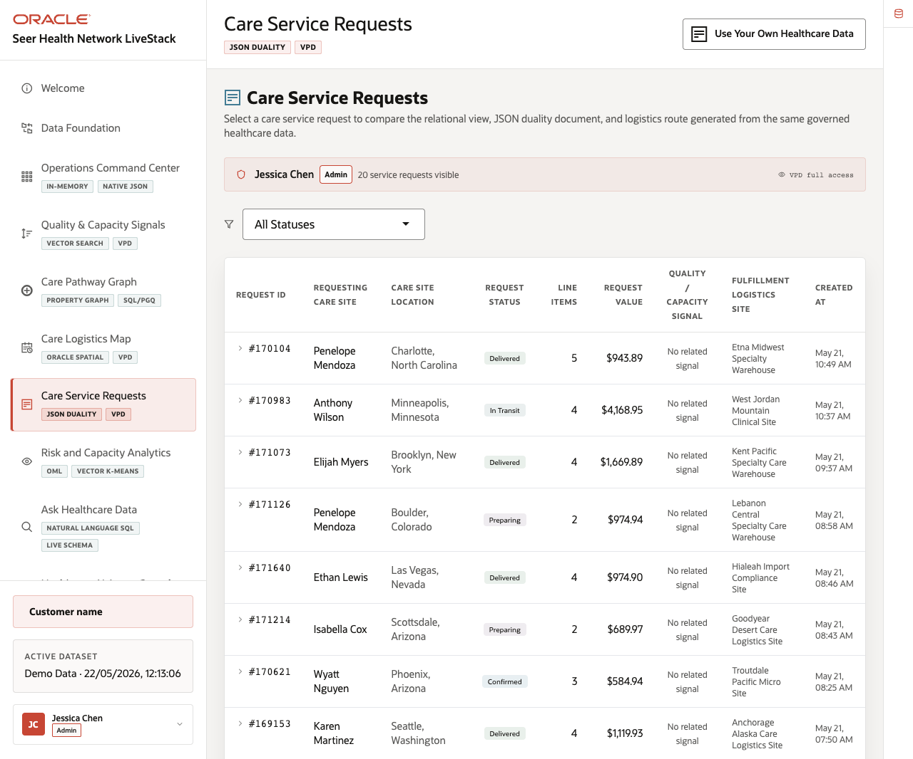
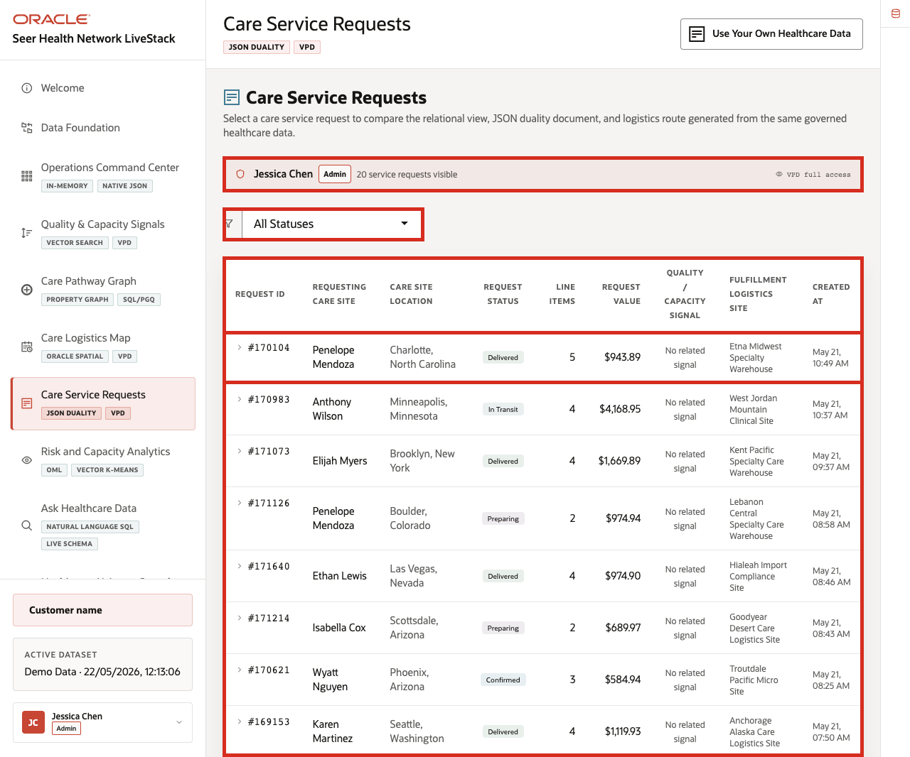
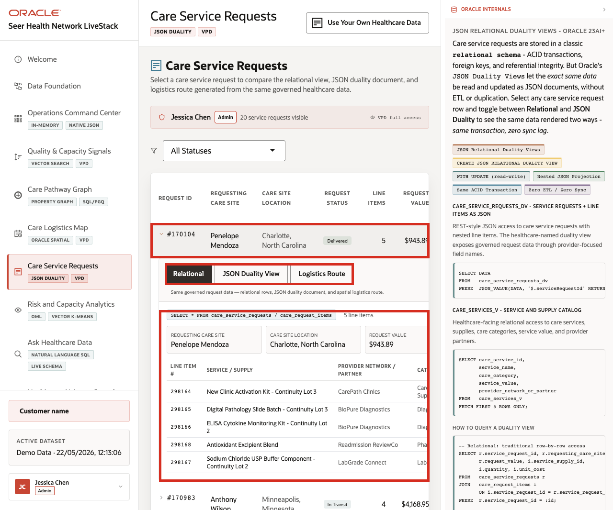
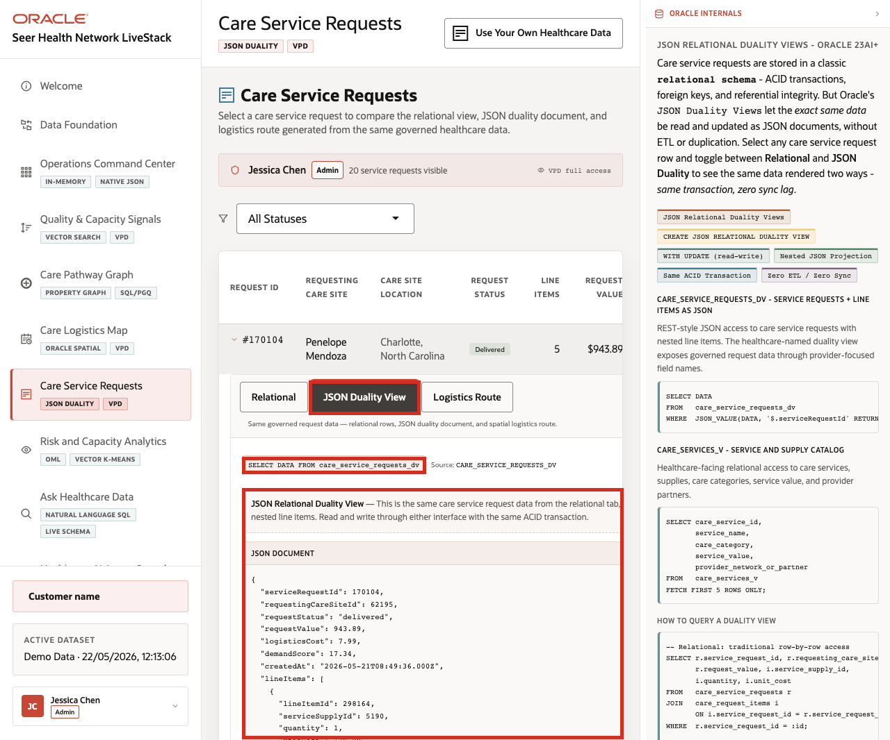
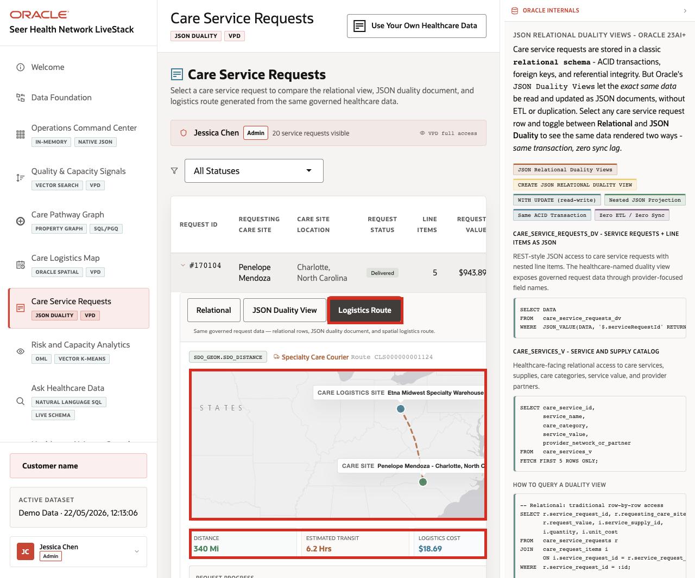

# Scene 7 Care Service Requests

## Introduction

**Care Service Requests** shows how one healthcare service request can support several workflows at once. Operations teams need request and line-item detail, application teams need document-shaped access, and logistics teams need route and distance context.

Healthcare teams struggle when the information needed for one decision lives in separate tools. That separation slows action, increases reconciliation work, and makes it harder to trust the result.

Oracle AI Database helps address these challenges by keeping the service request record in one governed platform while exposing it through the shape each workflow needs. Relational tables provide transactional detail. JSON Relational Duality Views expose the same request as a nested JSON document. Oracle Spatial adds logistics route and distance context.

Estimated Time: **10 minutes**

### Objectives

In this scene, you will learn what healthcare decision the page supports, what evidence the user should inspect, and what action the team may take next.

## Task 1: Review the service request workspace

Perform the following set of steps to establish the operational context: who requested care support, what status the request is in, what value is involved, and which logistics site is responsible.

1. Click **Care Service Requests** in the sidebar.
2. Review the active user banner. The current demo user is **Jessica Chen**, with **Admin** access and **20** visible service requests on the page.
3. Review the status filter.
4. Review the request table columns: request id, requesting care site, location, status, line items, value, quality or capacity signal, logistics site, and created time.
5. Focus on request **#170104**.

    

In the current demo dataset, request **#170104** is for **Penelope Mendoza** in **Charlotte, North Carolina**. It is **Delivered**, has **5** line items, totals **$943.89**, and is fulfilled by **Etna Midwest Specialty Warehouse**. This request will be the data point used through the rest of the scene.

**Note:** Sample values may change after data refreshes or rebuilds. Verify live output before presenting, then explain the business takeaway.

## Task 2: Inspect the relational request detail

Perform the following set of steps to validate the request header, care site, line items, value, logistics cost, and item-level information that operations teams need for service follow-up.

1. Click request **#170104**.

    

2. Confirm the **Relational** tab is selected.
3. Review requesting care site, care site location, request value, and logistics cost.
4. Review the line-item table.

For request **#170104**, the relational view shows line items such as **New Clinic Activation Kit - Continuity Lot 3**, **Digital Pathology Slide Batch - Continuity Lot 3**, **ELISA Cytokine Monitoring Kit - Continuity Lot 2**, **Antioxidant Excipient Blend**, and **Sodium Chloride USP Buffer Component - Continuity Lot 2**. This view is useful for operations because the request header and item detail remain normalized and easy to validate.

**Note:** Sample values may change after data refreshes or rebuilds. Verify live output before presenting, then explain the business takeaway.

## Task 3: Compare the JSON Duality View

Perform the following set of steps to show that the same governed request can support both operations users and application teams without creating separate copies of the record.

1. Click **JSON Duality View** in the expanded request panel.

    

2. Review the source label **CARE_SERVICE_REQUESTS_DV**.
3. Review the JSON document for request **170104**.
4. Notice that the document contains `serviceRequestId`, `requestingCareSiteId`, `requestStatus`, `requestValue`, `logisticsCost`, `demandScore`, `createdAt`, and nested `lineItems`.

The key point is that the request is not copied into a separate document store. The same governed request can appear as operational detail or as a document shape for applications.

## Task 4: Review logistics route context

Perform the following set of steps to connect the service request to the logistics site, care site, distance, transit time, cost, route status, and request progress.

1. Click **Logistics Route** in the expanded request panel.

    

2. Review the logistics site and care site.
3. Review distance, estimated transit, logistics cost, route status, and request progress.
4. Review the Oracle Spatial SQL example.

**Note:** Oracle Spatial stores healthcare locations and routes as governed map data, then include SDO_GEOMETRY as the implementation detail.

For request **#170104**, the page shows a route from **Etna Midwest Specialty Warehouse** to **Penelope Mendoza - Charlotte, North Carolina**. The route is delivered, the distance is about **340 miles**, the estimated transit time is **6.2 hours**, and the logistics cost is **$18.69**. The page explains that Oracle Spatial calculates distance between governed `SDO_GEOMETRY` points.

The value of Oracle AI Database is that the same request can support operations, API access, and logistics analysis without splitting the story across separate persistence layers.

**Note:** Sample values may change after data refreshes or rebuilds. Verify live output before presenting, then explain the business takeaway.

*You can move to the next scene.*

## Credits & Build Notes
- **Author** - Oracle LiveLabs Team
- **Last Updated By/Date** - Oracle LiveLabs Team, 2026-05-22
