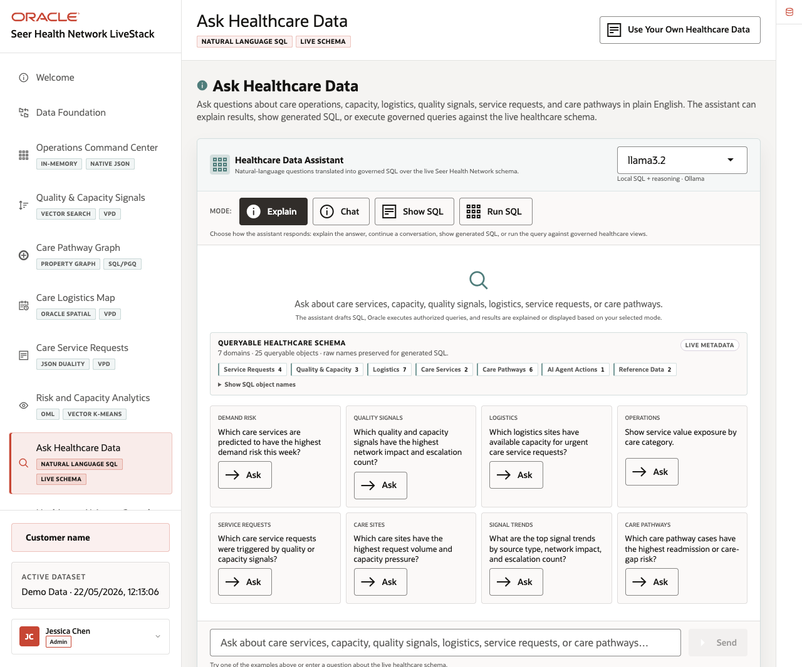
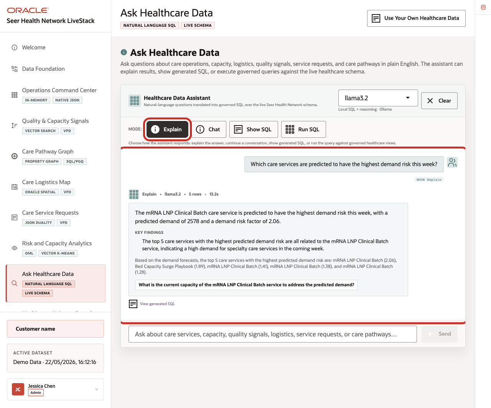
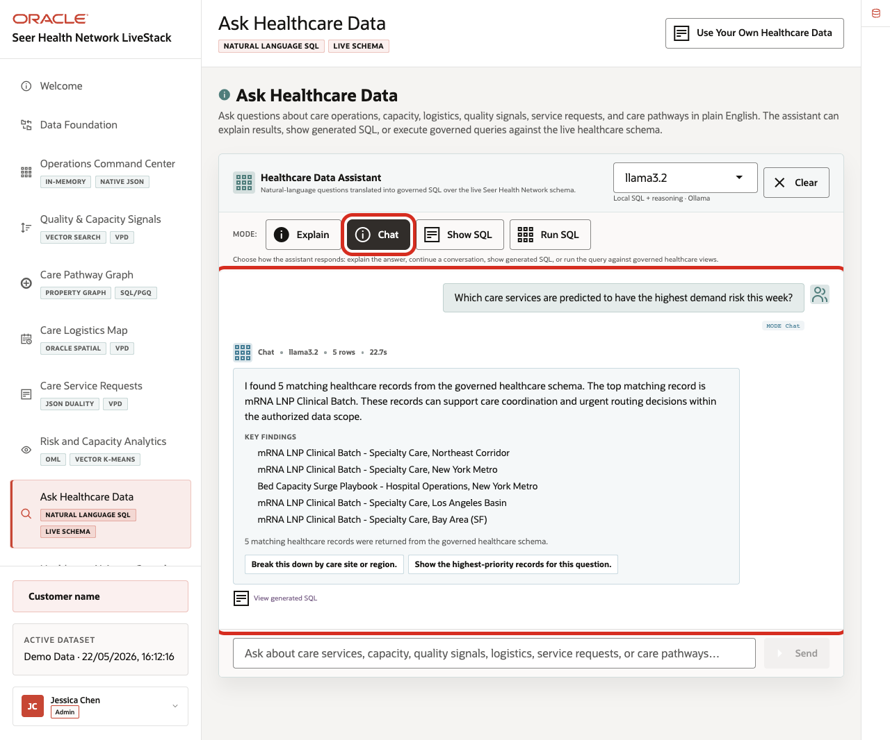
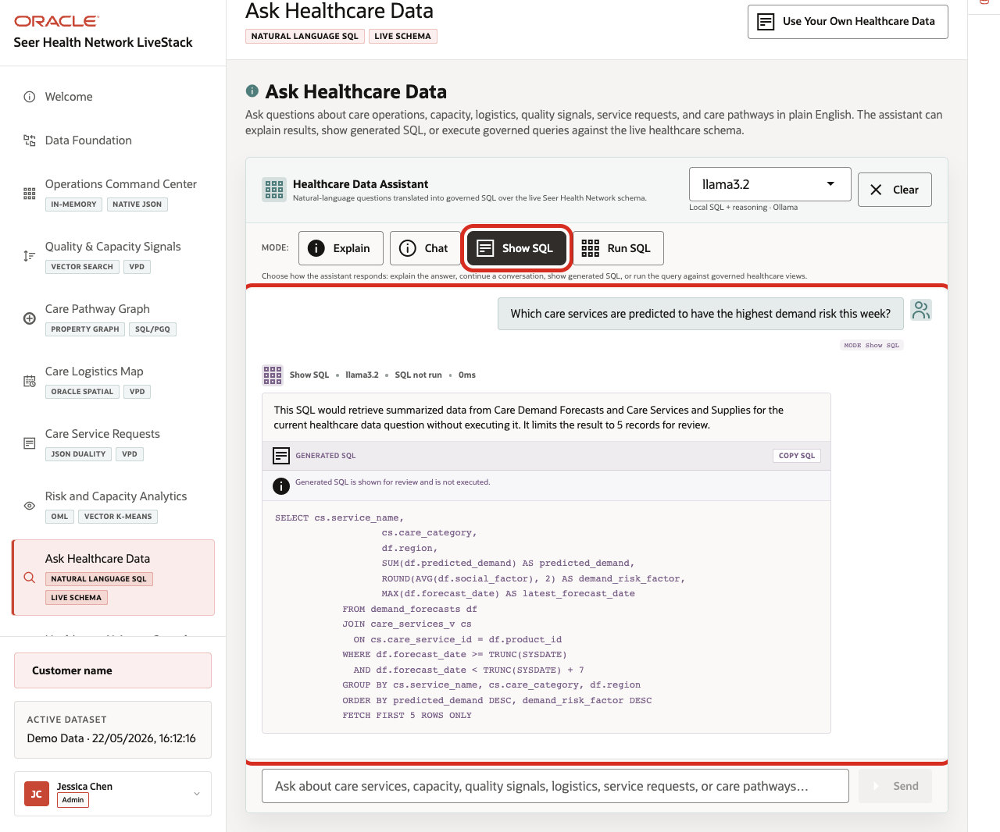
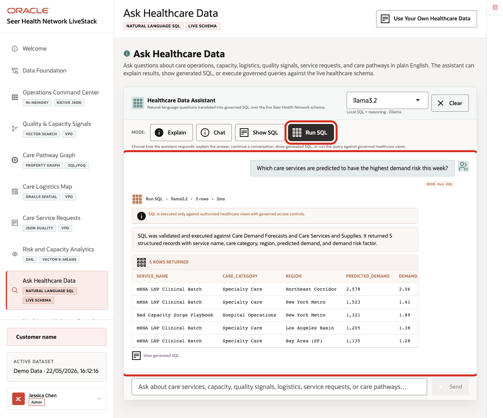

# Scene 9 Ask Healthcare Data

## Introduction

**Ask Healthcare Data** helps healthcare users ask operational questions in plain language while keeping the answer path visible. Users can compare narrated answers, conversational responses, generated SQL, and returned rows, making self-service analytics faster and easier to trust.

Natural-language data access can create governance risk if the language model generates invalid SQL, references the wrong tables, hides the query path, or exposes more data than the user should see. Healthcare teams need self-service analytics, but data teams still need traceability, read-only execution, and a clear source of truth.

Oracle AI Database helps address these challenges by keeping query execution grounded in the live healthcare schema. In this LiveStack Demo, the app sends the question and schema context to the local Ollama runtime, validates the generated SQL path, and uses Oracle AI Database 26ai as the execution authority.

**Note:** Ollama provides the local AI runtime used for reasoning, while Oracle remains the governed source for data access and execution.

Estimated Time: **10 minutes**

### Objectives

In this scene, you will learn what healthcare decision the page supports, what evidence the user should inspect, and what action the team may take next.

## Task 1: Use Explain mode for a narrated answer

 Perform the following set of steps when the user wants a business-readable answer first. The system still relies on governed SQL behind the scenes, but the response is shaped for healthcare operations users.

1. Click **Ask Healthcare Data** in the sidebar.
2. Review the runtime profile in the top right of the assistant card. The current demo uses **llama3.2** through the local Ollama runtime.
3. Review the queryable schema summary. The current page shows **7** domains and **25** queryable objects.
4. Click **Explain**.
5. Click **Ask** on the **Demand Risk** question: **Which care services are predicted to have the highest demand risk this week?**

    

**Expected result:** The assistant returns a narrated answer and key findings without making the generated SQL the main artifact. In the current demo dataset, the response identifies **mRNA LNP Clinical Batch** as the highest demand-risk care service, with **2,578** predicted demand and a **2.06** demand risk factor.

**Notes:**

- Sample values may change after data refreshes or rebuilds. Verify live output before presenting, then explain the business takeaway.

- Use this mode when the user wants a business-readable answer first. The system still uses governed SQL behind the scenes, but the presentation is optimized for a healthcare analyst, care operations lead, or capacity planner.

## Task 2: Use Chat mode for a conversational answer

Perform the following set of steps when the user is exploring the data interactively and may want follow-up questions, regional breakdowns, or a more conversational explanation.

1. Click **Clear** if the Explain result is still visible.
2. Click **Chat**.
3. Click **Ask** on the same **Demand Risk** question.

    

**Expected result:** The assistant returns a conversational response and follow-up prompts. The current response states that **5** matching healthcare records were found, calls out **mRNA LNP Clinical Batch** as the top matching record, and lists the care service and region combinations that need attention.

**Notes:**

- Sample values may change after data refreshes or rebuilds. Verify live output before presenting, then explain the business takeaway.

- Use this mode when the user is exploring the data interactively. Chat mode keeps the answer grounded in the live healthcare schema, but it is shaped for follow-up questions such as breaking the result down by region or showing the highest-priority records.

## Task 3: Use Show SQL mode to inspect the query path

Perform the following set of steps when a user, data steward, or reviewer needs to see the query path before rows are returned. This keeps the answer traceable instead of hidden behind an AI response.

1. Click **Clear** if the Chat result is still visible.
2. Click **Show SQL**.
3. Click **Ask** on the same **Demand Risk** question.

    

4. Review the generated SQL.

The generated SQL joins `demand_forecasts` with `care_services_v`, groups by service, category, and region, orders by predicted demand and demand risk factor, and limits the result with `FETCH FIRST 5 ROWS ONLY`. This is the governance moment: the user can inspect the generated SQL before asking the database to return rows.

**Note:** Use this mode when the user, data steward, or technical reviewer wants to verify what will run before rows are returned. The language model proposes the SQL, but the query path remains visible and reviewable.

## Task 4: Use Run SQL mode to inspect returned rows

Perform the following set of steps to inspect the live rows behind the answer. This helps the user connect a plain-English demand-risk question to specific services, regions, predicted demand, and risk factors.

1. Click **Clear** if the generated SQL result is still visible.
2. Click **Run SQL**.
3. Click **Ask** on the same **Demand Risk** question.

    

4. Review the returned table.

In the current demo dataset, the question returns **5** rows. The top row is **mRNA LNP Clinical Batch** in **Specialty Care** for the **Northeast Corridor**, with **2,578** predicted demand and a **2.06** demand risk factor. The remaining rows show **mRNA LNP Clinical Batch** for **New York Metro**, **Los Angeles Basin**, and **Bay Area (SF)**, plus **Bed Capacity Surge Playbook** for **New York Metro**.

**Note:** Sample values may change after data refreshes or rebuilds. Verify live output before presenting, then explain the business takeaway.

This is the data point to emphasize during the demo. A plain-English question surfaces a specific operating risk by service, category, region, predicted demand, and demand risk factor. The business user can discover the issue without writing SQL, while the SQL and database result remain visible for trust.

Use the four completed mode examples to explain the governance pattern behind the page:

1. The user asks a healthcare question in plain English.
2. The app builds prompt and schema context for the selected runtime profile.
3. Ollama drafts SQL or a response plan.
4. Oracle AI Database executes authorized SQL against the live schema.
5. The UI returns visible SQL, rows, or a narrated answer depending on the selected mode.

This pattern matters because healthcare users want faster answers, but they also need governed access, visible query logic, and a trusted execution layer.

*You can move to the next scene.*

## Credits & Build Notes
- **Author** - Oracle LiveLabs Team
- **Last Updated By/Date** - Oracle LiveLabs Team, 2026-05-22
