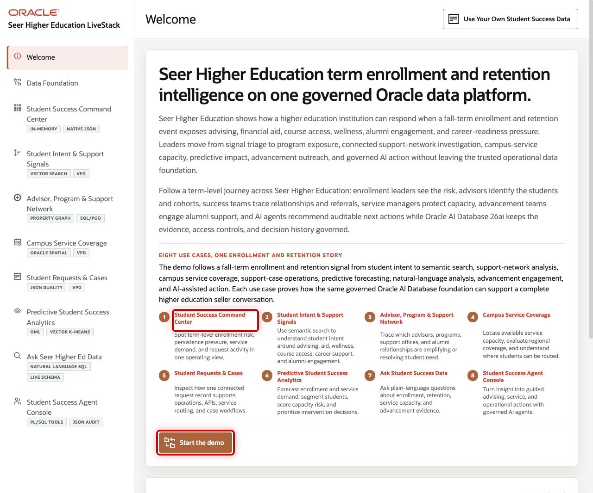

# Seer Higher Education Student Success LiveStack Guide

## Introduction

Higher education teams need to make faster decisions while enrollment, advising, retention, student support, financial aid, advancement, campus operations, and student signals are spread across many systems. The Seer Higher Education LiveStack shows how an institution can bring those signals together, understand where students need help, and move from insight to action with more confidence.

This runbook supports the Seer Higher Education Student Success LiveStack Demo. The demo shows how Oracle AI Database 26ai can help higher education teams bring those workloads together on one connected data foundation. Instead of splitting student records, service requests, JSON documents, support networks, campus geography, vector search, machine learning, natural-language SQL, and AI agent workflows across separate systems, the LiveStack shows how those capabilities can work against the same governed Oracle data model.

In the demo, Seer Higher Education uses Oracle AI Database to connect students, academic programs, campus services, advising requests, community and alumni signals, support networks, capacity, predictive analytics, conversational data access, and agent-assisted operations. The demo follows **Campus Shuttle Pass** as the opening service-demand thread: student demand is visible in the command center, signal evidence explains why, service coverage shows where capacity is available, and analytics, natural-language SQL, and AI agents help teams act from the same governed student-success foundation.

Estimated Demo Time: 90 minutes

Each scene is designed to take between 5 and 10 minutes.

### Objectives

In this LiveStack demo, you will see how a college, university, community college, public system, private institution, online learning provider, or student success team can use connected data and AI-assisted workflows to improve enrollment, retention, advising, student support, service access, and institutional performance.

### Prerequisites

Before you begin, confirm that you can open the running Seer Higher Education LiveStack in a modern browser. No database or coding knowledge is required to follow the business workflow.

## Demo Flow

- Scene 1: Welcome and Demo Orientation.
- Scene 2: Data Foundation.
- Scene 3: Student Success Command Center.
- Scene 4: Student Intent and Support Signals.
- Scene 5: Advisor, Program, and Support Network.
- Scene 6: Campus Service Coverage.
- Scene 7: Student Requests and Cases.
- Scene 8: Predictive Student Success Analytics.
- Scene 9: Ask Seer Higher Ed Data.
- Scene 10: Student Success Agent Console.

## Learn More

- [Oracle AI Database 26ai documentation](https://docs.oracle.com/en/database/oracle/oracle-database/26/index.html)
- [Oracle AI Agent Memory](https://www.oracle.com/database/ai-agent-memory/)
- [Oracle AI Vector Search](https://www.oracle.com/database/ai-vector-search/)
- Oracle Spatial and Graph documentation: [Oracle Spatial](https://docs.oracle.com/en/database/oracle/oracle-database/26/spatl/toc.htm) and [Oracle Property Graph](https://docs.oracle.com/en/database/oracle/property-graph/26.2/index.html)
- [Oracle Machine Learning for SQL documentation](https://docs.oracle.com/en/database/oracle/machine-learning/oml4sql/tasks.html)
- [Oracle REST Data Services documentation](https://docs.oracle.com/en/database/oracle/oracle-rest-data-services/25.4/orddg/index.html)
- [Oracle LiveLabs catalog](https://livelabs.oracle.com/)

## Credits & Build Notes
- **Author** - Oracle LiveLabs Team
- **Last Updated By/Date** - Oracle LiveLabs Team, 2026-05-29
