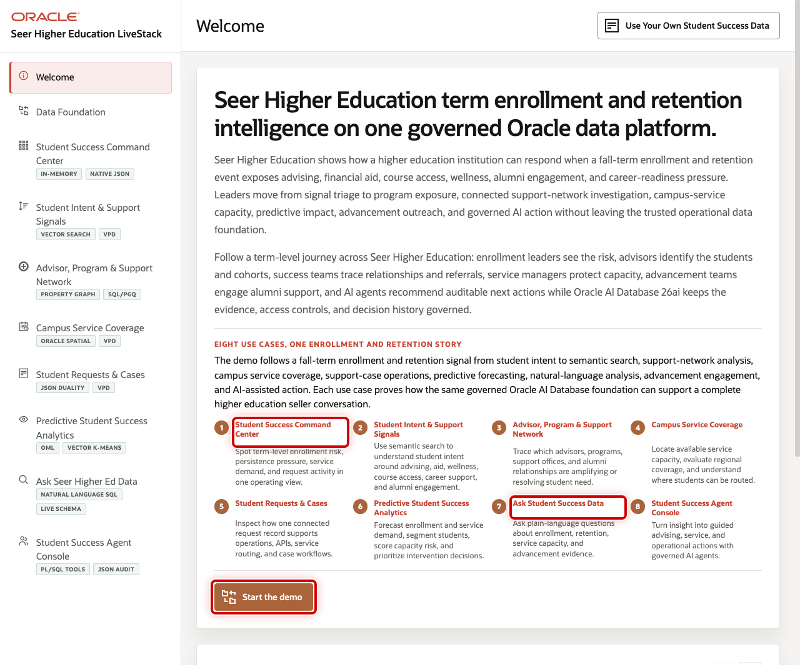
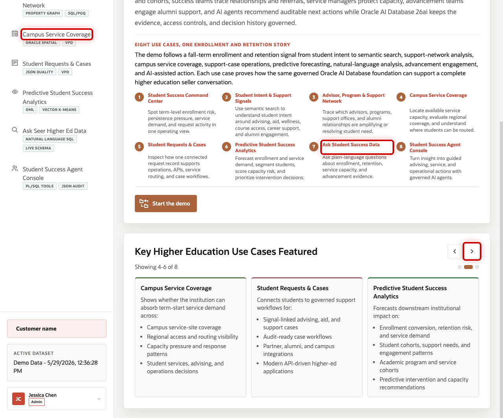

# Scene 1 Welcome and Demo Orientation

## Introduction

**Welcome and Demo Orientation** gives the seller a clean opening story for Seer Higher Education. It frames the demo as a connected student lifecycle journey, not a collection of separate database features.

Higher education leaders are under pressure to improve enrollment yield, support persistence, allocate scarce student services, explain risk, and show trusted evidence to executive, academic, advising, financial aid, and advancement stakeholders. The welcome page gives the presenter a guided way to introduce that journey before drilling into the operational scenes.

Oracle AI Database helps by bringing the operational data, signal data, graph relationships, spatial service coverage, vector search, machine learning, natural-language SQL, and agent workflows into one governed data foundation. The seller can start with the business challenge and then show how each scene contributes evidence.

Estimated Time: 5 minutes

### Objectives

In this scene, you will learn how to open the demo, frame the institutional story, and orient the audience to the student lifecycle use cases.

## Task 1: Start with the student-success story

Use the welcome page as the opening hook. It positions Seer Higher Education as an institution that wants to connect enrollment, retention, advising, service access, and advancement evidence on one trusted platform.

1. Review the **Welcome** page.
2. Point out the student lifecycle framing across the use-case cards.
3. Click **Start the demo** when you are ready to move into the command center.

## Task 2: Review the use-case carousel

Use the carousel to preview the full demo journey. The first group introduces the command center, student signals, and support network. The next group connects campus coverage, request evidence, predictive analytics, Ask Data, and agents.

1. Click the carousel arrow to review the next group of use cases.
2. Highlight **Campus Service Coverage** as the access and capacity scene.
3. Highlight **Ask Student Success Data** as the governed natural-language analytics scene.
4. Explain that the rest of the runbook follows the same connected student-success journey.

You can move to the next scene.

## Credits & Build Notes
- **Author** - Oracle LiveLabs Team
- **Last Updated By/Date** - Oracle LiveLabs Team, 2026-05-29
