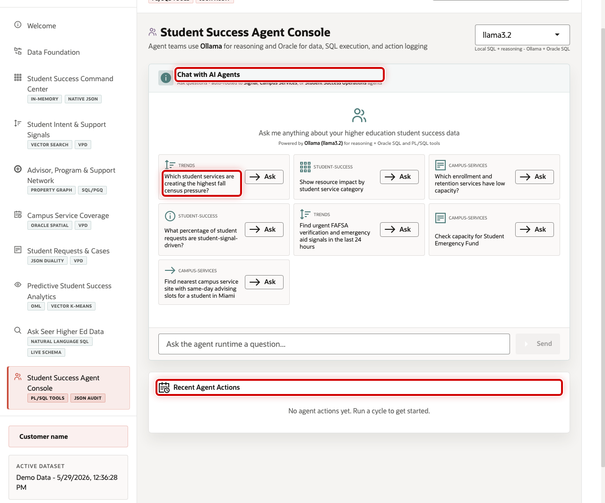
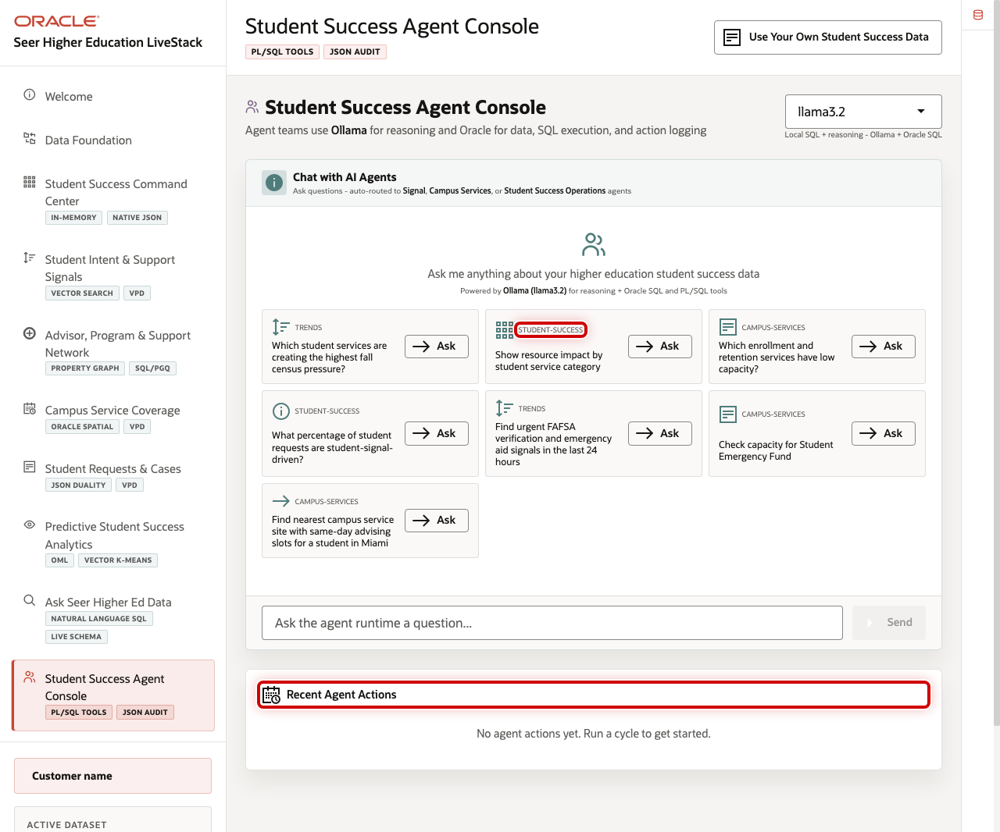

# Scene 10 Student Success Agent Console

## Introduction

**Student Success Agent Console** shows how AI-assisted operations can help a student success team move from insight to coordinated action. It routes questions to specialist agents for student signals, campus services, and student-success operations.

Institutions want AI assistance, but they also need auditability, grounded data access, and clear operational boundaries. A useful agent experience should query the live system, explain what it found, and leave a record of the action path.

Oracle AI Database helps address that challenge by keeping SQL tools, PL/SQL tool calls, JSON event streams, vector retrieval, model scoring, and action audit records together. The app uses Ollama for reasoning and Oracle for the data, execution, and logging layer.

Estimated Time: 10 minutes

### Objectives

In this scene, you will learn how agent-assisted workflows can help student success teams analyze signals, service capacity, and request impact while keeping actions traceable.

## Task 1: Review the agent console

Use the console to show the governed AI operations pattern.

1. Click **Student Success Agent Console** in the sidebar.
2. Review **Chat with AI Agents**.
3. Review the example questions.
4. Review **Recent Agent Actions** as the audit trail area.

## Task 2: Ask an agent question

Ask a trend-oriented question to show how the agent routes work to the right team and grounds the answer in student-success data.

1. Click **Which student services are creating the highest fall census pressure?**
2. Review the response from the agent runtime.
3. Review the recent action log area.
4. Explain that the system uses AI for reasoning but keeps data access, tool execution, and audit evidence inside the governed Oracle-backed application.

You have completed the Seer Higher Education Student Success LiveStack Demo.

## Credits & Build Notes
- **Author** - Oracle LiveLabs Team
- **Last Updated By/Date** - Oracle LiveLabs Team, 2026-05-29
