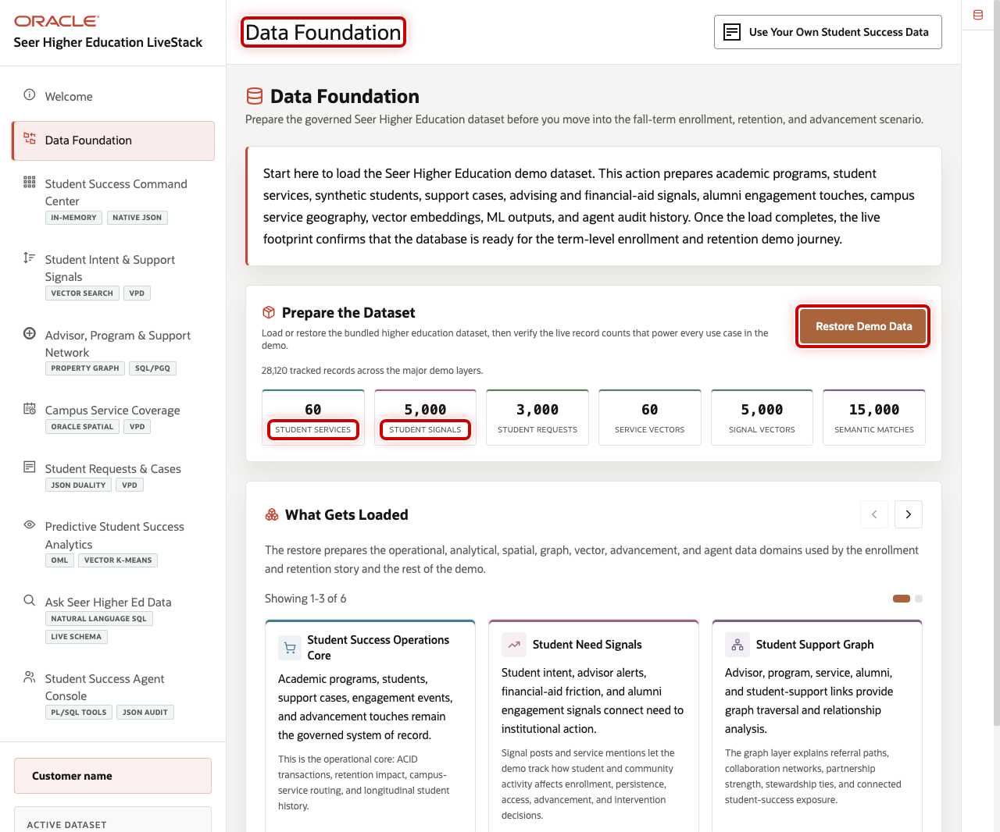
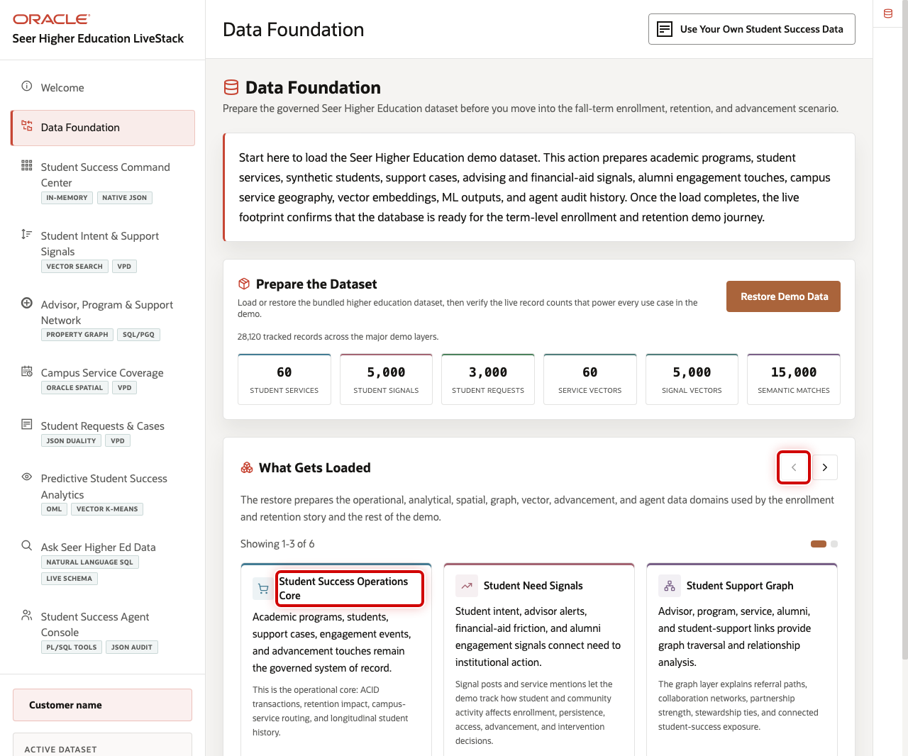

# Scene 2 Data Foundation

## Introduction

**Data Foundation** shows that the demo is backed by a loaded, governed higher education data model. It is the seller's proof point that the application is not running from disconnected fallback screens.

Student-success teams usually work across SIS records, CRM engagement, advising notes, financial aid activity, course access, case management, campus operations, alumni support, and institutional research datasets. Those systems often require reconciliation before leaders trust the result.

Oracle AI Database helps address that challenge by keeping relational data, JSON documents, vector embeddings, graph edges, spatial service coverage, OML models, and agent audit records close to the same governed schema. In the current live dataset, the app shows **60** student services, **5,000** student signals, **3,000** student requests, **5,000** signal vectors, **15,000** semantic matches, and **4** OML models.

Estimated Time: 5 minutes

### Objectives

In this scene, you will confirm that the demo has valid data loaded and explain how the data foundation supports the rest of the student-success journey.

## Task 1: Confirm the loaded data foundation

Use the top of the page to show that the LiveStack is running with valid demo data.

1. Click **Data Foundation** in the sidebar.
2. Review the loaded-data metrics for student services, student signals, student requests, vectors, semantic matches, and OML models.
3. Use **Restore Demo Data** only when you need to reset the running demo to a known good dataset.

## Task 2: Review the loaded data domains

The loaded data domains connect the business story to the physical data model.

1. Scroll to **Loaded Data Domains**.
2. Review **Student Success Operations Core** to explain students, services, requests, cases, and capacity.
3. Review the AI and analytics domains to explain vectors, semantic matches, graph connections, OML models, and agent audit data.
4. Explain that every later scene uses this same governed data foundation.

You can move to the next scene.

## Credits & Build Notes
- **Author** - Oracle LiveLabs Team
- **Last Updated By/Date** - Oracle LiveLabs Team, 2026-05-29
