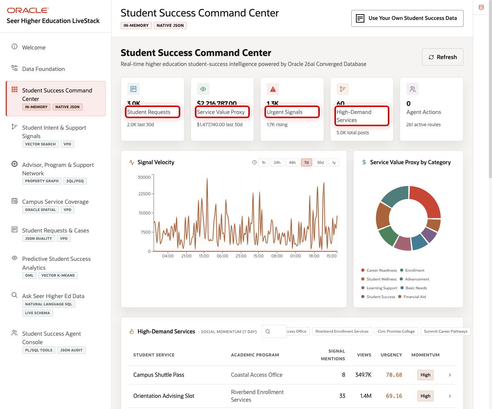
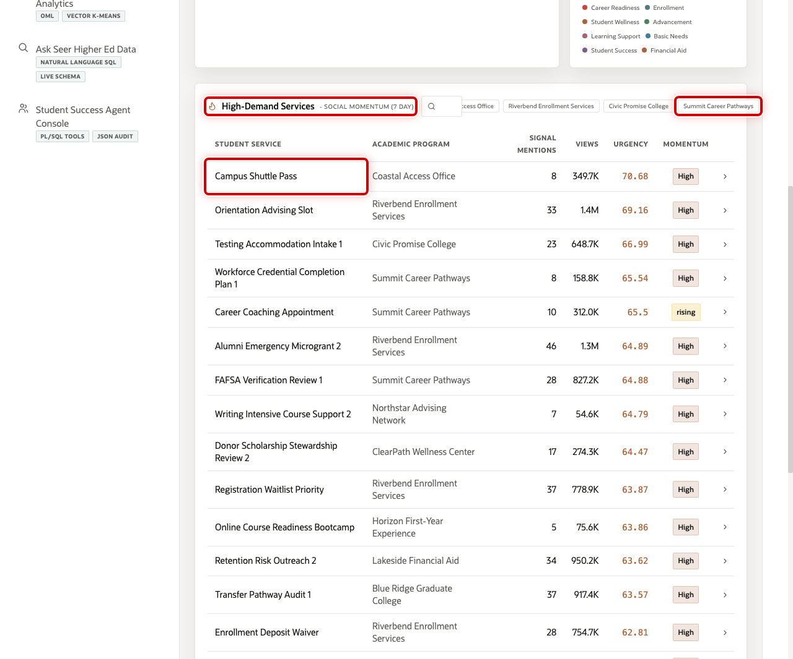
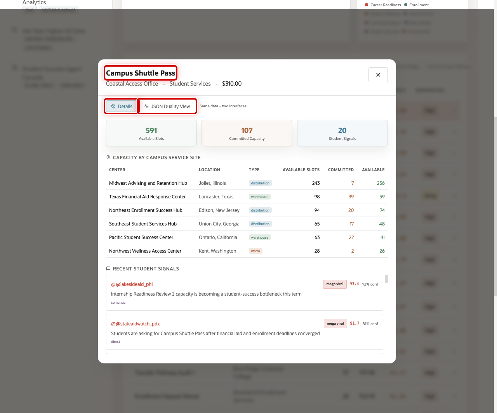
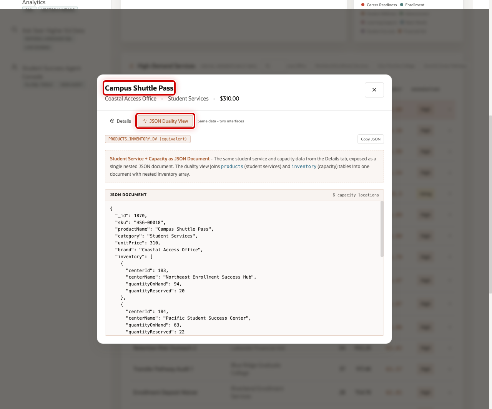

# Scene 3 Student Success Command Center

## Introduction

**Student Success Command Center** gives enrollment, student success, advising, and operations leaders a clear daily view of the institution. It tracks student requests, service value proxy, urgent signals, high-demand services, and agent actions in one place.

Across the industry, institutions that respond to early signals before a student misses a deadline, drops a course, or disengages consistently achieve stronger retention outcomes. This command center provides enrollment, advising, and operations leaders with a unified daily view of student demand, risk, and service activity, enabling them to act before small issues become long-term retention challenges.

Dashboards like this are difficult to implement when higher education data is split across SIS, CRM, LMS, case-management, advising, social listening, advancement, and analytics systems. Teams often need copied data, ETL jobs, separate search indexes, and reconciliation logic before a dashboard can show a trustworthy view.

Oracle AI Database helps address that challenge by keeping operational, analytical, JSON, in-memory, and AI-ready data close to the same governed data foundation. In this scene, **Campus Shuttle Pass** gives the seller a concrete opening example: demand is visible at the dashboard level and then traceable down to capacity, student signals, and JSON application shape.

Estimated Time: 10 minutes

### Objectives

In this scene, you will learn what institutional decision the page supports, what evidence the user should inspect, and what action the business may take next.

## Task 1: Review the command center dashboard

Use the dashboard as a triage view. In the current demo dataset, the opening KPI row shows **3,000** student requests, about **$2.2M** in service value proxy, **1,269** urgent signals, **60** high-demand services, and the current agent action count.

1. Click **Student Success Command Center** in the sidebar.
2. Review the KPI cards across the top of the page.
3. Review **Signal Velocity** to see how student and community activity changes over time.
4. Review **Service Value Proxy by Category** to see which service categories are carrying institutional demand.

## Task 2: Review high-demand services

The table helps the user move from dashboard-level signals to service-level evidence. In the current demo dataset, **Campus Shuttle Pass** appears as a leading student service with **8** recent signal mentions, about **349.7K** views, and **High** peak momentum.

1. Scroll to **High-Demand Services**.
2. Review the service rows and the columns for academic program, signal mentions, views, urgency, and momentum.
3. Use the search field or program chips if you want to narrow the table.
4. Click the **Campus Shuttle Pass** row.

## Task 3: Inspect the service detail modal

Open the service detail modal to connect student demand with operational readiness. The modal shows **591** available slots, **107** committed capacity, and **20** student signals for Campus Shuttle Pass.

1. Review the **Details** view.
2. Review **Capacity by Campus Service Site** to see where capacity exists.
3. Review **Recent Student Signals** to connect operational demand with student voice and community evidence.

## Task 4: Review the JSON Duality View

Review the JSON Duality View to show that the same trusted service data can support different users. Business users see service details in the interface, while applications can use the same information as a structured document.

1. In the service modal, click **JSON Duality View**.
2. Review the JSON document for the selected service.
3. Explain that Oracle JSON Relational Duality lets the application expose document-shaped data over trusted relational tables.

You can move to the next scene.

## Credits & Build Notes
- **Author** - Oracle LiveLabs Team
- **Last Updated By/Date** - Oracle LiveLabs Team, 2026-05-29
