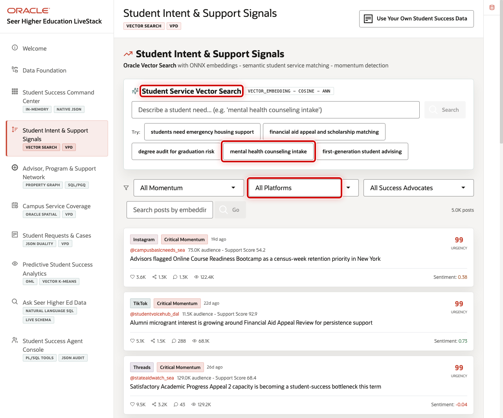
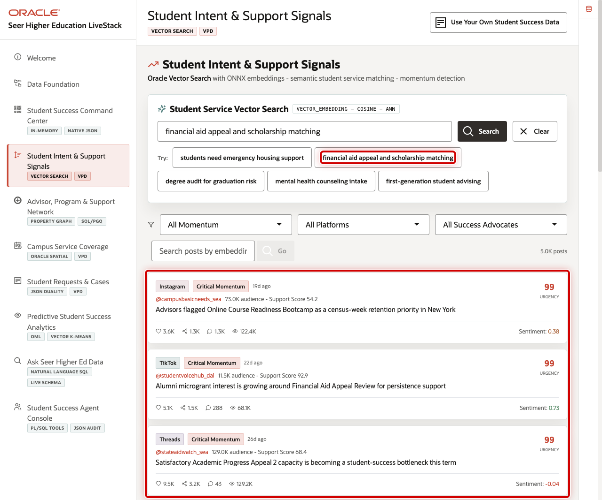
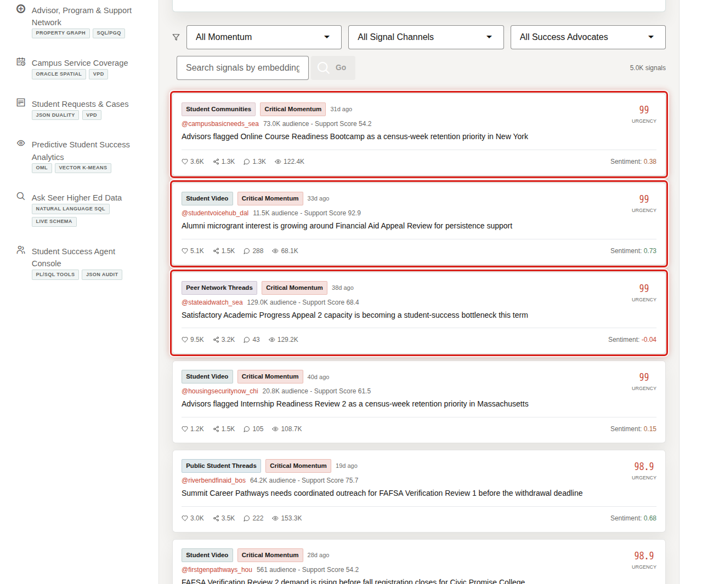

# Scene 4 Student Intent and Support Signals

## Introduction

**Student Intent and Support Signals** helps student success, enrollment, advising, financial aid, and engagement teams understand what students and communities are asking for before demand becomes a late intervention.

Students often signal their needs long before they submit a request, open a case, or contact an advisor. Those signals appear across financial aid communities, peer networks, alumni advocacy channels, and other student-driven conversations. When institutions can identify and interpret those signals early, they gain valuable time to intervene. With 5,000 signal posts across the live dataset, this scene shows how semantic search and AI-powered signal monitoring convert unstructured student voice into actionable operational intelligence, enabling student success teams to respond before challenges become escalations.

Oracle AI Database helps address that challenge with vector embeddings, semantic matching, SQL filtering, row-level security, and live signal analytics in the same data platform. The current dataset includes **5,000** student signal posts from realistic higher education sources such as `@riverbendfinaid_bos`, `@firstgenpathways_hou`, and `@campusbasicneeds_sea`.

Estimated Time: 10 minutes

### Objectives

In this scene, you will learn how semantic search and signal monitoring help teams detect student needs and connect them to student services.

## Task 1: Review the student signal workspace

Use the top of the page to show how a business user can search by need, not by exact keyword.

1. Click **Student Intent & Support Signals** in the sidebar.
2. Review **Student Service Vector Search**.
3. Review the example prompts, platform filter, success advocate filter, and feed controls.

## Task 2: Search for a student need

Vector search helps the institution find relevant services even when the user's language does not match exact service names.

1. Click **financial aid appeal and scholarship matching**.
2. Review the ranked student service matches.
3. Explain that the query is embedded and compared against student service vectors in Oracle AI Database.

## Task 3: Review live student signal posts

The feed turns student and community activity into operational evidence. It uses an uneven, realistic mix of higher education signal channels such as student communities, student video, campus video, peer network threads, and public student threads while preserving governed source data.

1. Scroll to the signal feed.
2. Review the signal-channel badges, momentum labels, urgency scores, and advocate handles.
3. Focus on the institutional handle pattern, such as `@riverbendfinaid_bos`, and explain why the channel names are normalized for a governed higher education demo.
4. Explain that student signal monitoring becomes useful only when it is tied back to services and interventions.

You can move to the next scene.

## Credits & Build Notes
- **Author** - Oracle LiveLabs Team
- **Last Updated By/Date** - Oracle LiveLabs Team, 2026-05-29
