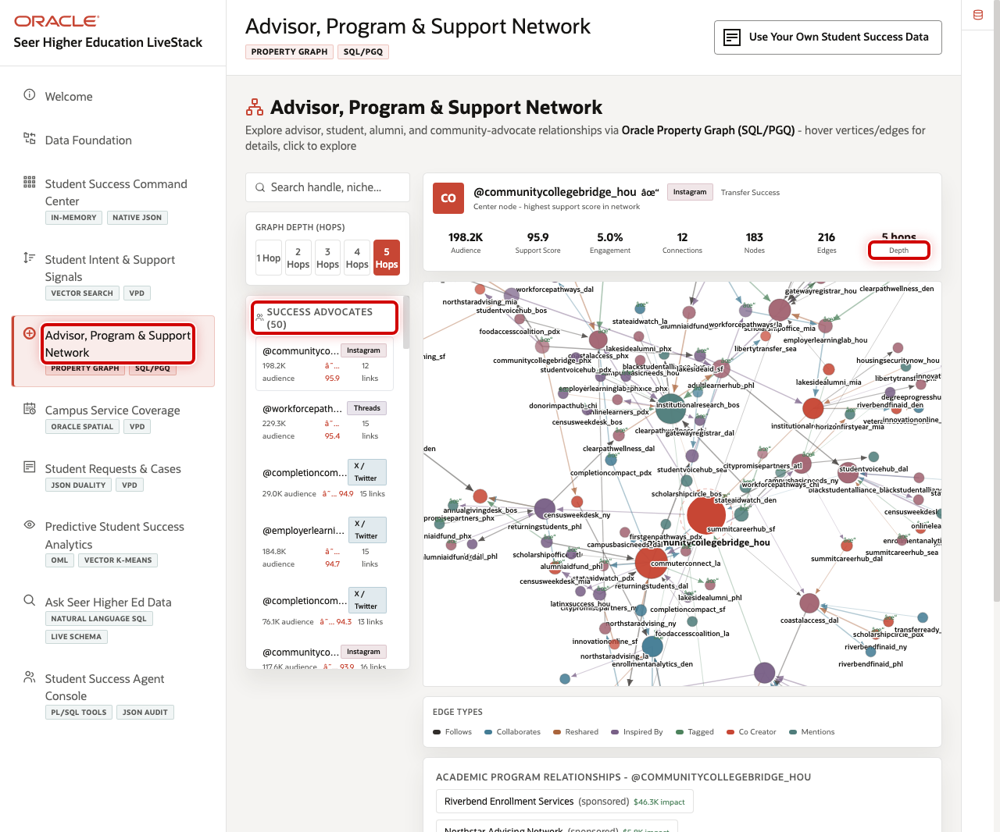
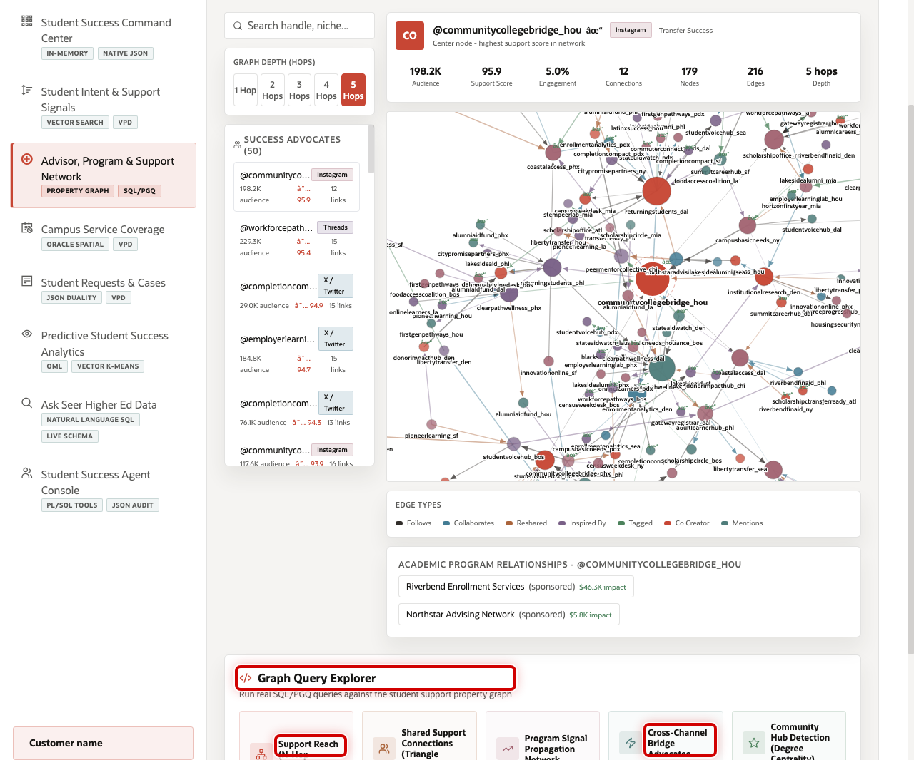

# Scene 5 Advisor, Program, and Support Network

## Introduction

**Advisor, Program, and Support Network** helps the seller show relationship intelligence across advisors, student communities, academic programs, alumni groups, financial aid offices, and community partners.

Higher education interventions rarely move through one system or one team. A retention issue may involve an advisor, a program chair, a first-generation student community, financial aid, basic needs support, and an alumni-funded emergency grant. Institutions need to know who is connected to whom and which relationships can move outreach faster.

Oracle AI Database helps address that challenge with property graph relationships and SQL/PGQ queries over the same governed data foundation. The current live graph includes **3,739** graph nodes, **3,047** graph edges, and **692** academic program relationship links.

Estimated Time: 10 minutes

### Objectives

In this scene, you will learn how graph analysis helps identify support paths, cross-channel advocates, and program relationships that matter to student success.

## Task 1: Explore the support network

Use the network view to explain that student success is a relationship problem as much as a data problem.

1. Click **Advisor, Program & Support Network** in the sidebar.
2. Review the **Success Advocates** list.
3. Review the graph visualization and the selected advocate metrics.
4. Adjust graph depth if you want to show broader support reach.

## Task 2: Review graph query options

The query explorer turns graph analytics into guided business questions.

1. Scroll to **Graph Query Explorer**.
2. Review the available graph query cards.
3. Focus on **Support Reach (N-Hop)** and **Cross-Channel Bridge Advocates**.
4. Explain that SQL/PGQ lets the application query connected support relationships without moving data into a separate graph database.

You can move to the next scene.

## Credits & Build Notes
- **Author** - Oracle LiveLabs Team
- **Last Updated By/Date** - Oracle LiveLabs Team, 2026-05-29
