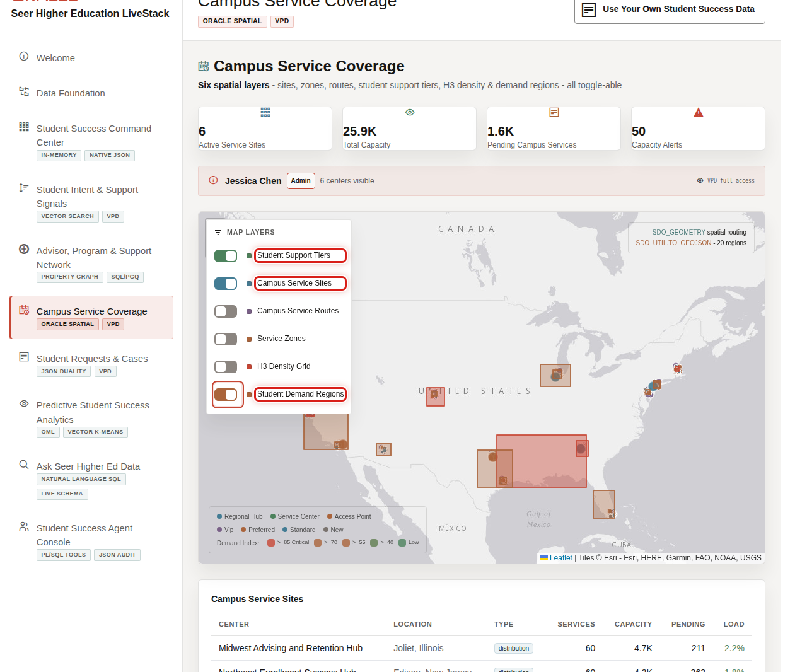
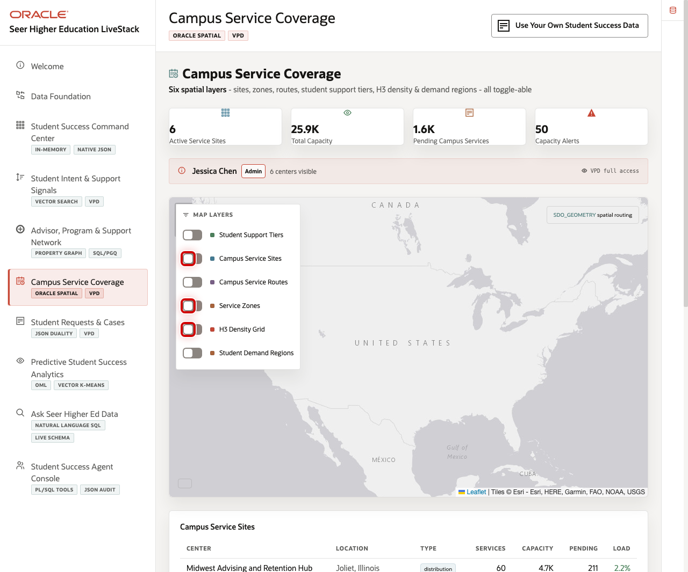

# Scene 6 Campus Service Coverage

## Introduction

**Campus Service Coverage** helps campus operations, advising, access, and student services teams see whether students can reach the right support at the right time.

Institutions must coordinate service sites, online support, advising hubs, financial aid centers, wellness access, and regional student demand. This is difficult when geography, capacity, student demand, and request data are stored in separate tools.

Oracle AI Database helps address that challenge with Oracle Spatial, service-site geometry, demand regions, service zones, H3 density grids, and capacity data in the same database that supports the rest of the student-success workflow.

Estimated Time: 10 minutes

### Objectives

In this scene, you will learn how spatial data helps teams evaluate student access, service capacity, and regional demand pressure.

## Task 1: Review service coverage on the map

Use the map to show that the institution can connect student demand to physical and operational service access.

1. Click **Campus Service Coverage** in the sidebar.
2. Review the map and the active service layers.
3. Point out student support tiers, campus service sites, service routes, service zones, H3 density grid, and demand regions.

## Task 2: Toggle spatial layers

Layer toggles let the presenter show the map from different operational perspectives.

1. Review **Campus Service Sites** to show available support locations.
2. Review **Service Zones** to explain coverage boundaries.
3. Review **H3 Density Grid** and **Student Demand Regions** to explain demand pressure.
4. Explain that Oracle Spatial lets the application calculate and visualize service access without leaving the database platform.

That is the Oracle AI Database point: spatial and GeoJSON data can sit beside relational student records, JSON service requests, capacity data, vectors, graph relationships, and governed operations data in one engine. The map can therefore answer a business question: where are students, what do they need, and can the institution reach them with the right support?

You can move to the next scene.

## Credits & Build Notes
- **Author** - Oracle LiveLabs Team
- **Last Updated By/Date** - Oracle LiveLabs Team, 2026-05-29
