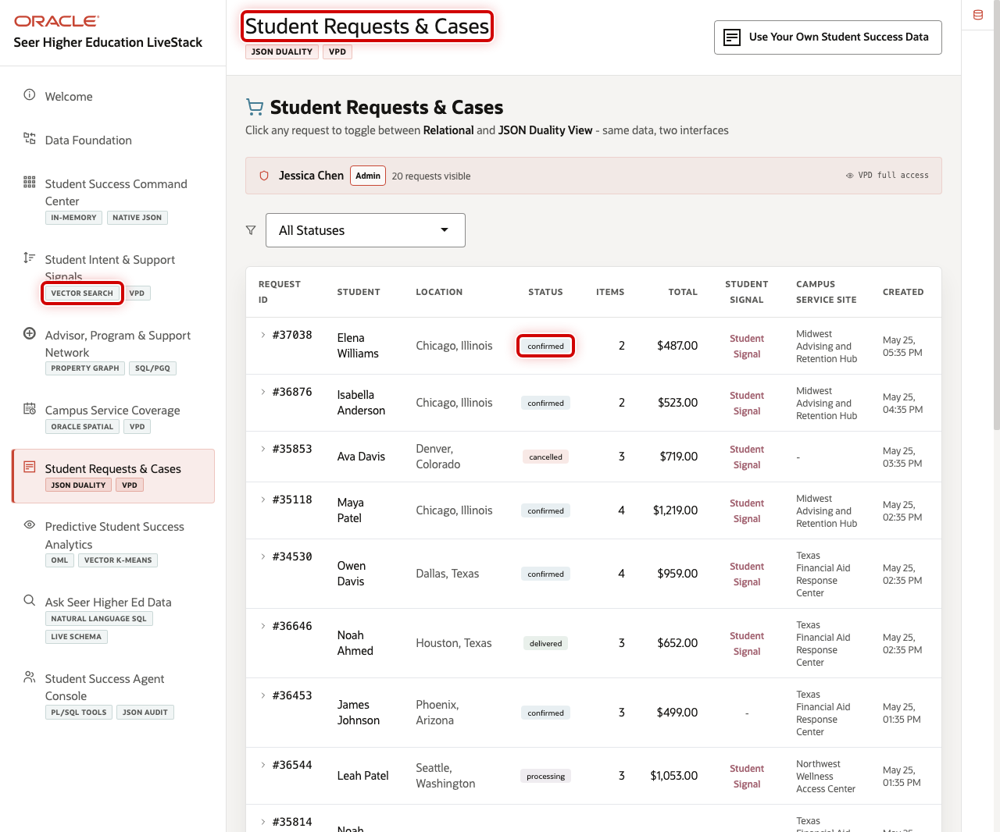
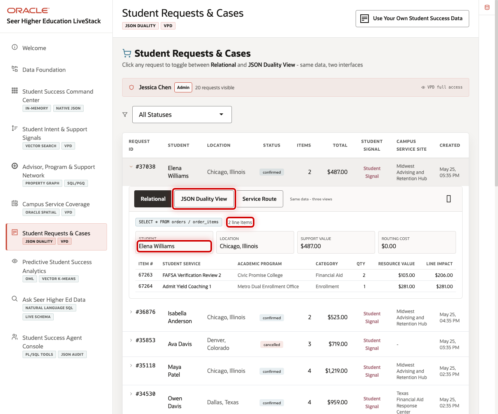
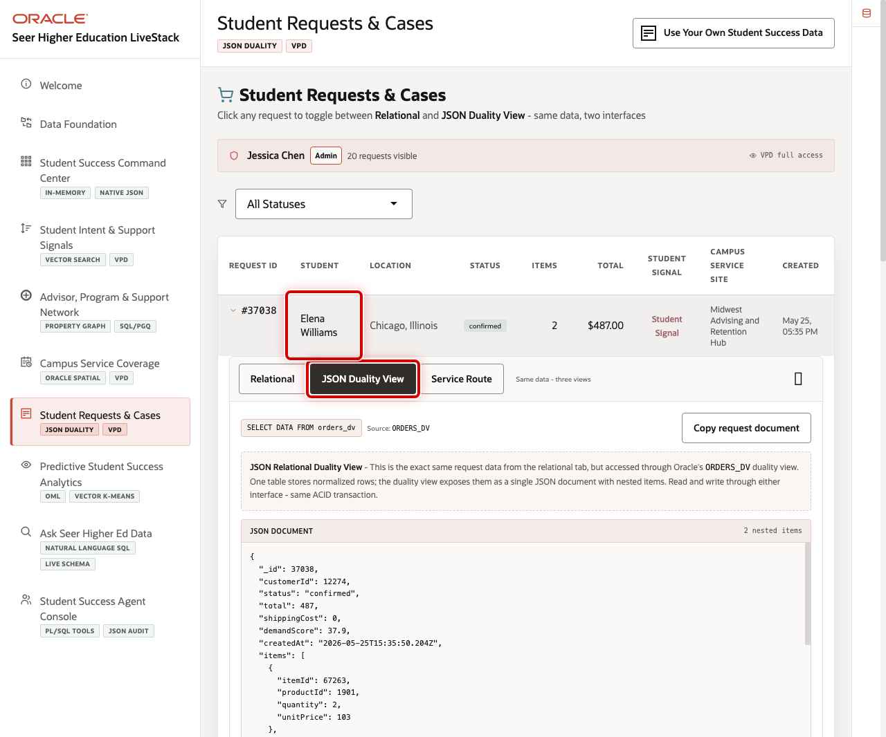

# Scene 7 Student Requests and Cases

## Introduction

**Student Requests and Cases** connects the student-support workflow to individual request evidence. It helps advisors, student success teams, financial aid offices, and campus service teams inspect the operational records behind aggregate demand.

Student requests often include relational transaction data, request lines, case state, service routing, signal attribution, and document-style application payloads. When those records are split across systems, teams struggle to explain what happened and why.

Oracle AI Database helps address that challenge by keeping the request workflow and JSON application shape connected. Business users can inspect a request in the UI, while applications can consume the same trusted data through JSON Duality.

Estimated Time: 10 minutes

### Objectives

In this scene, you will learn how to move from institutional metrics to a specific student request and inspect both relational and JSON views.

## Task 1: Review student request records

Use the page to show how the command center evidence connects to individual student cases.

1. Click **Student Requests & Cases** in the sidebar.
2. Review the search and filter controls.
3. Review the request rows, including status, total service value, demand score, student name, location, and service site.
4. Focus on the request for **Elena Williams**.

## Task 2: Inspect a request detail

The detail modal helps a user inspect the case behind the metric.

1. Click the **Elena Williams** request row.
2. Review the request status, student, service site, request lines, and signal-driven context.
3. Explain how this view supports advising, service coordination, and operations follow-up.

## Task 3: Review the JSON Duality View

JSON Duality shows how the same request can support application developers without creating a separate document store.

1. In the request modal, click **JSON Duality View**.
2. Review the generated JSON document.
3. Explain that the user interface and application document view remain tied to the same trusted Oracle data.

You can move to the next scene.

## Credits & Build Notes
- **Author** - Oracle LiveLabs Team
- **Last Updated By/Date** - Oracle LiveLabs Team, 2026-05-29
