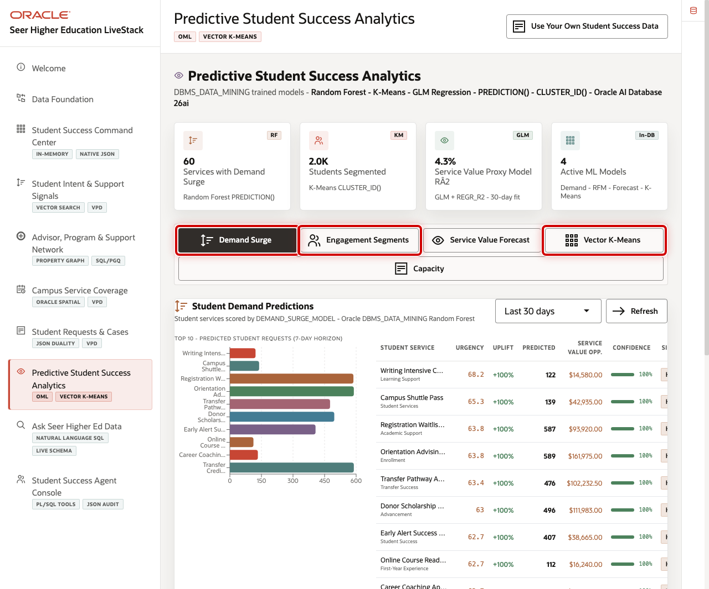
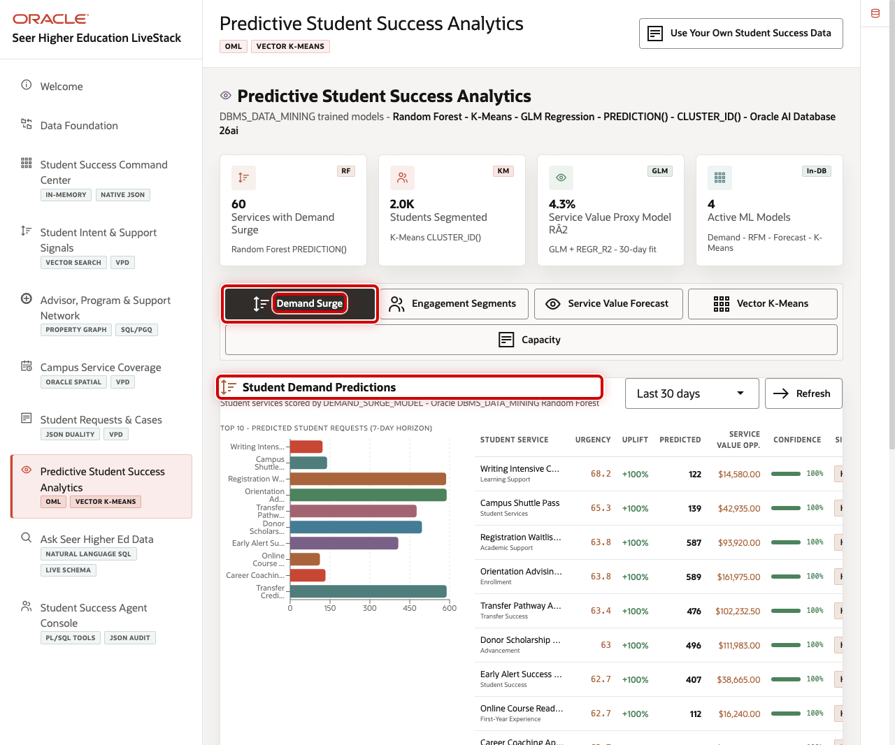
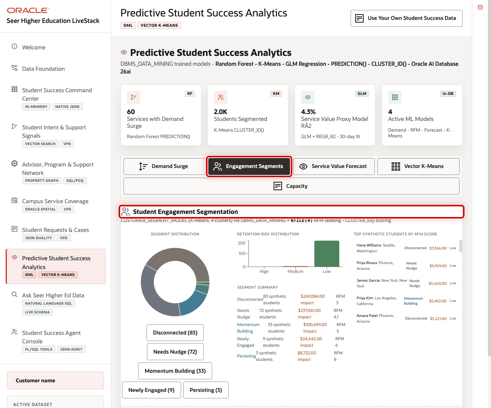
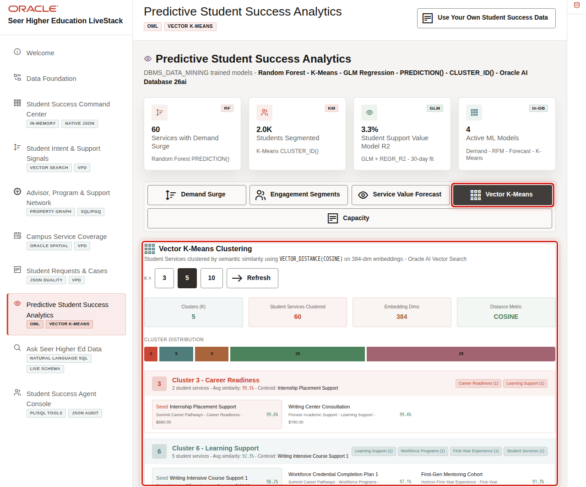

# Scene 8 Predictive Student Success Analytics

## Introduction

**Predictive Student Success Analytics** helps institutional research, enrollment management, student success, advising, and operations teams move from historical reporting to predictive decisions.

With a projected 15% decline in the 18-year-old population by 2029, institutions can no longer afford to learn about retention risk after the fact. The institutions winning in this environment are the ones scoring demand, segmenting student populations, and forecasting service pressure in advance, not in a quarterly IR report, but in the same workflow where advisors and operations teams are already working. This scene shows how Oracle Machine Learning trains, stores, and scores predictive models inside Oracle AI Database, with no data export, no separate ML pipeline, and no reconciliation before someone will trust the result.

Oracle Machine Learning helps address that challenge by training, storing, and scoring models inside Oracle AI Database. In this scene, the application exposes demand prediction, engagement segmentation, service value forecasting, vector clustering, and capacity intelligence from the same student-success data foundation.

Estimated Time: 10 minutes

### Objectives

In this scene, you will learn how in-database machine learning helps identify demand pressure, student engagement patterns, and service risk.

## Task 1: Review the analytics workspace

Use the page to show the institution's model-driven decision options.

1. Click **Predictive Student Success Analytics** in the sidebar.
2. Review the model action buttons.
3. Point out **Demand Surge**, **Engagement Segments**, **Service Value Forecast**, **Vector K-Means**, and **Capacity**.

## Task 2: Run demand surge scoring

Demand surge scoring helps the seller connect current student signals to likely service pressure.

1. Click **Demand Surge**.
2. Review the returned student service demand predictions.
3. Explain that Oracle Machine Learning scores the current data in SQL without exporting the dataset.

## Task 3: Review student engagement segmentation

Engagement segmentation helps teams understand student populations by behavior, recency, request value, and risk.

1. Click **Engagement Segments**.
2. Review the segment output.
3. Explain how student success teams can use segments to prioritize outreach.

## Task 4: Review vector clustering

Vector clustering groups semantically similar services or signals, which helps teams spot related student needs.

1. Click **Vector K-Means**.
2. Review the cluster output.
3. Explain that vector and ML workloads can stay close to governed operational data.

You can move to the next scene.

## Credits & Build Notes
- **Author** - Oracle LiveLabs Team
- **Last Updated By/Date** - Oracle LiveLabs Team, 2026-05-29
