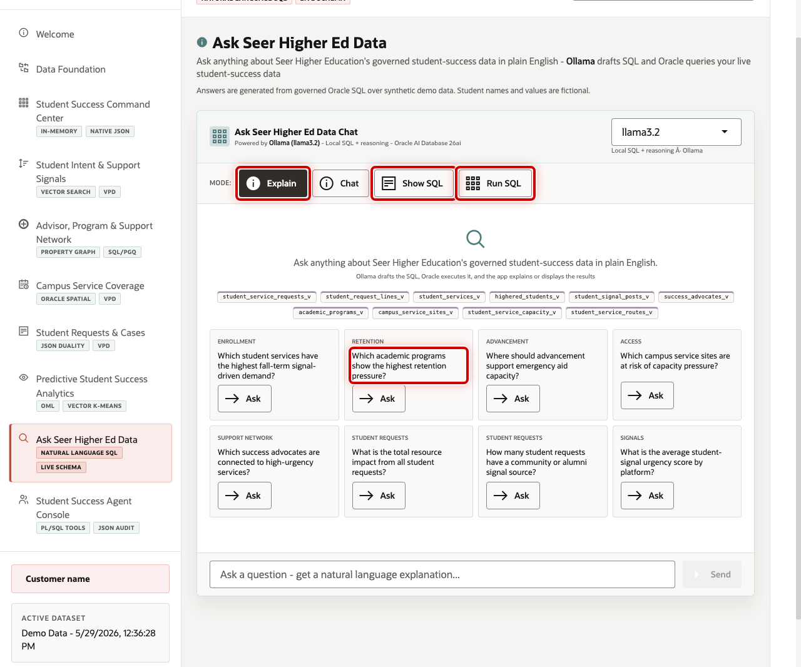
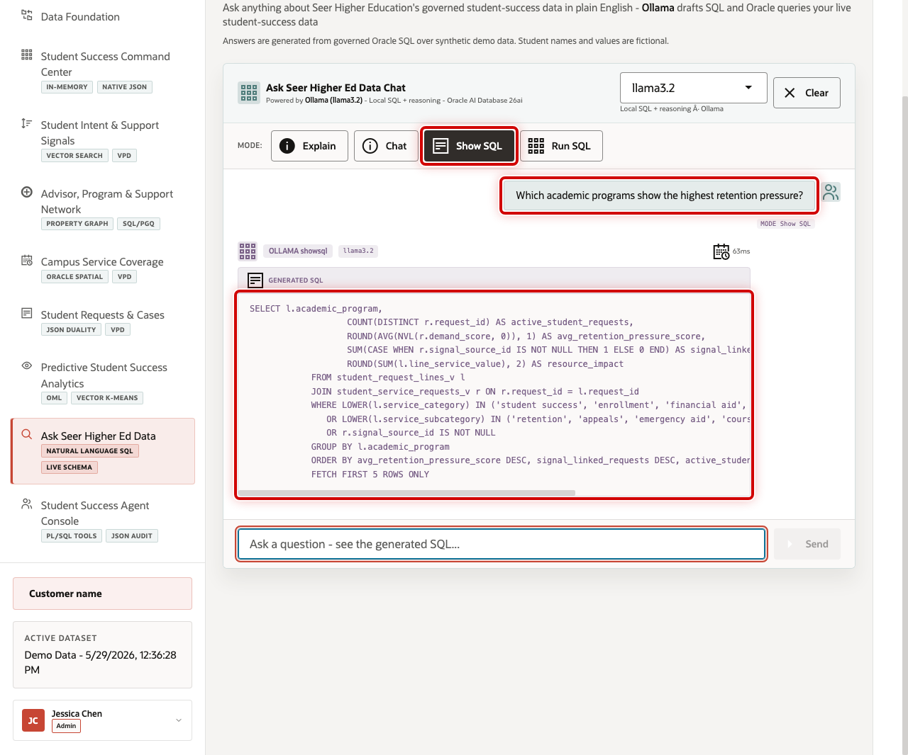
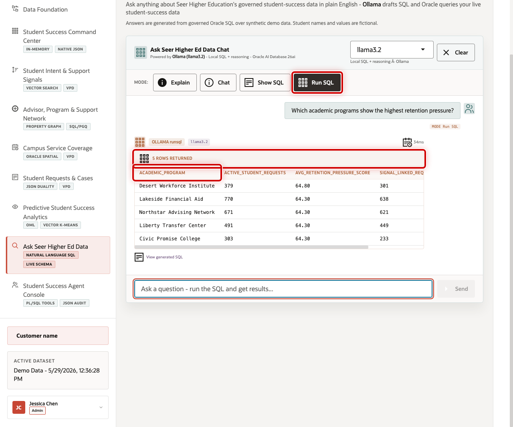

# Scene 9 Ask Seer Higher Ed Data

## Introduction

**Ask Seer Higher Ed Data** helps business users ask higher education questions in plain language without losing transparency. Users can inspect generated SQL, run it against trusted Oracle data, and review returned rows, which makes self-service analytics faster and easier to trust.

This is difficult to implement safely because natural-language data access can create governance risk. A language model may generate invalid SQL, reference the wrong views, hide the logic behind an answer, or expose more data than the user should see. Higher education teams need self-service analytics, but data teams still need traceability, read-only execution, and a clear source of truth.

Oracle AI Database helps address these challenges by keeping query execution grounded in the live higher education schema. In this LiveStack Demo, the app sends the business question and schema context to the local Ollama runtime, validates the generated SQL path, and uses Oracle AI Database 26ai as the execution authority.

Estimated Time: 10 minutes

### Objectives

In this scene, you will learn how natural-language analytics can support student success while keeping the SQL path visible and governed.

## Task 1: Review the Ask Data workspace

Review the workspace to show how business users can ask questions in plain language while still keeping the query path visible and controlled.

1. Click **Ask Seer Higher Ed Data** in the sidebar.
2. Review the four modes: **Explain**, **Chat**, **Show SQL**, and **Run SQL**.
3. Review the example question tiles.
4. Focus on the **Retention** question: **Which academic programs show the highest retention pressure?**

## Task 2: Inspect generated SQL

Inspect the generated SQL to show that the answer is traceable. Even if the user does not read every line, the query can be reviewed instead of trusting a hidden AI response.

1. Click **Show SQL**.
2. Ask **Which academic programs show the highest retention pressure?**
3. Review the generated SQL.

The generated SQL groups student request and signal evidence by academic program. This is the governance moment in the scene: the business user can inspect the query path before asking the database to return rows.

## Task 3: Run the SQL and inspect the returned data

Run the SQL and inspect the returned rows to find concrete institutional pressure points.

1. Click **Clear** if the generated SQL result is still visible.
2. Click **Run SQL**.
3. Ask the same **Retention** question.
4. Review the returned table.
5. Focus on **Desert Workforce Institute**, which appears with **379** active student requests, an average retention pressure score of **64.80**, and **301** signal-linked requests.

A business user can discover the issue without writing SQL, while the SQL and database result remain visible for trust.

You can move to the next scene.

## Credits & Build Notes
- **Author** - Oracle LiveLabs Team
- **Last Updated By/Date** - Oracle LiveLabs Team, 2026-05-29
