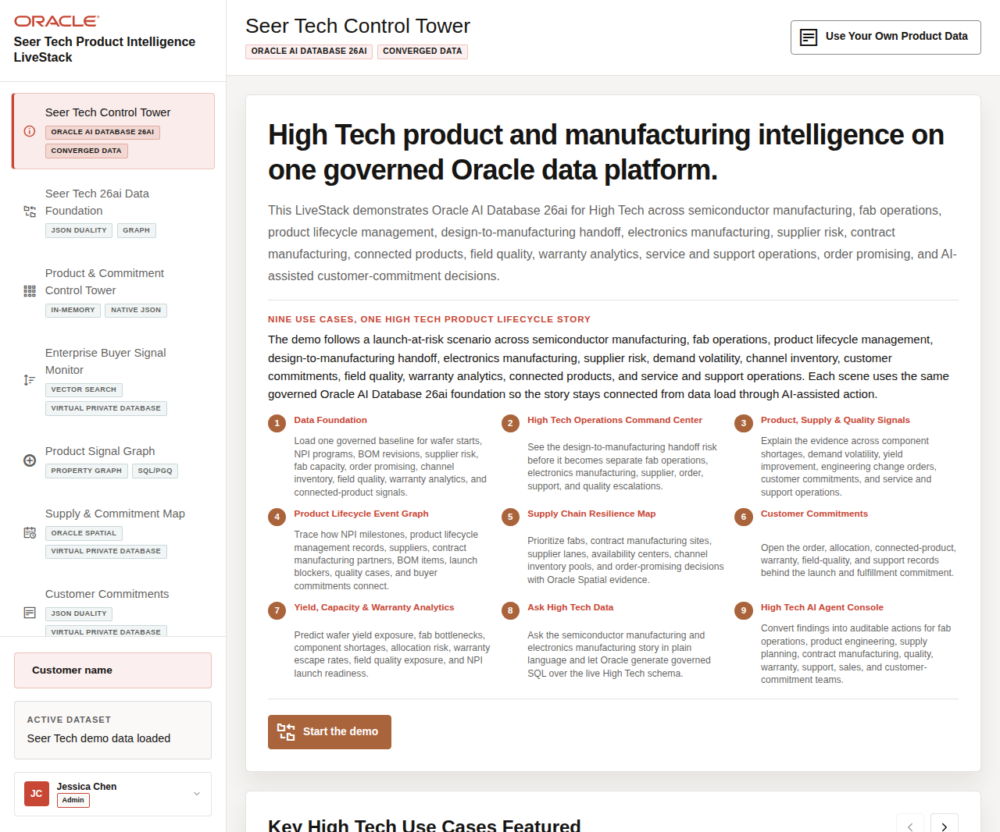

# Seer Tech High Tech Product Intelligence LiveStack Guide

## Introduction

High Tech organizations coordinate semiconductor manufacturing, fab capacity, product lifecycle management, component supply, customer commitments, field quality, warranty exposure, connected-product telemetry, service operations, and AI-assisted decisions while keeping operational data governed. Those teams need the same trusted operating picture when a product launch, supplier constraint, quality signal, and customer promise collide.

The **Seer Tech Product Intelligence LiveStack** demonstrates how **Oracle AI Database 26ai** can bring those High Tech workflows together on one governed data platform. The demo follows one AI infrastructure release train from early pressure to coordinated action. The control tower detects rising demand and limited supply flexibility; product signals explain the pressure; lifecycle paths expose substrate, wafer-start, engineering-change, quality, and allocation dependencies; spatial evidence identifies response options; commitments show customer impact; and predictive analytics identifies the next likely constraint.

Visible examples include **AI Accelerator Module**, **AI Edge Gateway Reference Kit**, **Wafer Probe Exception Detector**, **Engineering Change Order Copilot**, **Supplier Risk Heatmap Service**, **Autonomous Test Cell Controller**, **Connected Device Health Twin**, and **Customer Commitment Console**. Together they represent the products, planning services, and operational controls required to deliver a complex High Tech launch rather than a disconnected catalog of demonstrations.

The runbook is a story-led walkthrough, not a feature checklist. Each scene shows how relational transactions, JSON Relational Duality, property graph, Oracle Spatial, vector search, Oracle Machine Learning, natural-language SQL, PL/SQL tools, and auditable AI agent actions work against the same governed High Tech foundation.

In the demo, Seer Tech uses **Oracle AI Database** to connect product portfolios, manufacturing capacity, wafer-start and yield signals, bill of materials dependencies, engineering change orders, supplier risk, customer commitments, quality records, warranty exposure, service operations, and AI agent actions.

Estimated Workshop Time: **90 minutes**

Each scene is designed to take between **5 and 10 minutes**.

### Objectives

In this **LiveStack** demo, you will learn how **Oracle AI Database** supports product-launch resilience across component availability, manufacturing coordination, product lifecycle governance, customer commitment management, quality and warranty intelligence, predictive analytics, governed data questions, and AI-assisted operating action.

### Prerequisites

Before you begin, confirm that you can open the running Seer Tech High Tech Product Intelligence LiveStack in a modern browser. No coding or database administration knowledge is required for the guided demo scenes.

**Note:** **Podman** and **Podman Compose** are required only if you plan to run the portable LiveStack locally in the download lab.

## Demo Flow

- **Scene 1:** Seer Tech Control Tower.
- **Scene 2:** Seer Tech 26ai Data Foundation.
- **Scene 3:** Product & Commitment Intelligence Control Tower.
- **Scene 4:** Enterprise Buyer Signal Monitor.
- **Scene 5:** Product Signal Graph.
- **Scene 6:** Supply & Commitment Map.
- **Scene 7:** Customer Commitments.
- **Scene 8:** Predictive Product & Commitment Analytics.
- **Scene 9:** Ask Seer Tech Data.
- **Scene 10:** AI Agent Console.
- **Scene 11:** Use Your Own Product Data.
- **Download and run the portable High Tech LiveStack.**

## Learn More

- [Oracle AI Database 26ai documentation](https://docs.oracle.com/en/database/oracle/oracle-database/26/index.html)
- [Oracle AI Agent Memory](https://www.oracle.com/database/ai-agent-memory/)
- [Oracle AI Vector Search](https://www.oracle.com/database/ai-vector-search/)
- Oracle Spatial and Graph documentation: [Oracle Spatial](https://docs.oracle.com/en/database/oracle/oracle-database/26/spatl/toc.htm) and [Oracle Property Graph](https://docs.oracle.com/en/database/oracle/property-graph/26.2/index.html)
- [Oracle Machine Learning for SQL documentation](https://docs.oracle.com/en/database/oracle/machine-learning/oml4sql/tasks.html)
- [Oracle REST Data Services documentation](https://docs.oracle.com/en/database/oracle/oracle-rest-data-services/25.4/orddg/index.html)
- [Oracle LiveLabs catalog](https://livelabs.oracle.com/)

## Credits & Build Notes
- **Author** - Oracle LiveLabs Team
- **Last Updated By/Date** - Oracle LiveLabs Team, 2026-07-02
- **Source Bundle** - `livestack-hightech.zip`
