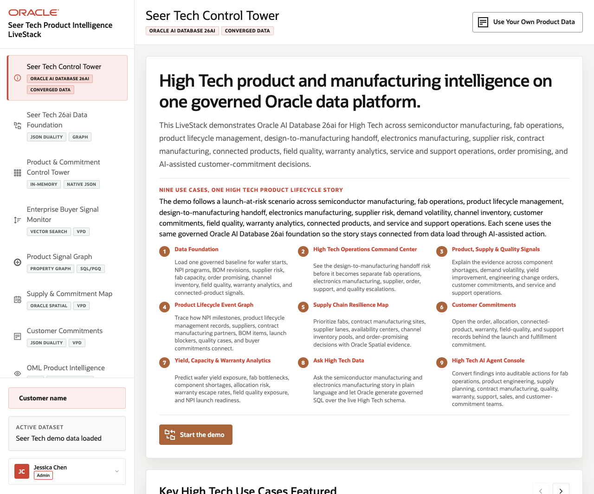
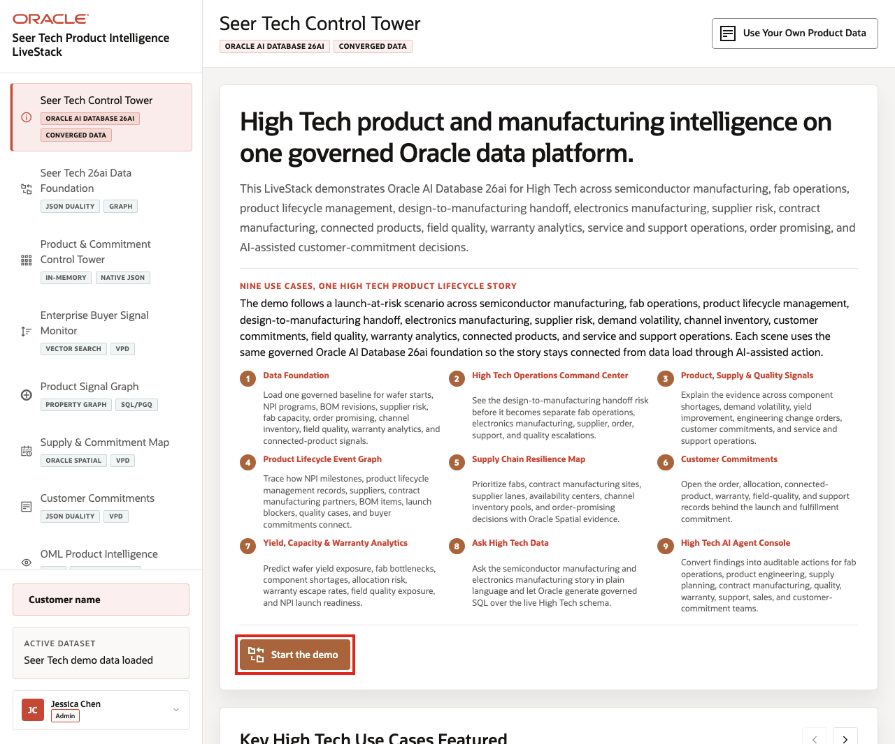

# Scene 1 Seer Tech Control Tower

## Introduction

The **Seer Tech Control Tower** establishes the demo story: a High Tech product launch is under pressure from demand volatility, component availability, fab and contract manufacturing capacity, product lifecycle changes, field quality signals, warranty exposure, and customer commitments.

Use this scene to make clear that the LiveStack is broader than one product dashboard. Semiconductor manufacturing, electronics manufacturing, PLM, supply chain, service, warranty, connected-device, and customer operations all appear as parts of one operating picture.

Estimated Time: **7 minutes**

### Objectives

In this scene, you will learn how the demo story is organized, which High Tech operating domains are represented, and how the rest of the runbook follows one launch-risk story through Oracle AI Database capabilities.

## Task 1: Review the lifecycle story

Perform the following set of steps to orient the audience to the headline and story rail:

1. Open **Seer Tech Control Tower** from the sidebar.
2. Read the welcome headline and launch-risk story.
3. Review the numbered lifecycle sequence that moves from data foundation through AI-assisted action.
4. Point out the covered domains: product portfolio, semiconductor manufacturing, fab capacity, supplier risk, BOM readiness, PLM, ECOs, customer commitments, field quality, warranty, service, and connected-device telemetry.

Use this first screen to anchor the business conversation before you move into the data model or Oracle capability details.

## Task 2: Review the use case carousel

Perform the following set of steps to show how the same governed **Oracle AI Database** foundation supports the entire demo flow:

1. Review **Key High Tech Use Cases Featured**.
2. Use the carousel controls to move through the use-case groups.
3. Call out examples such as High Tech Data Foundation, Product & Commitment Control Tower, Enterprise Buyer Signal Monitor, Product Signal Graph, Supply & Commitment Map, Customer Commitments, OML Product Intelligence, Ask Seer Tech Data, and AI Agent Console.

    

Each page is a different operating lens on the same launch-risk story: the control tower detects pressure, the data foundation proves the governed baseline, signals explain emerging demand and quality risk, the graph connects lifecycle records, the map coordinates capacity and commitments, customer commitments show commercial exposure, analytics predict the next constraint, Ask Data supports governed questions, and agents coordinate audited action.

## Task 3: Continue the demo

After the audience understands the story, continue to the data foundation page to load or verify the governed baseline.

1. Click **Start the demo**.

    

2. Confirm that the app moves to **Seer Tech 26ai Data Foundation**.

Use this transition to explain that every later scene uses the same High Tech dataset, including product records such as **AI Accelerator Module**, **Component Allocation Optimizer**, **Silicon Lot Genealogy Viewer**, **Wafer Probe Exception Detector**, **Connected Device Health Twin**, and customer commitment examples such as **67187** or **69347** when they are visible.

**Note:** Sample values may change after data refreshes or rebuilds. Verify live output before presenting, then explain the business takeaway.

*You can move to the next scene.*

## Credits & Build Notes
- **Author** - Oracle LiveLabs Team
- **Last Updated By/Date** - Oracle LiveLabs Team, 2026-06-16
- **Source Bundle** - `livestack-hightech.zip`
