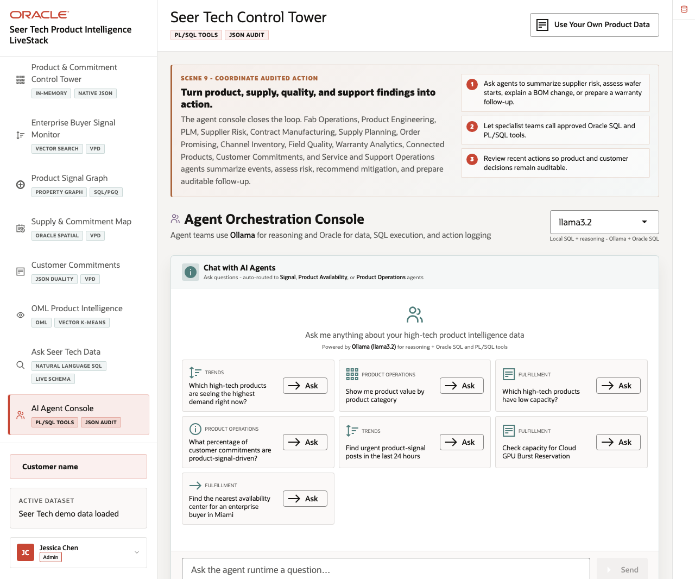
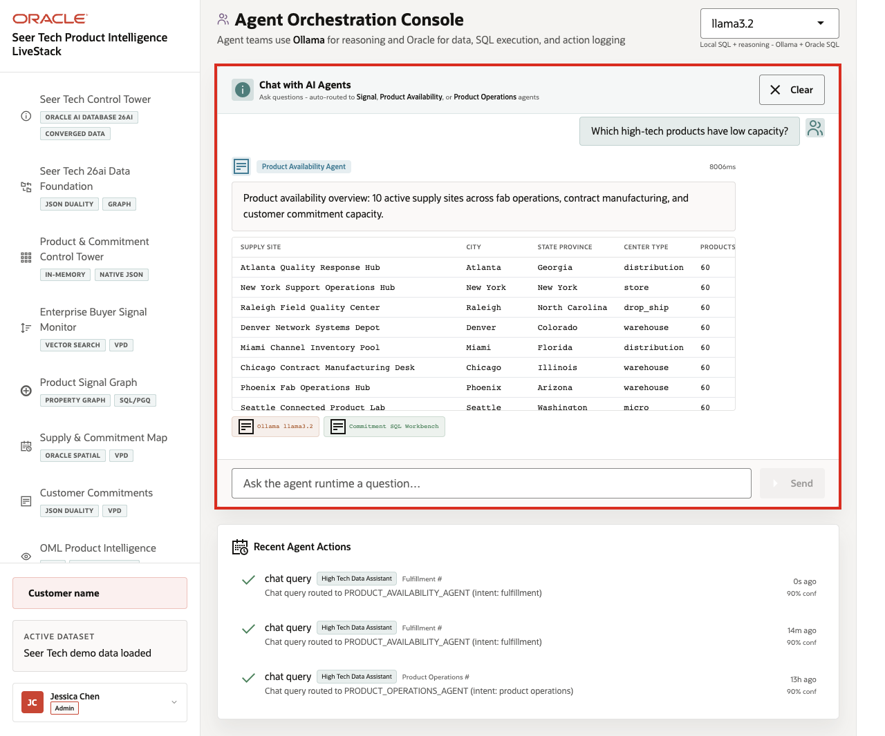
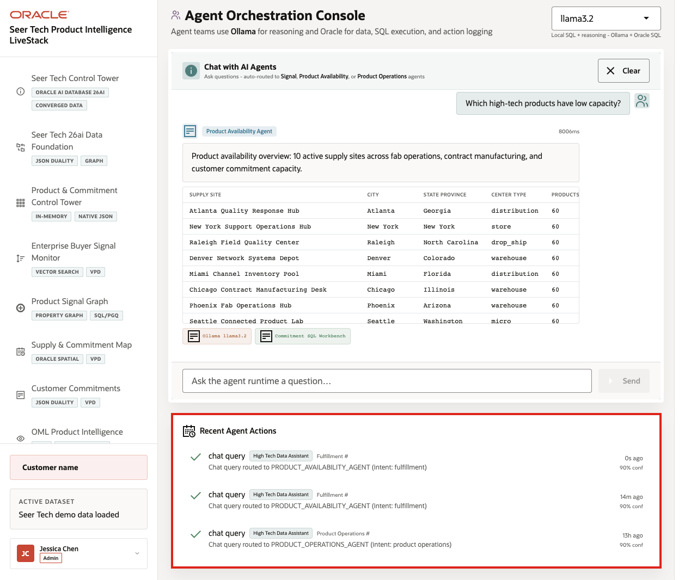

# Scene 10 AI Agent Console

## Introduction

The **AI Agent Console** shows how AI assistance can support High Tech operating decisions without becoming a black box. The page positions specialist agents as visible operating tools rather than generic chat responses.

**Oracle AI Database** keeps the source data, SQL execution, PL/SQL tools, graph and spatial context, in-database analytics, and durable action logging connected to the same governed High Tech data foundation. The app orchestrates the agent workflow, Ollama provides local reasoning when available, and Oracle AI Database 26ai executes governed data operations and records action evidence.

Estimated Time: **10 minutes**

### Objectives

In this scene, you will learn how specialist agents convert product, capacity, signal, quality, and commitment findings into auditable operating actions.

## Task 1: Review the agent console workspace

Perform the following set of steps to review the agent console as an operational workspace before running an agent task:

1. Click **AI Agent Console** in the sidebar.
2. Review the runtime profile selector.
3. Review the specialist example questions for product signals, capacity, product operations, supplier risk, customer commitments, and service follow-up.
4. Review **Recent Agent Actions** below the workspace.
5. Focus on a capacity or commitment example such as **Which high-tech products have low capacity?**

Use this opening view to explain that the page is an operational agent console. The user can see routing, tools, results, confidence, fallback status, and action history, not just a chat response.

## Task 2: Run an agent question

Perform the following set of steps to show how the agent summarizes product capacity evidence while exposing the data, tool path, runtime status, and fallback context behind the answer:

1. Type or select the following question:

    `<copy>Which high-tech products have low capacity?</copy>`

2. Click **Send**.
3. Review the agent response at the top of the chat output.
4. Review the agent team badge, response, returned rows, tools used, runtime badge, or fallback status.

    

**Expected result:** The response should summarize constrained products or capacity signals using Oracle-backed product and supply evidence. It should connect the answer to product availability, supply sites, shortage alerts, customer commitments, and next operating steps when those records are present in the live dataset.

If the runtime shows a timeout or fallback, use it as an observability example: the operator can see whether the answer came from a complete LLM/tool path or from Oracle SQL and PL/SQL fallback evidence.

**Note:** Sample values may change after data refreshes or rebuilds. Verify live output before presenting, then explain the business takeaway.

## Task 3: Review the agent action audit trail

Perform the following set of steps to show that AI-assisted actions do not disappear after the conversation. Operators, planners, engineers, architects, and auditors can review what the agent did, which route it used, and how confident the system was:

1. Scroll to **Recent Agent Actions**.
2. Review the newest action row when the action list is populated.
3. Confirm that the row captures the agent action type, operational intent, confidence, related evidence, and runtime path.
4. Compare the visible action trail with the Oracle Internals diagram.

    

The governance point is that agent decisions should remain observable after the conversation, with action history available for supply review, product operations, customer follow-up, quality escalation, warranty response, service operations, and continuous improvement.

The business value is that teams can make the decision from connected, governed data. **Oracle AI Database** provides the shared foundation that keeps operational data, analytics, graph evidence, SQL tools, PL/SQL actions, and AI workflows aligned.

*You can move to the next scene.*

## Credits & Build Notes
- **Author** - Oracle LiveLabs Team
- **Last Updated By/Date** - Oracle LiveLabs Team, 2026-06-16
- **Source Bundle** - `livestack-hightech.zip`
