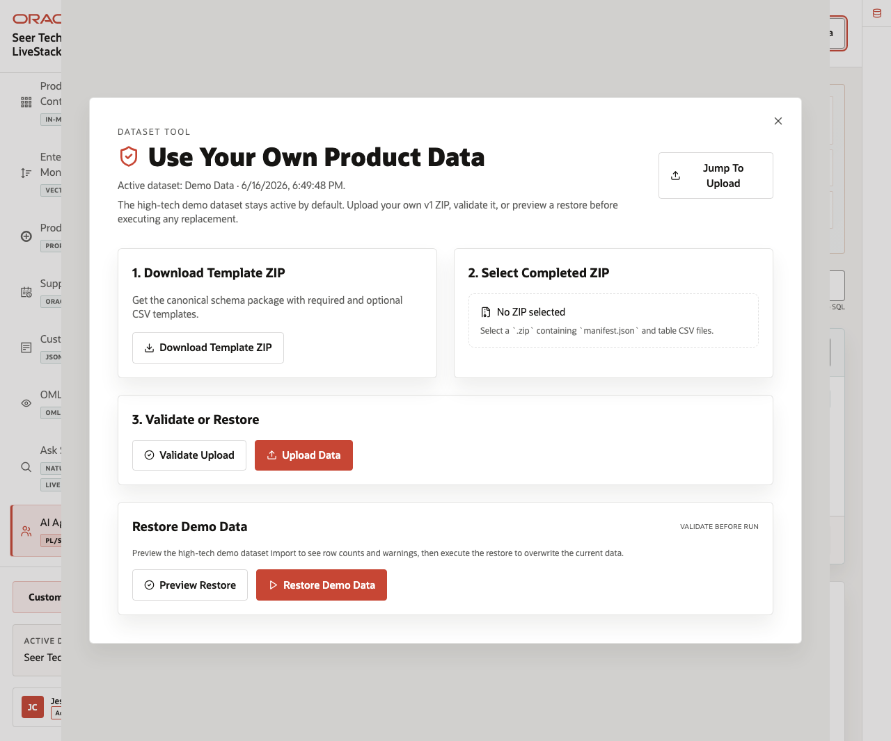
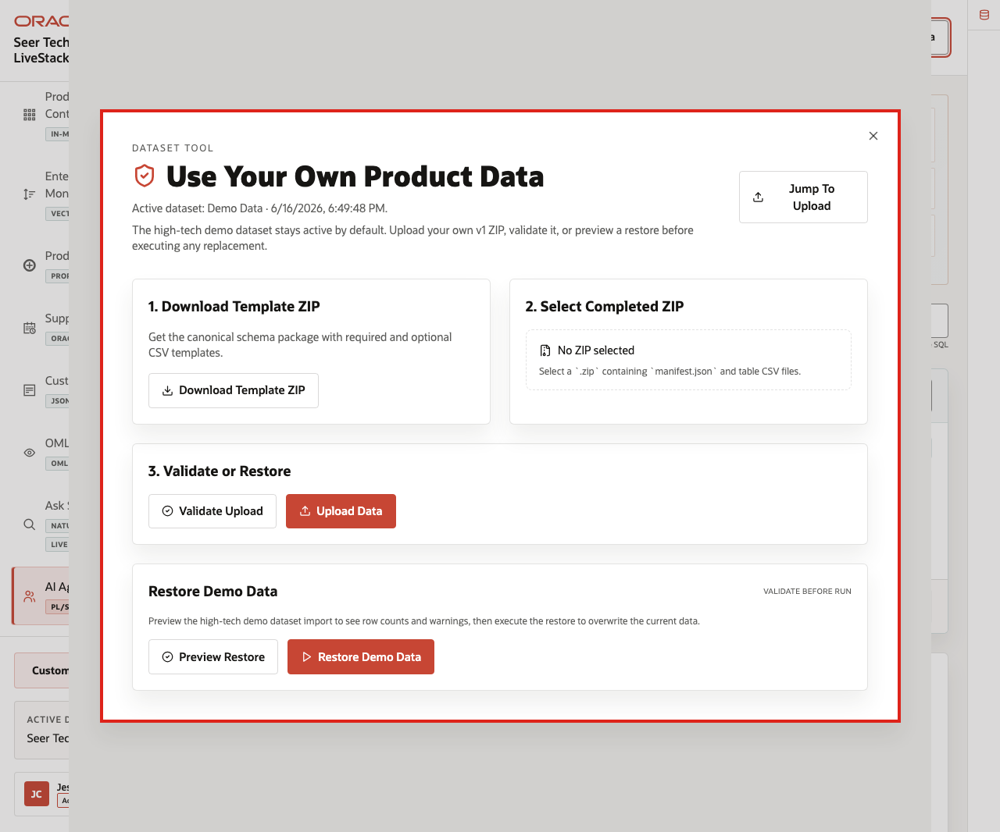
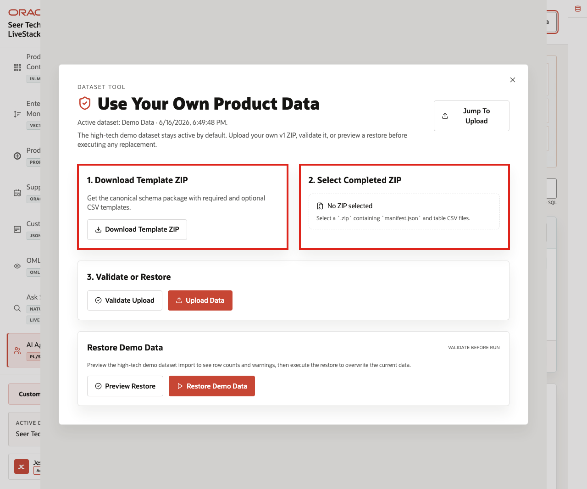
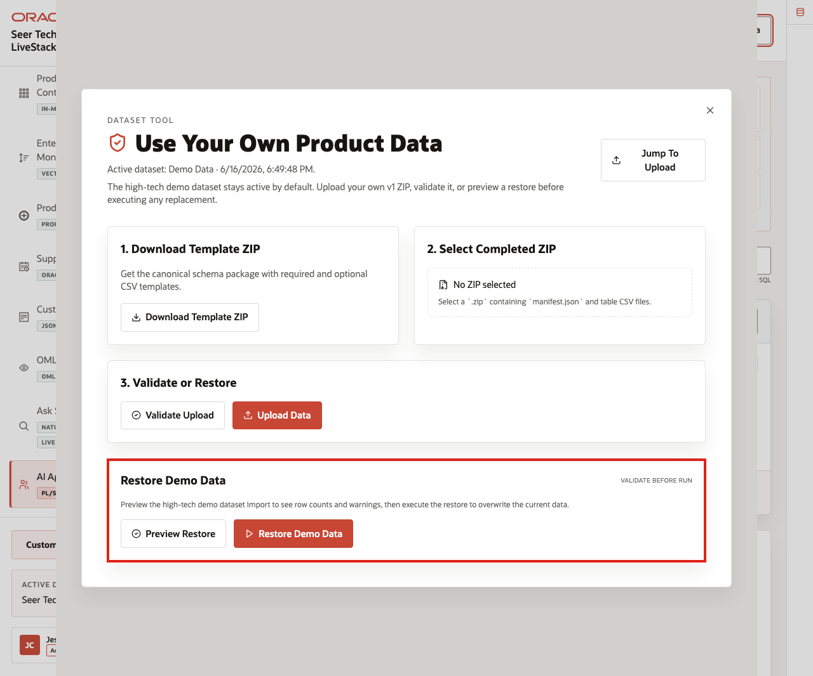

# Scene 11 Use Your Own Product Data

## Introduction

**Use Your Own Product Data** shows how a team can map the LiveStack pattern to its own High Tech operating data while preserving the seeded Seer Tech baseline as a known-good demo state.

This workflow matters because customers may bring product portfolio, supplier, component, BOM, PLM, ECO, manufacturing, capacity, customer commitment, quality, warranty, connected-device, service, and support data. The dataset tool makes the import path explicit while keeping destructive actions controlled and reinforcing that demo uploads should use synthetic, de-identified, or anonymized data.

Estimated Time: **8 minutes**

### Objectives

In this scene, you will learn how the dataset tool supports template ZIP download, completed ZIP upload/replace, validation, restore-demo preview, restore-demo execution, active dataset state, and data-safety expectations.

Use synthetic, de-identified, or anonymized data for workshop uploads. Do not upload confidential product, customer, supplier, warranty, support, employee, or export-controlled information into a shared demo environment.

## Task 1: Open the dataset tool

Perform the following set of steps to open the dataset workflow from the app shell:

1. Click **Use Your Own Product Data** in the top-right application header.
2. In the live application, review the active dataset state when the tool opens.
3. In the live application, review the available actions for template ZIP download, completed ZIP upload/replace, validation, and restore-demo.

    

Use this first view to explain that the dataset tool is part of the demo workflow, not a separate admin-only appendix. The seeded High Tech demo dataset stays active by default, and replacement data goes through a validate-and-upload path.

## Task 2: Review the template and upload workflow

Perform the following set of steps to explain what a customer would replace when they bring their own data:

1. Review **Download Template ZIP**.
2. Review **Select Completed ZIP**.
3. Explain that a completed ZIP must contain `manifest.json` and table CSV files.
4. Emphasize that replacement data should preserve the required schema shape while using synthetic or de-identified customer-specific High Tech records.

    

The key point is that customers can map their own terminology to the same Oracle AI Database capability pattern without changing the runbook story. A customer's product hierarchy, component names, supplier sites, commitment statuses, or quality codes can fit the same guided flow when the data shape is preserved.

## Task 3: Preview or restore the seeded dataset

Perform the following set of steps to show the demo-safe reset path:

1. Review **Restore Demo Data**.
2. Click **Preview Restore**.
3. Review the preview message, row counts, or validation issues.
4. Do not click **Restore Demo Data** during a shared workshop unless the presenter intentionally wants to reset the app for everyone.

    

Use this scene to close the runbook with a practical adoption point: the same LiveStack can tell the seeded Seer Tech product-launch story or help customers reason about their own High Tech operating data while preserving a known-good demo baseline.

The business value is that teams can test their own product and commitment story without losing the demo-safe reset path that keeps workshops repeatable.

*This completes the guided High Tech demo scenes.*

## Credits & Build Notes
- **Author** - Oracle LiveLabs Team
- **Last Updated By/Date** - Oracle LiveLabs Team, 2026-06-16
- **Source Bundle** - `livestack-hightech.zip`
