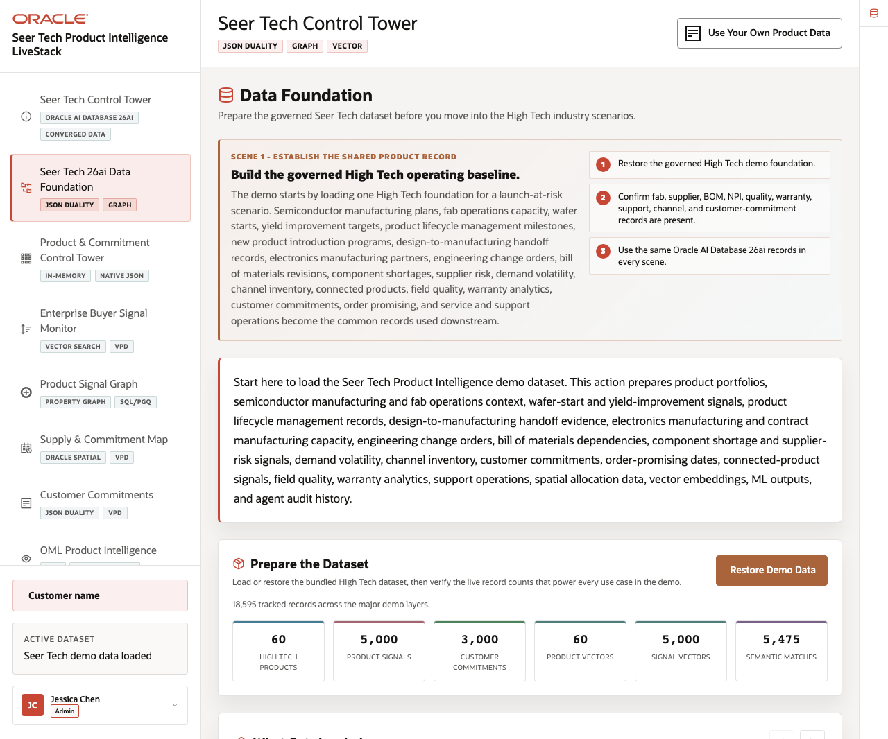
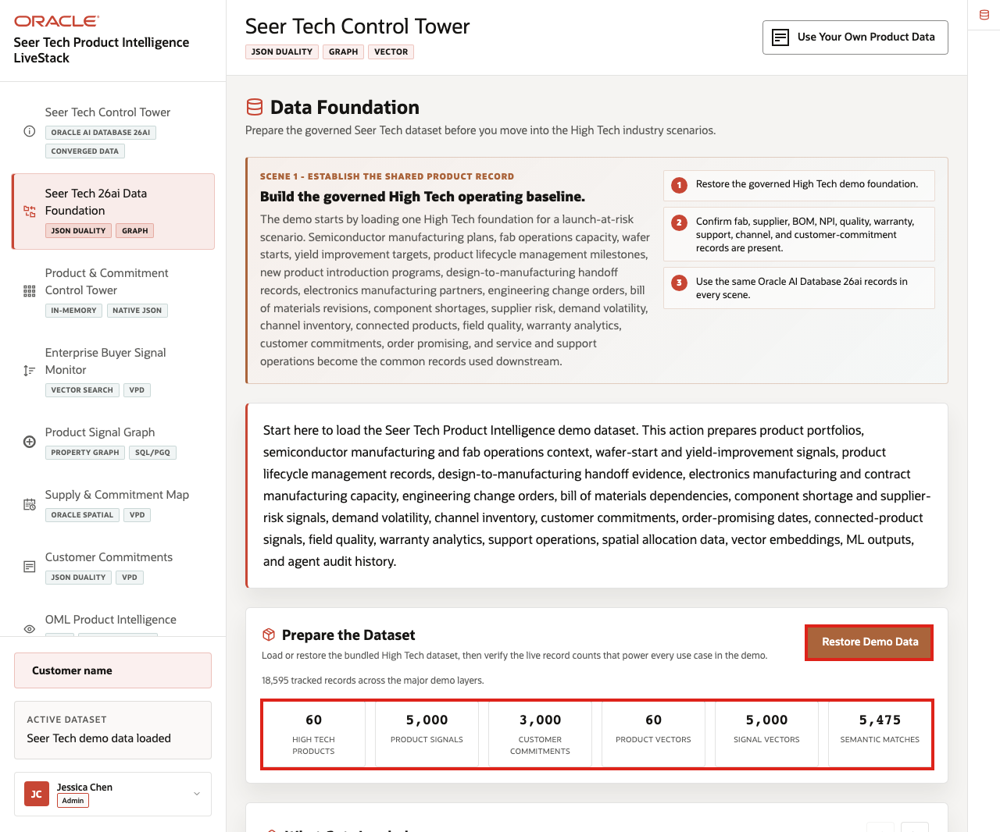
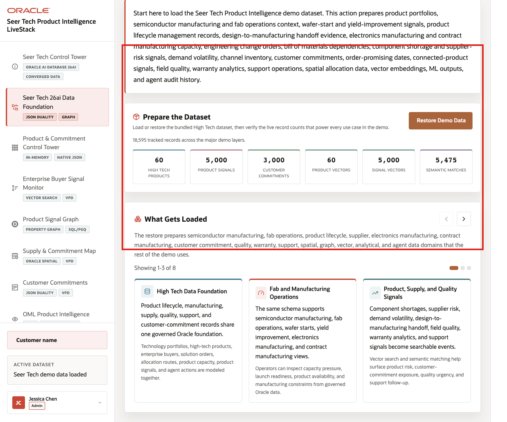
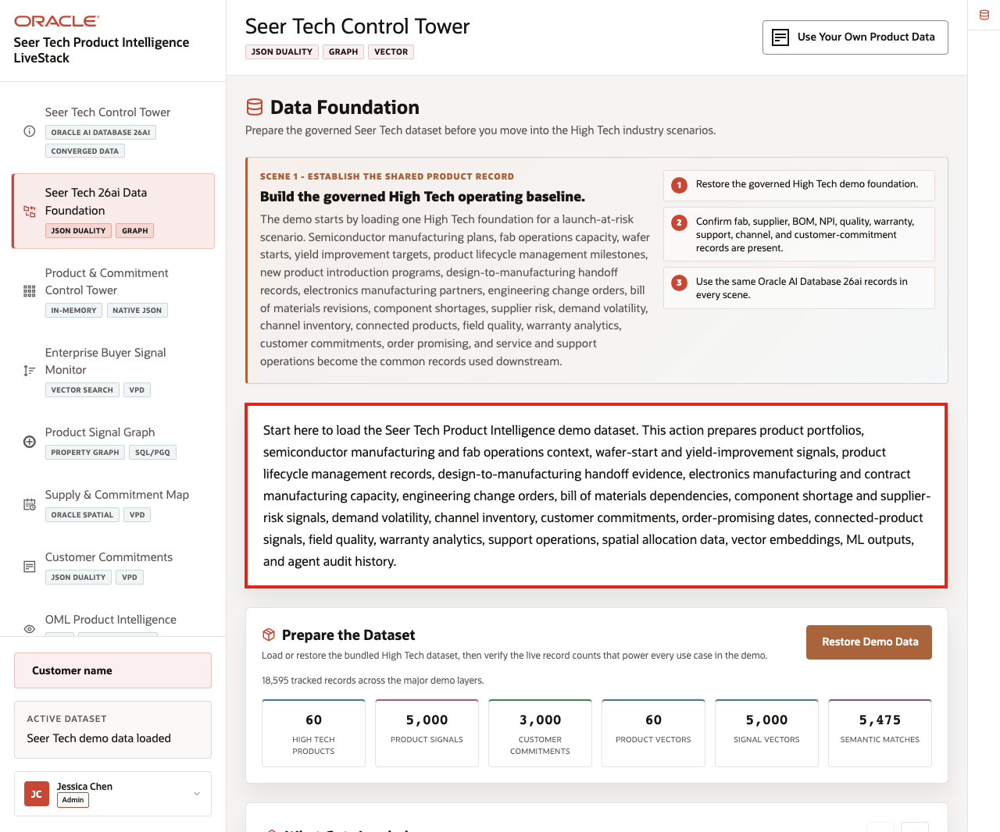

# Scene 2 Seer Tech 26ai Data Foundation

## Introduction

The **Seer Tech 26ai Data Foundation** prepares the trusted High Tech operating baseline used across the demo. Whether the data is loaded or restored, every subsequent screen starts from the same governed records.

That baseline includes product portfolios, semiconductor manufacturing records, fab and wafer-start context, yield-improvement signals, PLM records, design-to-manufacturing handoff evidence, electronics manufacturing capacity, contract manufacturing capacity, engineering change orders, bill of materials dependencies, component shortage and supplier-risk signals, demand volatility, channel inventory, customer commitments, order-promising dates, connected-product telemetry, field quality, warranty analytics, support operations, spatial allocation data, vector embeddings, ML outputs, and agent audit history.

This page makes clear that the runbook is a connected end-to-end workflow, not a series of isolated mini-demos. The same Oracle-backed records power the control tower, vector search, product signal graph, supply map, customer commitments, analytics, Ask Data, data import, and agent workflows.

Estimated Time: **8 minutes**

### Objectives

In this scene, you will confirm that the demo has a governed baseline for product portfolios, fab operations, component supply, customer commitments, lifecycle records, field quality, warranty, connected products, service operations, vector search, graph traversal, analytics, Ask Data, and agent workflows.

**Note:** Oracle Internals is collapsed by default. Expand it only after the business flow is clear so you can connect the visible data foundation to the database capabilities behind the page.

## Task 1: Restore and verify the demo dataset

Start the demo by restoring the seeded High Tech baseline so the audience sees the database prepare the shared operating record before any scene depends on it:

1. From the welcome page, click **Start the demo**, or click **Seer Tech 26ai Data Foundation** in the sidebar.
2. In **Prepare the Dataset**, click **Restore Demo Data** as the first live action.
3. Explain that this reloads the governed High Tech dataset into Oracle AI Database 26ai and prepares the records, vectors, semantic matches, graph relationships, ML outputs, and audit history used by the rest of the runbook.
4. Wait for the restore operation to complete, then review the live record counts below the action.

    

In the current live demo, the page shows **60** High Tech products, **5,000** product signals, **3,000** customer commitments, **60** product vectors, **5,000** signal vectors, and **5,475** semantic matches. These numbers prove that Oracle AI Database has prepared enough product, signal, vector, graph, ML, and commitment evidence for the later scenes.

**Notes:**
- Sample values may change after data refreshes or rebuilds. Verify live output before presenting, then explain the business takeaway.
- Use these counts to show that the dataset supports operational, analytical, spatial, graph, vector, machine learning, natural-language SQL, and audit workflows.

## Task 2: Review what gets loaded

Perform the following set of steps to show that the demo uses recognizable High Tech data, not only generic product records:

1. Scroll to **What Gets Loaded**.
2. Review the data cards for product portfolios, products, product signals, customer commitments, supply and commitment sites, route zones, demand regions, vector embeddings, graph relationships, ML outputs, agent actions, and import history.
3. Use the carousel controls to review the remaining data groups.
4. Click the **Oracle Internals** icon on the far-right rail to expand the sidebar, then review the Oracle capability notes.

    

The carousel should make the shared data model concrete: fab, supplier, BOM, NPI, ECO, warranty, service, product telemetry, and customer commitment data are prepared from one foundation and reused by multiple Oracle AI Database capabilities.

## Task 3: Connect the foundation to the rest of the demo

Use this page as the bridge into the operating story. The same governed foundation supports the control tower, enterprise buyer signal monitor, product signal graph, supply and commitment map, customer commitments, analytics, Ask Data, data import, and AI agent workflows.

1. Explain that the control tower will summarize the foundation as product-launch and customer-commitment indicators.
2. Explain that vector search will connect supply, demand, quality, and service signals to affected products and commitments.
3. Explain that graph, spatial, JSON duality, OML, Ask Data, BYO data, and agent pages all read from the same governed records.

    

The business value is that teams can move from a single trusted data foundation to product-launch resilience, component availability, manufacturing coordination, customer commitment protection, quality and warranty follow-up, service operations, and AI-assisted decision-making.

*You can move to the next scene.*

## Credits & Build Notes
- **Author** - Oracle LiveLabs Team
- **Last Updated By/Date** - Oracle LiveLabs Team, 2026-06-16
- **Source Bundle** - `livestack-hightech.zip`
