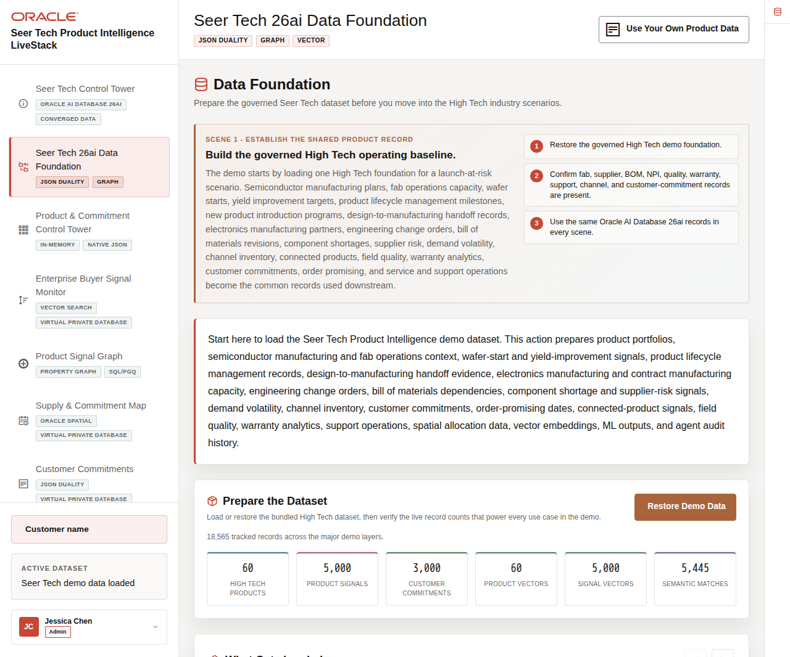
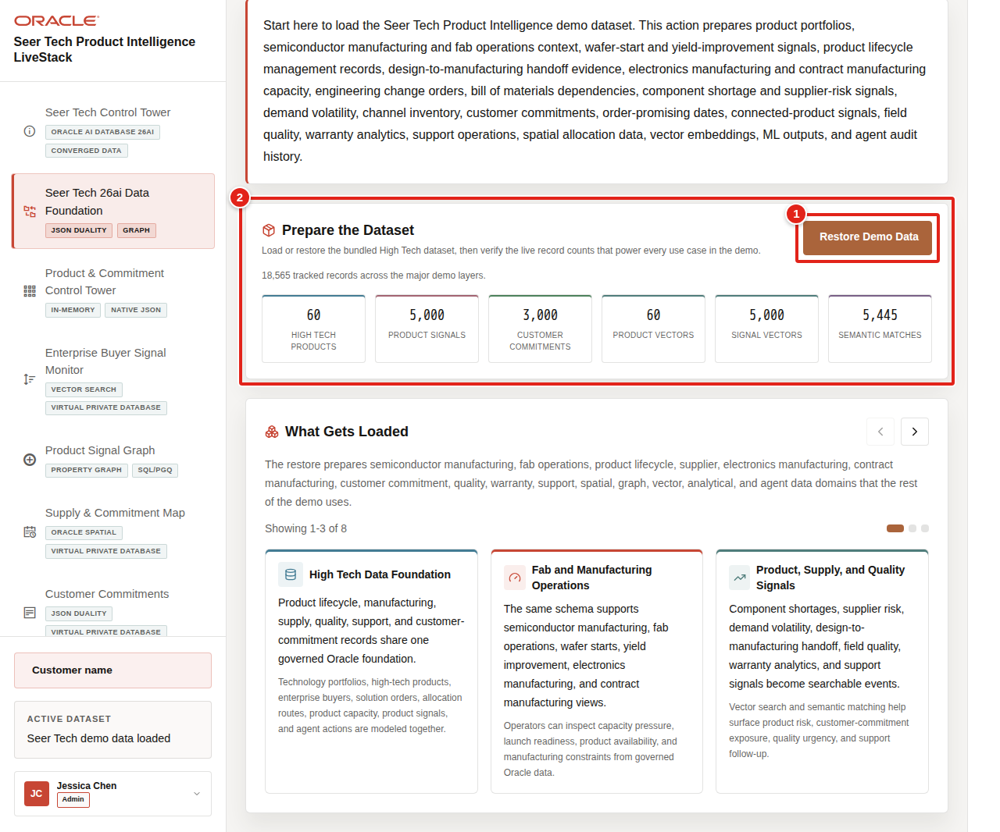
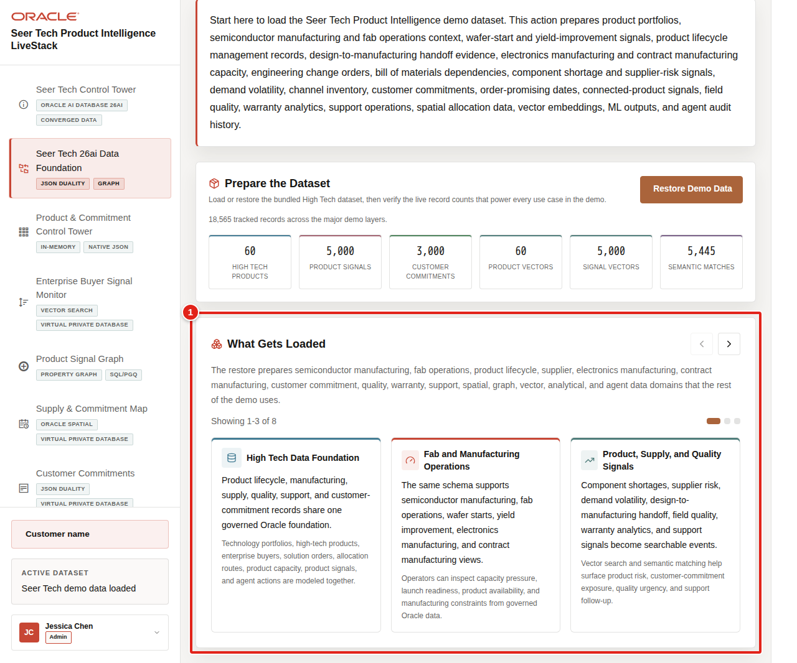
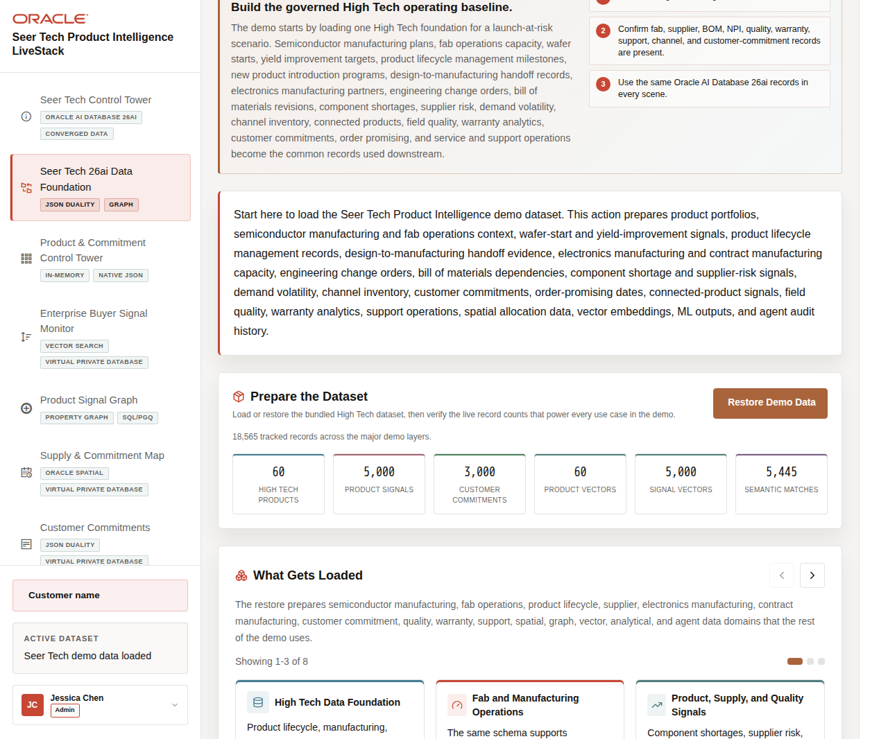

# Scene 2 Seer Tech 26ai Data Foundation

## Introduction

The **Seer Tech 26ai Data Foundation** prepares the trusted High Tech operating baseline used across the demo. Whether the data is loaded or restored, every subsequent screen starts from the same governed records.

The baseline includes product portfolios, manufacturing capacity, wafer-start context, yield signals, **PLM** records, **BOM** dependencies, engineering change orders, supplier risk, customer commitments, quality and warranty records, connected-device telemetry, service operations, vectorized signals, graph relationships, spatial locations, model outputs, and agent audit records.

This page makes clear that the runbook is a connected workflow, not a set of isolated mini-demos. The same Oracle-backed records power the control tower, vector search, graph, supply map, customer commitments, analytics, **Ask Data**, data import, and AI agent workflows.

Estimated Time: **8 minutes**

### Objectives

In this scene, you will confirm that the demo has a governed baseline for the product, manufacturing, supply, customer commitment, lifecycle, quality, warranty, connected-product, service, vector search, graph, analytics, **Ask Data**, and agent workflows that follow.

**Note:** Oracle Internals is collapsed by default. Expand it only after the business flow is clear so you can connect the visible data foundation to the database capabilities behind the page.

## Task 1: Restore and verify the demo dataset

Perform the following set of steps to restore the seeded **High Tech** baseline and show the audience how the database prepares the shared operating record before any scene depends on it:

1. From the welcome page, click **Start the demo**, or click **Seer Tech 26ai Data Foundation** in the sidebar.
2. In **Prepare the Dataset**, click **Restore Demo Data** as the first live action.
3. Explain that this reloads the governed High Tech dataset into Oracle AI Database 26ai and prepares the records, vectors, semantic matches, graph relationships, machine learning outputs, and audit history used by the rest of the runbook.
4. Wait for the restore operation to complete, then review the live record counts below the action.

    

In the current live demo, the page shows **60** High Tech products, **5,000** product signals, **3,000** customer commitments, **60** product vectors, **5,000** signal vectors, and **5,475** semantic matches. These numbers prove that Oracle AI Database has prepared enough product, signal, vector, graph, machine learning, and commitment evidence for the later scenes.

**Notes:**
- Sample values may change after data refreshes or rebuilds. Verify live output before presenting, then explain the business takeaway.
- Use these counts to show that the dataset supports operational, analytical, spatial, graph, vector, machine learning, natural-language SQL, and audit workflows.

## Task 2: Review what gets loaded

Perform the following set of steps to show that the demo uses recognizable High Tech data, not only generic product records:

1. Scroll to **What Gets Loaded**.
2. Review the data cards for product portfolios, products, product signals, customer commitments, supply and commitment sites, route zones, demand regions, vector embeddings, graph relationships, machine learning outputs, agent actions, and import history.
3. Use the carousel controls to review the remaining data groups.
4. Click the **Oracle Internals** icon on the far-right rail to expand the sidebar, then review the Oracle capability notes.

    

The carousel should make the shared data model concrete: fab, supplier, bill of materials, new product introduction, engineering change order, warranty, service, product telemetry, and customer commitment data are prepared from one foundation and reused by multiple Oracle AI Database capabilities.

## Task 3: Connect the foundation to the rest of the demo

Perform the following set of steps to use the data foundation as the bridge into the operating story and connect it to the control tower, signal monitor, graph, map, commitments, analytics, **Ask Data**, data import, and AI agent workflows:

1. Explain that the control tower will summarize the foundation as product-launch and customer-commitment indicators.
2. Explain that vector search will connect supply, demand, quality, and service signals to affected products and commitments.
3. Explain that graph, spatial, JSON Relational Duality, Oracle Machine Learning, Ask Data, bring-your-own-data, and agent pages all read from the same governed records.

    

The business value is that the release-train story begins from one known operating baseline. Every metric and screenshot in later scenes can be traced back to the same product, signal, supply, customer, lifecycle, and predictive records.

*You can move to the next scene.*

## Credits & Build Notes
- **Author** - Oracle LiveLabs Team
- **Last Updated By/Date** - Oracle LiveLabs Team, 2026-07-02
- **Source Bundle** - `livestack-hightech.zip`
